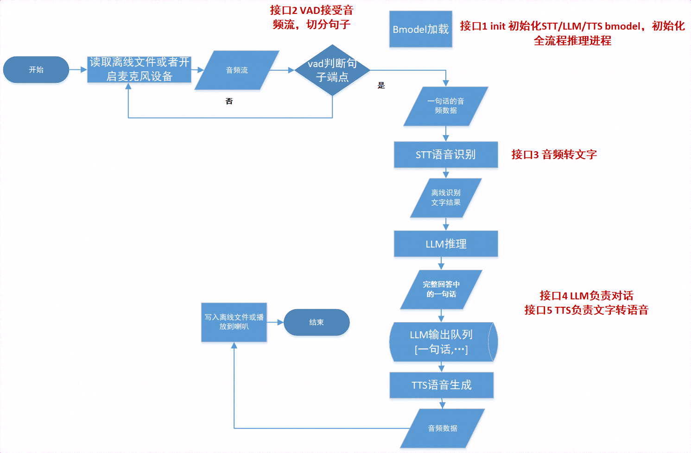

# Python例程 <!-- omit in toc -->

## 目录 <!-- omit in toc -->
- [1. 环境准备](#1-环境准备)
  - [1.1 SoC平台](#11-soc平台)
- [2. 推理测试](#2-推理测试)
  - [2.1 参数说明](#21-参数说明)
  - [2.2 使用方式](#22-使用方式)
- [3. 流程图](#3-流程图)

python目录下提供了Python例程，具体情况如下：

| 序号  |             Python例程                    |             说明                |
| ---- | ----------------------------------------  | ------------------------------- |
| 1    |    whisper_minicpm_llama3_vits.py         |         使用SAIL和BMRT推理       |


## 1. 环境准备
### 1.1 SoC平台

如果您使用SoC平台（如SE、SM系列边缘设备），并使用它测试本例程，刷机后在`/opt/sophon/`下已经预装了相应的libsophon、sophon-opencv和sophon-ffmpeg运行库包。

- 如果您使用Llama3作为LLM，则需要在SOC平台执行如下步骤进行编译
```bash
sudo apt-get install pybind11-dev
# 编译库文件
cd Llama3/python_demo
mkdir build
cd build && cmake -DTARGET_ARCH=soc .. && make && mv *cpython* ../..
cd ../../..
```

- 如果您使用MiniCPM作为LLM，则需要在SOC平台执行如下步骤进行编译
```bash
# 编译库文件
cd MiniCPM/demo
mkdir build
cd build && cmake -DTARGET_ARCH=soc .. && make && mv minicpm ..
cd ../../..
```

- 此外您还需要在SOC平台安装其他python第三方库：
```bash
# 对于SE9平台
python3 -m dfss --url=open@sophgo.com:sophon-demo/application/Audio_assistant/sophon_arm-3.8.0-py3-none-any.whl
pip3 install sophon_arm-3.8.0-py3-none-any.whl --force-reinstall
rm -f sophon_arm-3.8.0-py3-none-any.whl
pip3 install -r requirements.txt
```

- 运行前需要下载额外动态库，然后设置环境变量
```bash
# 对于SE9平台
python3 -m dfss --url=open@sophgo.com:sophon-demo/application/Audio_assistant/libfirmware_core.so
export BMRUNTIME_USING_FIRMWARE=/path-to-current-dir/libfirmware_core.so
```

## 2. 推理测试
python例程不需要编译，可以直接运行，不同平台的测试参数和运行方式是相同的。
### 2.1 参数说明

算法配置参数说明：
```bash
usage: whisper_minicpm_llama3_vits.py [-h] [--profile] [--audio_in AUDIO_IN] [--output_file] [--llm_type LLM_TYPE] [--microphone_devid MICROPHONE_DEVID]

--profile: 打印一些性能数据，默认不打印。
--audio_in: 输入音频，默认不传入任何参数，输入是麦克风，或者传入音频文件路径。
--output_file: 是否输出到文件， 默认输出到喇叭。
--llm_type: LLM的类型，目前仅支持minicpm-2b或llama3-8b，目前BM1688上仅仅支持minicpm-2b。
--microphone_devid: 麦克风设备的ID，当且仅当输入为麦克风时有效。
```

**注意**
>1. 对于其中包含的语音算法或语言算法的配置参数可参考`whisper_minicpm_llama3_vits.py`源码。


### 2.2 使用方式
为了测试实时的麦克风输入、喇叭输出，可以执行如下命令
```bash
python3 whisper_minicpm_llama3_vits.py
```

为了测试语音文件输入、喇叭输出，可以执行如下命令
```bash
python3 whisper_minicpm_llama3_vits.py --audio_in=../datasets/fitness_zh.wav
```

## 3. 流程图

`whisper_minicpm_llama3_vits.py`中的处理流程，遵循以下流程图：

