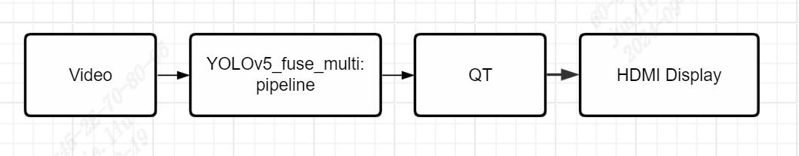

[简体中文](./README.md) 

# C++例程

## 目录

* [1. 环境准备](#1-环境准备)
* [2. 程序编译](#2-程序编译)
* [3. 推理测试](#3-推理测试)
    * [3.1 参数说明](#31-参数说明)
    * [3.2 运行程序](#32-运行程序)
    * [3.3 程序流程图](#33-程序流程图)

cpp目录下提供了C++例程以供参考使用，具体情况如下：
| 序号  | C++例程      | 说明                                 |
| ---- | ------------- | -----------------------------------  |
| 1    | yolov5_bmcv   | 使用opencv解码、BMCV前处理、BMRT推理   |


## 1. 环境准备

SE9系列刷机后在`/opt/sophon/`下已经预装了相应的libsophon、sophon-opencv和sophon-ffmpeg运行库包，可直接使用它作为运行环境。通常还需要一台x86主机作为开发环境，用于交叉编译C++程序。


## 2. 程序编译
C++程序运行前需要编译可执行文件。

通常在x86主机上交叉编译程序，您需要在x86主机上使用SOPHON SDK搭建交叉编译环境，将程序所依赖的头文件和库文件打包至soc-sdk目录中，具体请参考[交叉编译环境搭建](../../../docs/Environment_Install_Guide.md#41-交叉编译环境搭建)。本例程主要依赖libsophon、sophon-opencv和sophon-ffmpeg运行库包。

您还需要准备aarch64版本的qtbase依赖库，此前如果运行过下载脚本`download.sh`，会下载一份我们编译好的qtbase依赖库，在`cpp/install`目录下。

交叉编译环境搭建好后，使用交叉编译工具链编译生成可执行文件：

```bash
cd cpp/yolov5_bmcv
mkdir build && cd build
# 请根据实际情况修改-DSDK的路径，需使用绝对路径。
# 请根据实际情况修改-DQT_PATH的路径，需要用绝对路径:/your_workspace_path/sophon-demo/application/YOLOv5_fuse_multi_QT/cpp/install
cmake -DTARGET_ARCH=soc -DSDK=/path_to_sdk/soc-sdk ..  -DQT_PATH=/path_to_qtlib 
make
```
编译完成后，会在yolov5_bmcv目录下生成yolov5_bmcv.soc。


## 3. 推理测试
需将交叉编译生成的可执行文件及所需的模型、测试数据拷贝到SoC平台中测试。

### 3.1 参数说明
本例程通过读取json来配置参数。json格式如下：

```json
{
  "dev_id": 0,
  "bmodel_path": "../../models/CV186X/yolov5s_v6.1_fuse_int8_4b.bmodel",
  "channels": [
    {
      "url": "../../datasets/test_car_person_1080P.mp4",
      "is_video": true,
      "skip_frame": 0
    },
    {
      "url": "../../datasets/test_car_person_1080P.mp4",
      "is_video": true,
      "skip_frame": 0
    },
    {
      "url": "../../datasets/test_car_person_1080P.mp4",
      "is_video": true,
      "skip_frame": 0
    },
    {
      "url": "../../datasets/test_car_person_1080P.mp4",
      "is_video": true,
      "skip_frame": 0
    }
  ],
  "queue_size": 10,
  "num_pre": 1,
  "num_post": 1,
  "class_names": "../../datasets/coco.names",
  "conf_thresh": 0.5,
  "nms_thresh": 0.5,
  # 显示窗口的个数，应与视频流数量匹配。
  "display_rows": 2,
  "display_cols": 2
```
|   参数名      | 类型    | 说明 |
|-------------|---------|-----  |
|dev_id       | int     | 设备号|
|bmodel_path  | string  | bmodel路径 |
| channels    | list    | 多路设置 |
| url         | string  | 图片目录路径(以/结尾)、视频路径或视频流地址 |
| is_video    | bool    | 是否是视频格式 |
| skip_frame  | int     | 跳帧，间隔多少帧处理一次，图片设置为0 |
| queue_size  | int     | 缓存队列长度 |
| num_pre     | int     | 预处理线程个数 |
| num_post    | int     | 后处理线程个数 |
| class_name  | string  | 类别名 |
| conf_thresh | float   | 置信度 | 
| nms_thresh  | float   | nms阈值 |
|display_rows|int|qt界面显示行数|
|display_cols|int|qt界面显示列数|


### 3.2 运行程序
将YOLOv5_fuse_multi_QT整个文件夹放到SE9-8上；如有修改视频地址的需求，可修改 YOLOv5_fuse_multi/cpp/yolov5_bmcv/config_se9-8.json 中的 url。
在SE9-8/SE9-16上，YOLOv5_fuse_multi/cpp/目录下执行以下脚本：
```
./run_hdmi_show.sh
```

如有需求，可在该脚本中的以下内容，按需修改可执行文件 yolov5_bmcv.soc 的路径、json 配置文件的路径：
```
./yolov5_bmcv/yolov5_bmcv.soc --config=./yolov5_bmcv/config_se9-8.json
```


### 3.3 程序流程图

整体流程如下：


pipeline的实现请参考 [YOLOv5_multi](../../YOLOv5_multi/cpp/README.md#33)


