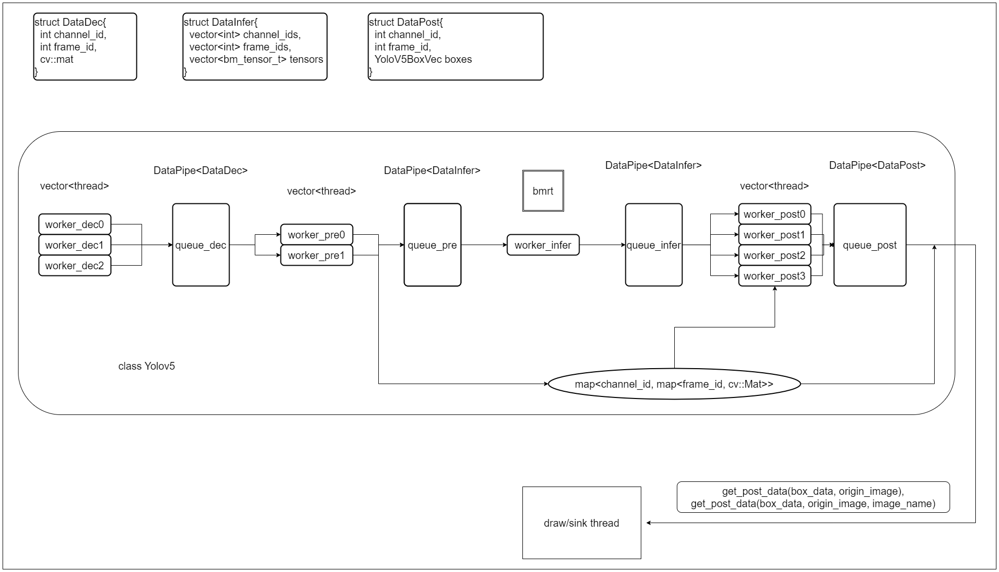
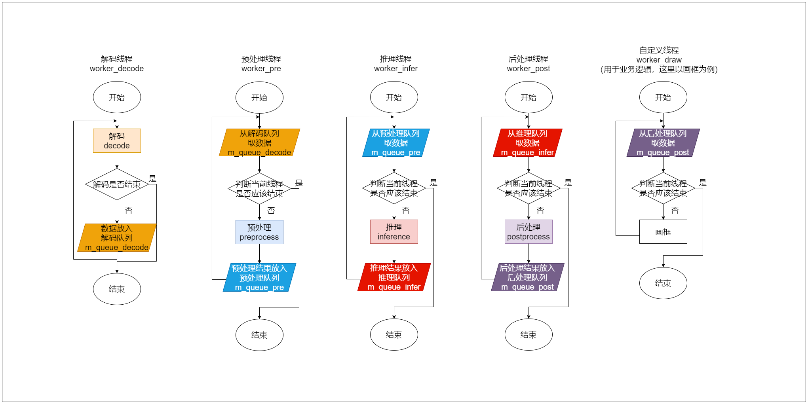
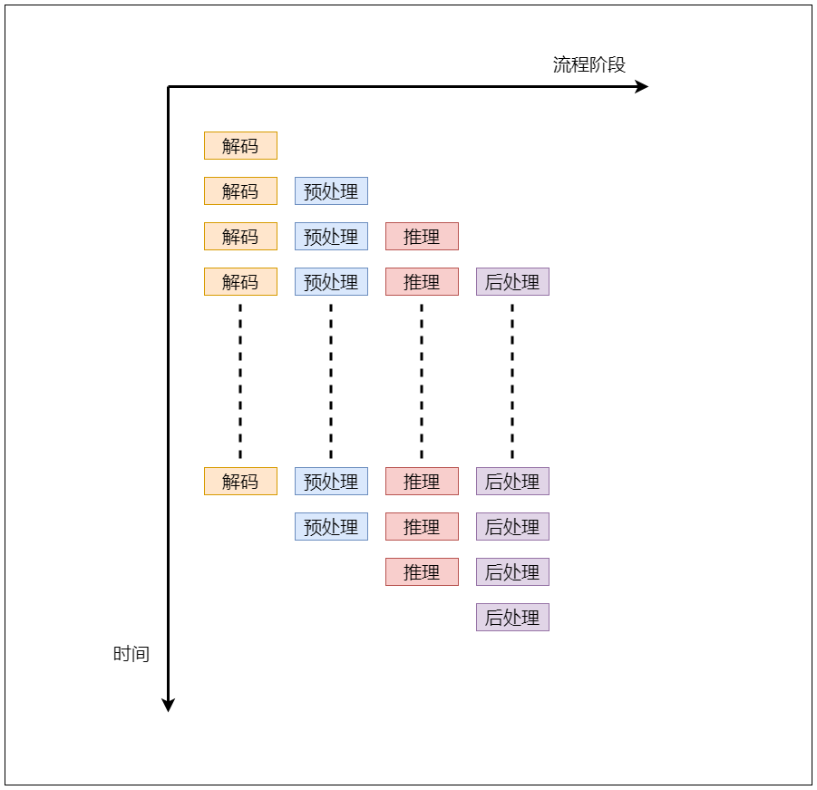

[简体中文](./README.md) 

# C++例程

## 目录

* [1. 环境准备](#1-环境准备)
    * [1.1 x86/arm PCIe平台](#11-x86arm-pcie平台)
    * [1.2 SoC平台](#12-soc平台)
* [2. 程序编译](#2-程序编译)
    * [2.1 x86/arm PCIe平台](#21-x86arm-pcie平台)
    * [2.2 SoC平台](#22-soc平台)
* [3. 推理测试](#3-推理测试)
    * [3.1 参数说明](#31-参数说明)
    * [3.2 运行程序](#32-运行程序)
    * [3.3 程序流程图](#33-程序流程图)

cpp目录下提供了C++例程以供参考使用，具体情况如下：
| 序号  | C++例程      | 说明                                 |
| ---- | ------------- | -----------------------------------  |
| 1    | yolov5_bmcv   | 使用opencv解码、BMCV前处理、BMRT推理   |


## 1. 环境准备
### 1.1 x86/arm PCIe平台
如果您在x86/arm平台安装了PCIe加速卡（如SC系列加速卡），可以直接使用它作为开发环境和运行环境。您需要安装libsophon、sophon-opencv和sophon-ffmpeg，具体步骤可参考[x86-pcie平台的开发和运行环境搭建](../../../docs/Environment_Install_Guide.md#3-x86-pcie平台的开发和运行环境搭建)或[arm-pcie平台的开发和运行环境搭建](../../../docs/Environment_Install_Guide.md#5-arm-pcie平台的开发和运行环境搭建)。

### 1.2 SoC平台
如果您使用SoC平台（如SE、SM系列边缘设备），刷机后在`/opt/sophon/`下已经预装了相应的libsophon、sophon-opencv和sophon-ffmpeg运行库包，可直接使用它作为运行环境。通常还需要一台x86主机作为开发环境，用于交叉编译C++程序。


## 2. 程序编译
C++程序运行前需要编译可执行文件。
### 2.1 x86/arm PCIe平台
可以直接在PCIe平台上编译程序：
#### 2.1.1 bmcv
```bash
cd cpp/yolov5_bmcv
mkdir build && cd build
cmake .. 
make
cd ..
```
编译完成后，会在yolov5_bmcv目录下生成yolov5_bmcv.pcie。


### 2.2 SoC平台
通常在x86主机上交叉编译程序，您需要在x86主机上使用SOPHON SDK搭建交叉编译环境，将程序所依赖的头文件和库文件打包至soc-sdk目录中，具体请参考[交叉编译环境搭建](../../../docs/Environment_Install_Guide.md#41-交叉编译环境搭建)。本例程主要依赖libsophon、sophon-opencv和sophon-ffmpeg运行库包。

交叉编译环境搭建好后，使用交叉编译工具链编译生成可执行文件：
#### 2.2.1 bmcv
```bash
cd cpp/yolov5_bmcv
mkdir build && cd build
#请根据实际情况修改-DSDK的路径，需使用绝对路径。
cmake -DTARGET_ARCH=soc -DSDK=/path_to_sdk/soc-sdk ..  
make
```
编译完成后，会在yolov5_bmcv目录下生成yolov5_bmcv.soc。


## 3. 推理测试
对于PCIe平台，可以直接在PCIe平台上推理测试；对于SoC平台，需将交叉编译生成的可执行文件及所需的模型、测试数据拷贝到SoC平台中测试。测试的参数及运行方式是一致的，下面主要以PCIe模式进行介绍。

### 3.1 参数说明
本例程通过读取json来配置参数。json格式如下：

```json
{
  "dev_id": 0,
  "bmodel_path": "../../models/BM1684/yolov5s_v6.1_3output_int8_1b.bmodel",
  "channels": [
    {
      "url": "../../datasets/coco/val2017_1000/",
      "is_video": false,
      "skip_frame": 0
    },
    {
      "url": "../../datasets/test_car_person_1080P.mp4",
      "is_video": true,
      "skip_frame": 5
    }
    

  ],
  "queue_size": 50,
  "num_pre": 2,
  "num_post": 4,
  "class_names": "../../datasets/coco.names",
  "conf_thresh": 0.5,
  "nms_thresh": 0.5
  

}
```
|   参数名      | 类型    | 说明 |
|-------------|---------|-----  |
|dev_id       | int     | 设备号|
|bmodel_path  | string  | bmodel路径 |
| channels    | list    | 多路设置 |
| url         | string  | 图片目录路径(以/结尾)、视频路径或视频流地址 |
| is_video    | bool    | 是否是视频格式 |
| skip_frame  | int     | 跳帧，间隔多少帧处理一次，图片设置为0 |
| queue_size  | int     | 缓存队列长度 |
| num_pre     | int     | 预处理线程个数 |
| num_post    | int     | 后处理线程个数 |
| class_name  | string  | 类别名 |
| conf_thresh | float   | 置信度 | 
| nms_thresh  | float   | nms阈值 |


### 3.2 运行程序
配置好json后，运行应用程序即可，请自行根据您的配置文件修改路径

```bash
./yolov5_bmcv.pcie --config=config.json
```
如果需要保存图片，请修改main.cpp中的宏定义为如下：
```cpp
#define DRAW_ACC 1
```
预测的图片或视频帧将保存在`results/images`下，预测的结果保存在`results/yolov5.json`下


### 3.3 程序流程图

整体流程和相关数据结构如下：



注：解码部分一路一个线程，预处理和后处理线程数可根据实际情况自定义，处理速度慢的部分可以使用相对较多的线程处理。不同路共用相同的缓存队列。

线程内部逻辑和pipeline示意图如下：





