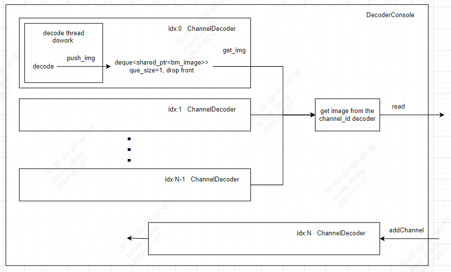
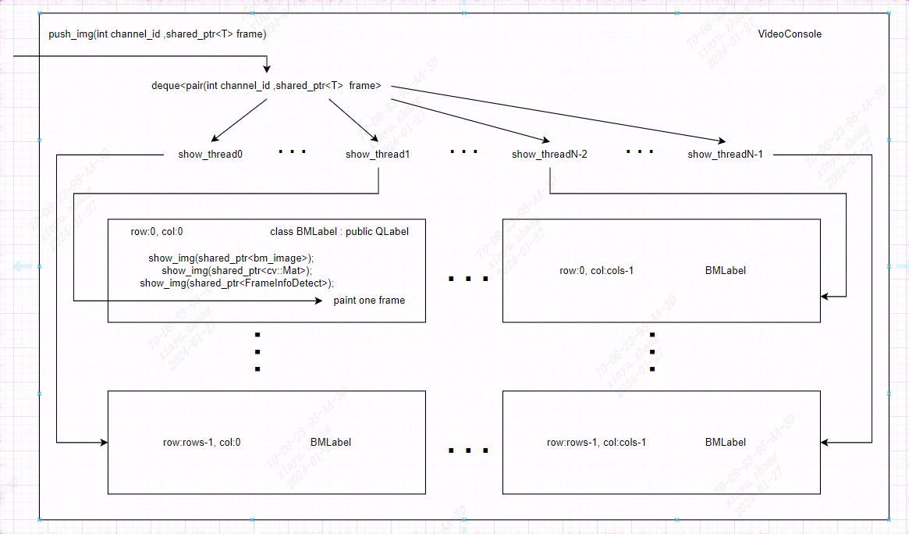
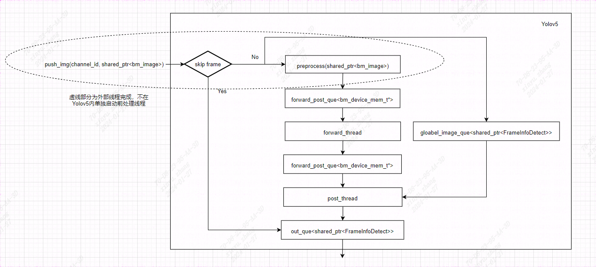
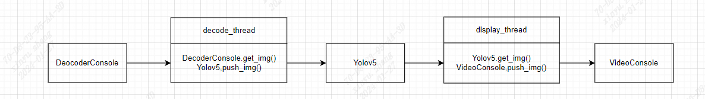

# YOLOv5_multi_QT

YOLOv5_multi_QT在算能SE7上实现了低延时的视频流解码+QT显示模块，可选择性的开启YOLOv5算法模块对视频流进行目标检测。

main.cpp 中 #define OPEN_YOLOV5 1 即为开始YOLOv5检测，0 即为纯解码+QT显示。

* 本demo为sophon-demo中YOLOv5_opt的功能扩展，建议运行本demo前，优先按说明文档跑通YOLOv5_opt的例程，本例程中将延用YOLOv5_opt中的模型，具体模型转换过程请参考YOLOv5_opt。

## 环境准备

### 获取交叉编译需要使用的libsophon,sophon-ffmpeg,sophon-opencv

*此章节所有的编译操作都是在x86主机上,使用交叉编译的方式进行编译。下面示例中选择libsophon的版本为0.5.0, sophon-ffmpeg的版本为0.7.3,sophon-opencv的版本为0.7.3。*

1) 从算能官网中获取`libsophon_soc_0.5.0_aarch64.tar.gz`,并解压
    ```
    tar -xvf libsophon_soc_0.5.0_aarch64.tar.gz
    ```
解压后libsophon的目录为`libsophon_soc_0.5.0_aarch64/opt/sophon/libsophon-0.5.0`

2) 从算能官网中获取`sophon-mw-soc_0.7.3_aarch64.tar.gz`,并解压
    ```
    tar -xvf sophon-mw-soc_0.7.3_aarch64.tar.gz
    ```

解压后sophon-ffmpeg的目录为`sophon-mw-soc_0.7.3_aarch64/opt/sophon/sophon-ffmpeg_0.7.3`。

解压后sophon-opencv的目录为`sophon-mw-soc_0.7.3_aarch64/opt/sophon/sophon-opencv_0.7.3`。

3) 可将libsophon-0.5.0、sophon-ffmpeg_0.7.3、sophon-opencv_0.7.3三个目录放置在同一目录下，构成SOC_SDK

- SOC_SDK  
    |- libsophon-0.5.0  
    |- sophon-ffmpeg_0.7.3  
    |- sophon-opencv_0.7.3  

### 安装gcc-aarch64-linux-gnu工具链

*如果已经安装,可忽略此步骤*

```
sudo apt-get install gcc-aarch64-linux-gnu g++-aarch64-linux-gnu
```

## 编译程序

1) 根据SOC_SDK路径及版本号修改yolov5_app.pro中对应路径，主要是23~26行

2) 编译程序

```
mkdir build && cd build
../../tools/install/bin/qmake ../yolov5_app.pro
make -j
cd ..
```

## 执行程序

1) 修改yolov5_app.json文件对程序进行配置

```
{
    "decoder":{
        "urls":[
            "rtsp_url_0", 
            "rtsp_url_1",
            "rtsp_url_2",
            "rtsp_url_3"
        ]
    },
    "yolov5":{
        "dev_id": 0,
        "bmodel_path": "../models/BM1684X/yolov5s_tpukernel_int8_1b.bmodel",
        "tpu_kernel_module_path": "../tools/tpu_kernel_module/libbm1684x_kernel_module.so",
        "que_size": 1,
        # 视频每跳过skip_num帧检测1帧
        "skip_num": 0,
        "nmsThreshold": 0.5,
        "confThreshold": 0.5
    },
    # 显示窗口的个数，应与视频流数量匹配。
    "display":{
        "rows": 2,
        "cols": 2
    }
}
```

2) 将YOLOv5_multi_QT完整目录拷贝至SOC上，sudo bash ./run_hdmi_show.sh 即可执行程序。

* 注意：如果SE7上的桌面程序正在运行，需要先停止服务 sudo systemctl stop SophonHDMI.service


## 程序流程图及二次开发说明

demo中各个功能均为模块化设计，便于用户直接取其中的功能类进行二次开发，后续将简要介绍各个模块的流程图。

### DecoderConsole



DecoderConsole实现了多路视频解码功能，可以通过addChannel接口接入视频流，read接口可以从指定id的ChannelDecoder中获取shared_ptr<bm_image>，此处的shared_ptr自定义了删除器，在析构时可以自动释放bm_image的资源，无需再额外的进行destroy，否则可能造成内存double free！

ChannelDecoder实现了单路的视频解码功能，该类内部启动了一个解码线程，且存在一个默认长度为1的非阻塞队列，对外暴露从队列中的获取image的接口get_img。ChannelDecoder可以作为解码器单独使用，也可与DecoderConsole配套使用。

注意：此处长度为1的非阻塞队列保证每次read时，取走的都是最新的帧，这保证了显示的低延时，但是如果算法处理较慢时，可能会出现丢帧现象。


### VideoConsole



VideoConsole实现了多路视频的QT同窗显示功能。VideoConsole是一个模板类，可以实现bm_image,cv::Mat或额外带有检测框信息的FrameInfoDetect的显示；VideoConsole内部初始化了QT布局，包含rows*cols个BMLabel，一个输入队列，并默认启动rows*cols个线程从输入队列中获取数据，并按channel_id分配至对应的BMLabel.

BMLabel继承了QLable，具备QLable的全部功能，且重载实现了show_img，实现了三个类型的画面显示和检测框绘制，BMLabel也可以单独使用。


### Yolov5



Yolov5类中实现yolov5算法的pipeline全流程，只需调用push_img接口送入数据，就可以get_img获得带有检测框信息的图片。

需要注意的是，为了第一时间获取最低延时视频帧，yolov5的preprocess并不是在类中单独起线程进行处理的，而是由外部执行push_img的线程承担，这样降低了从解码到算法处理的滞后缓存帧数量。


### main.cpp构造


在主函数中，利用两个线程将三个模块串联起来，实现解码——检测——显示全流程。decode_thread通过轮询的方式汇聚各个channel解出的视频帧并送入Yolov5中进行检测。display_thread只起到了从Yolov5到VideoConsole中的搬运功能，并未做额外处理。