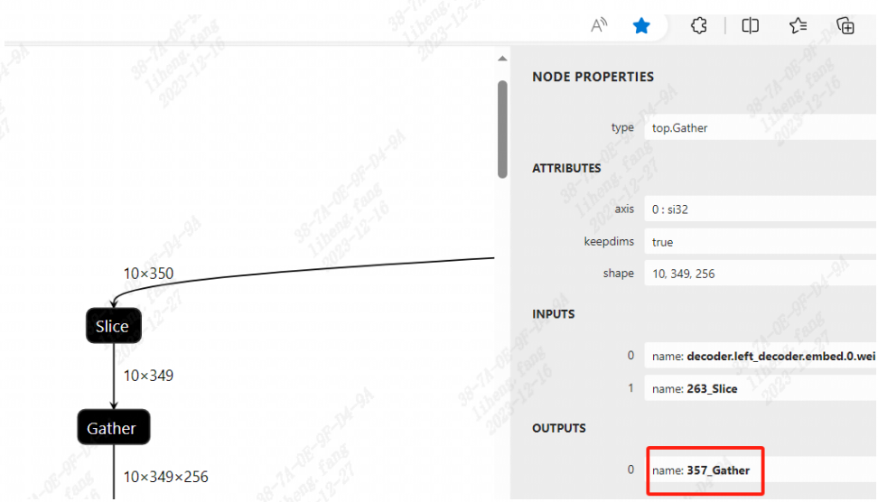

[简体中文](./Calibration_Guide.md) | [English](./Calibration_Guide_EN.md.md)

# Model quantization

To find more about models quantify tutorial, please refer to the TPU-MLIR/TPU-NNTC development reference (please visit sophgo website (https://developer.sophgo.com/site/index/material/28/all.html) to get the corresponding version of the SDK).

## 1. Notice
### 1.1 Quantized dataset
It is recommended to randomly select 100 to 500 samples from the training set as the quantization dataset, which should cover test scenarios and categories as far as possible. During quantization, you can try different iterations to quantify to obtain the best quantization accuracy.

### 1.2 Preprocessing alignment
The preprocessing of quantization data set should be consistent with that of inference test, otherwise it will lead to a large loss of accuracy. It is suggested that data should be preprocessed when making lmdb data set for TPU-NNTC or npz/npy data for TPU-MLIR.

### 1.3 Specific model optimization techniques
#### 1.3.1 YOLO series models
Since the output of the yolo series includes both classification and regression, resulting in uneven statistical distribution of output, the last three conv layers and all subsequent layers are not usually quantized, sometimes the first few convs also should not be quantized, you can do experiments in real cases to find the most useful strategy. 

The specific steps in TPU-MLIR are as follows:
1. use mlir2onnx.py, transform the .mlir file generated in model_transform.py to onnx, then check its network structure by netron.app.
   ```bash
   mlir2onnx.py -m xxx.mlir -o xxx.onnx
   ```
2. use fp_forward.py to generate qtable, --fpfwd_outputs --fpfwd_inputs args have the same function as nntc, by specifying the layer name, all corresponding layers can be assigned the corresponding fp_type. 
   
   Refer to the picture above, layer name is this layer's OUTPUTS name in netron.app. There is a command for reference:
   ```bash
   fp_forward.py xxx.mlir --fpfwd_outputs 357_Gather --chip bm1684 --fp_type F32 -o xxx_qtable
   ```
3. Pass the generated qtable to model_deploy.py, and test_input and test_reference should be  added to verify whether the mixed precision strategy is effective.


The specific steps in TPU-NNTC are as follows:

1. Generate the prototxt file of fp32 umodel.

2. Use Netron to open prototxt file of fp32 umodel, select conv layer of the following three branches (large target, medium target, small target), and write down the name;

3. The conv layer obtained in step 2 was specified by --fpfwd_outputs in step-quantization or one-key quantization. You can see the method through --help or refer to YOLOv5's quantization script.

## 2. Common Questions

### 2.1 Serious deviation of detection frame after quantization

On the basis of the above precautions are confirmed correct, try different threshold policy 'th_method'. ADMM, MAX,PERCENTILE9999 are recommended.

### 2.2 In the process of TPU-NNTC quantization, precision comparison does not lead to quantization interrupt

Related error in TPU-NNTC:

```bash

w0209 14:47:33.992739 3751 graphTransformer.cpp:515] max diff = 0.00158691 max diff blob id :4 blob name: out put

Fail: only one compare!

```

Cause: During quantization, the precision comparison of fp32 exceeded the threshold (default value: 0.001).
Solution: Change the fp32 precision comparison threshold, such as -fp32_diff=0.01.

### 2.3 In the process of TPU-MLIR model_deploy, precision comparison does not lead to quantization interrupt
Related error in TPU-MLIR:
```bash
min_similiarity = (0.7610371112823486, -0.6141192159850581, -16.15570902824402)
Target    yolov8s_bm1684_int8_sym_tpu_outputs.npz
Reference yolov8s_top_outputs.npz
npz compare FAILED.
compare output0_Concat: 100%|███████████████████████████████████████████████████████████████████████████████████████████████████████████████████████████████████| 1/1 [00:00<00:00,  3.88it/s]
Traceback (most recent call last):
  File "/usr/local/lib/python3.10/dist-packages/tpu_mlir/python/tools/model_deploy.py", line 335, in <module>
    tool.lowering()
  File "/usr/local/lib/python3.10/dist-packages/tpu_mlir/python/tools/model_deploy.py", line 132, in lowering
    tool.validate_tpu_mlir()
  File "/usr/local/lib/python3.10/dist-packages/tpu_mlir/python/tools/model_deploy.py", line 225, in validate_tpu_mlir
    f32_blobs_compare(self.tpu_npz, self.ref_npz, self.tolerance, self.excepts)
  File "/usr/local/lib/python3.10/dist-packages/tpu_mlir/python/utils/mlir_shell.py", line 190, in f32_blobs_compare
    _os_system(cmd)
  File "/usr/local/lib/python3.10/dist-packages/tpu_mlir/python/utils/mlir_shell.py", line 50, in _os_system
    raise RuntimeError("[!Error]: {}".format(cmd_str))
RuntimeError: [!Error]: npz_tool.py compare yolov8s_bm1684_int8_sym_tpu_outputs.npz yolov8s_top_outputs.npz --tolerance 0.8,0.5 --except - -vv 
mv: cannot stat 'yolov8s_int8_1b.bmodel': No such file or directory
```
The rootcause maybe you are using your own onnx, the qtable that our samples provide, has different layer names with the newly generated mlir. In this case, you should generate qtable yourself. For yolo series, you can refer to [specific-model-optimization-techniques](#13-specific-model-optimization-techniques).
For other models, you can refer to [TPU-MLIR Github](https://github.com/sophgo/tpu-mlir/blob/master/docs/quick_start/source_en/07_quantization.rst) for more guidance.