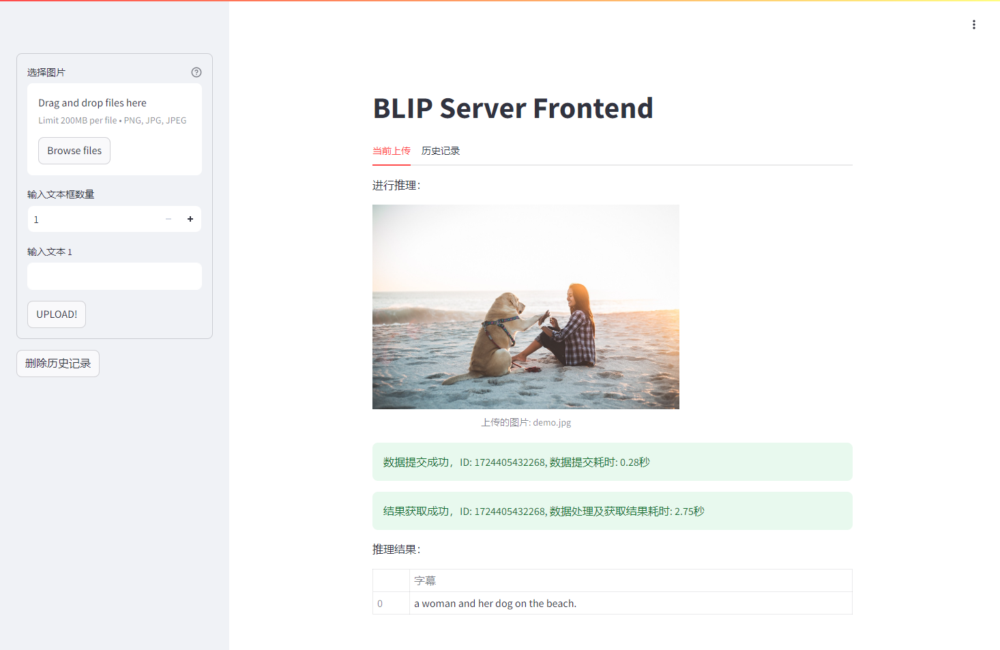
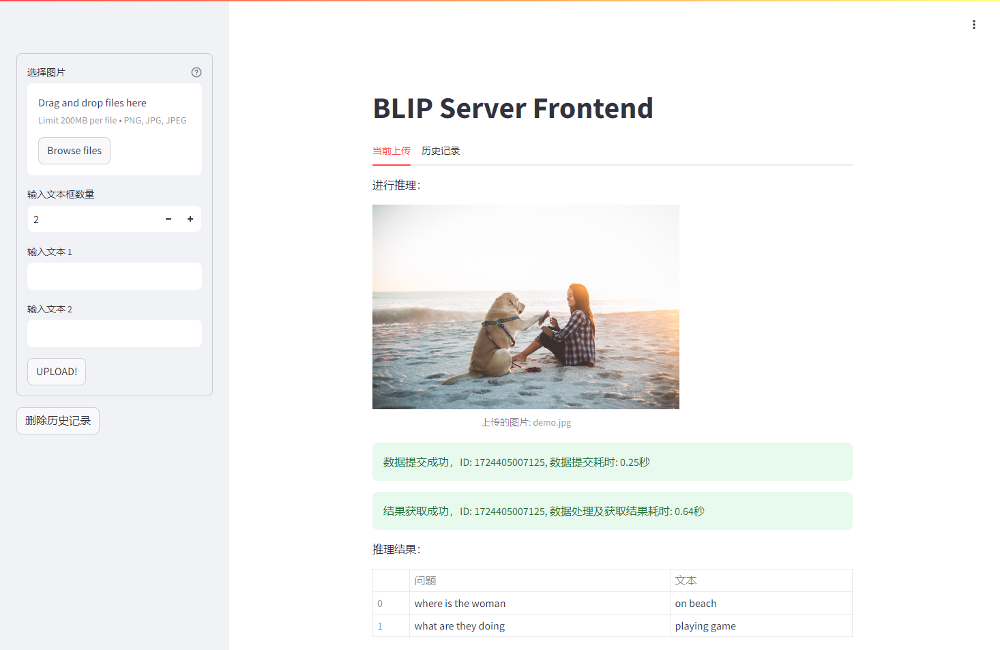

# BLIP_WEB_UI 例程

## 目录

- [BLIP\_WEB\_UI 例程](#blip_web_ui-例程)
  - [目录](#目录)
  - [简介](#简介)
  - [1. 工程目录](#1-工程目录)
  - [2. 准备数据与模型](#2-准备数据与模型)
  - [3.准备环境：](#3准备环境)
  - [4. 启动前后端程序](#4-启动前后端程序)
  - [5.运行示例](#5运行示例)


## 简介
BLIP_WEB_UI 例程是一个基于 BLIP 模型的图像-文本多模态测试系统，包含图像检索、图文匹配，图文问答这三个示例。

每个例程由三部分组成：

1. 业务中台：`../python/blip_server_${func}.py`， 使用了数据队列和线程，具有数据队列管理等功能，为网页后端提供接口服务；
2. 前端应用：`server-front_${func}.py`， 为使用streamlit搭建的网页前端；运行在client客户端；
3. 后端应用：`server-backend_${func}.py`， 为后端接口服务，为前端提供接口请求调用；运行在server服务器端，如SE7 SE9微服务器；

其中func表示具体的功能，cap为图文字幕，itm为图文匹配，vqa为图文问答。

## 1. 工程目录

```
web_ui
├── README.md 
├── server-backend_cap.py   # 图文字幕后端接口服务
├─- server-front_cap.py     # 图文字幕前端网页
├── server-backend_itm.py   # 图文匹配后端接口服务
├── server-front_itm.py     # 图文匹配前端网页
├── server-backend_vqa.py   # 图文问答后端接口服务
└── server-front_vqa.py     # 图文问答前端网页
```

## 2. 准备数据与模型

本例程在`../scripts`目录下提供了相关模型和数据集的下载脚本`download.sh`，您也可以自己准备模型和数据集，并参考[4. 模型编译](../README.md#4-模型编译)进行模型转换。

```bash
# 安装7z和zip，若已安装请跳过，非ubuntu系统视情况使用yum或其他方式安装
sudo apt install unzip
sudo apt install p7zip p7zip-full
chmod -R +x scripts/
# 下载模型，target可选输入BM1684, BM1684X, BM1688；不输入默认下载全部模型 
./scripts/download.sh [target] 
```

## 3.准备环境：

后端程序启动时会自动检查安装依赖库，您也可以使用以下命令安装依赖库：
```bash
pip3 install transformers streamlit
```

若您使用sophon-opencv，需要设置环境变量
```bash
export PYTHONPATH=/opt/sophon/sophon-opencv_<x.x.x>/opencv-python:$PYTHONPATH
```


## 4. 启动前后端程序

前端程序运行在您的客户端，可以是SE7 SE9服务器，也可以是个人PC，用于网页交互显示；后端程序运行在您的服务器端，如SE7 SE9微服务器，用于处理任务，下面以图文问答为例

- 后端
  
  首先启动后端接口服务，在您的服务器端执行如下命令，如SE7 SE9微服务器，其中 --host 0.0.0.0 --port 8080 用于指定当前后端服务器的地址和端口。
  ```bash
  python3 server-backend_vqa.py --host 0.0.0.0 --port 8080 
  ```


- 前端

  在您的客户端执行如下命令启动前端网页，其中 "http://localhost:8080" 用于指定第一步中后端程序服务器地址和端口； --server.address 0.0.0.0 --server.port 5000 是streamlit服务的参数，用于指定前端网页的服务器地址和端口。

  ```bash
  streamlit run server-front_vqa.py "http://localhost:8080" --server.address 0.0.0.0 --server.port 5000 
  ```

注：若8080端口被占用，可以修改端口号，前后端保持一致即可。

## 5.运行示例
1. 分别启动前后端程序；启动参数可以替换成您启动脚本所在服务器的IP地址；
2. 按照上述默认参数，前端启动后打开浏览器，输入http://127.0.0.1:5000，您将看到前端网页：

3. 图像字幕
   3.1. 前端程序为serfer-front_cap.py，后端程序为server-backend_cap.py，参考以上示例运行；
   3.2. 选择本地图片上传，不输入文本，点击“UPLOAD”按钮，您将看到预测结果；
   3.3. 若您不选择本地图片，默认为本例程../datasets/test/demo.jpg 的图片，字幕生成如下
  
4. 图文匹配
   4.1. 前端程序为serfer-front_itm.py，后端程序为server-backend_itm.py，参考以上示例运行；
   4.2. 选择本地图片上传，并输入文本（可输入多个），点击“UPLOAD”按钮，您将看到预测结果；
   4.3  若您不选择本地图片，默认为本例程../datasets/test/demo.jpg 的图片，输入两段文字，
        "a woman sitting on the beach with a dog", "a woman sitting on the beach with a cat"，匹配度结果如下
  
5. 图文问答
   5.1. 前端程序为serfer-front_vqa.py，后端程序为server-backend_vqa.py，参考以上示例运行；
   5.2. 选择本地图片上传，并输入文本（可输入多个），点击“UPLOAD”按钮，您将看到预测结果；
   5.3. 若您不选择本地图片，默认为本例程../datasets/test/demo.jpg 的图片，输入两个问题，
        "where is the woman", "what are they doing"，回答结果如下
  
6. 历史记录
    6.1. 若您多次提交图片，您可以在“历史记录”中查看您的提交记录。
