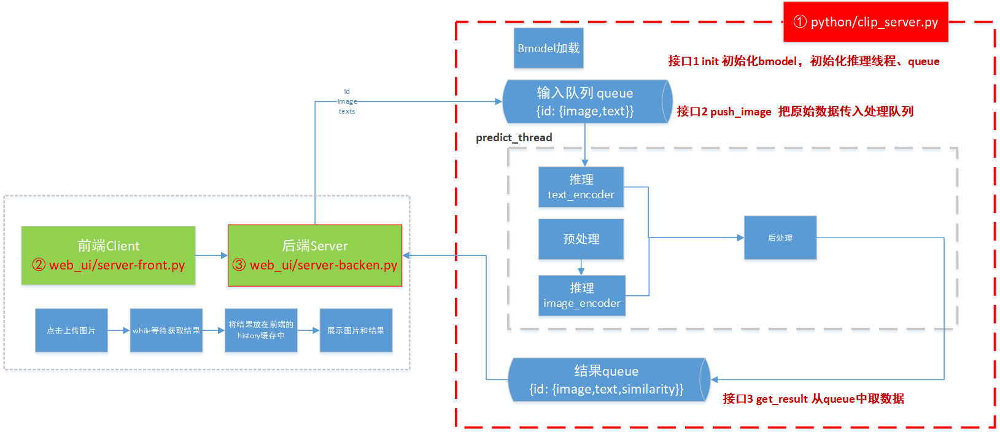
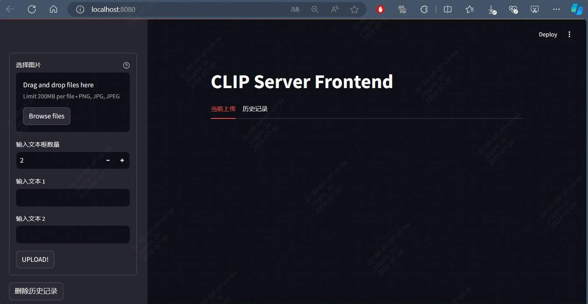
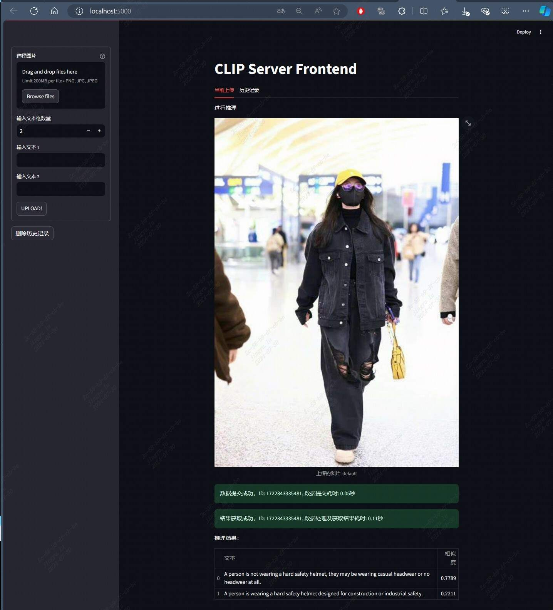
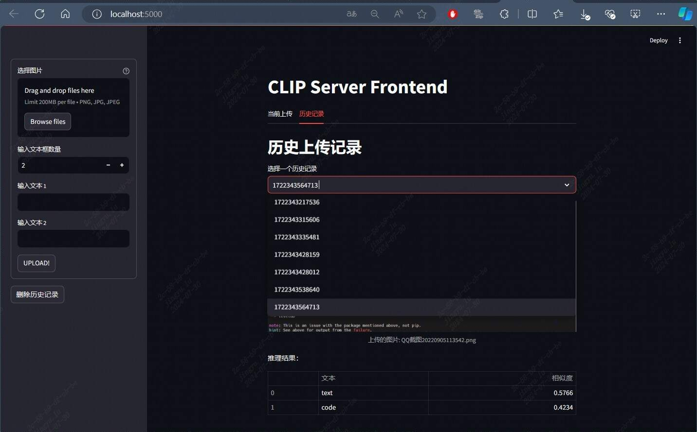

# CLIP_WEB_UI 例程

## 目录

- [CLIP\_WEB\_UI 例程](#clip_web_ui-例程)
  - [目录](#目录)
  - [简介](#简介)
  - [1. 工程目录](#1-工程目录)
  - [2. 环境准备](#2-环境准备)
  - [3. 启动前后端程序](#3-启动前后端程序)
  - [4.运行示例](#4运行示例)


## 简介
CLIP_WEB_UI 例程是一个基于 CLIP 模型的图像-文本匹配系统，支持输入为图像与文本，输出为 文本与图片的相似度。在实际业务中，可以用于检测误报、图像检索、图像分类等场景。

此例程由三部分组成：

1. 业务中台：`../python/clip_server.py`， 使用了数据队列和线程，具有数据队列管理等功能，为网页后端提供接口服务；
2. 前端应用：`server-front.py`， 为使用streamlit搭建的网页前端；运行在client客户端；
3. 后端应用：`server-backend.py`， 为后端接口服务，为前端提供接口请求调用；运行在server服务器端，如SE7 SE9微服务器；

流程图:


## 1. 工程目录

```
web_ui
├── README.md 
├── server-backend.py   # 后端接口服务
└── server-front.py     # 前端网页
```

## 2. 环境准备

后端程序启动时会自动检查安装依赖库，您也可以使用以下命令安装依赖库：
```bash
pip3 install ftfy
pip3 install regex
pip3 install torch
pip3 install torchvision
```

若您使用sophon-opencv，需要设置环境变量
```bash
export PYTHONPATH=$PYTHONPATH:/opt/sophon/sophon-opencv_<x.x.x>/opencv-python
```


## 3. 启动前后端程序

您需要启动前后端程序，前端程序运行在您的客户端，后端程序运行在您的服务器端，如SE7 SE9微服务器。

```bash
python3 server-backend.py --host 0.0.0.0 --port 8080 # 启动后端接口服务，在您的服务器端启动，如SE7 SE9微服务器，其中--host 0.0.0.0 --port 8080 用于指定后端服务器的地址和端口
streamlit run server-front.py "http://localhost:8080" --server.address 0.0.0.0 --server.port 5000  # 启动前端网页，在您的客户端启动，其中 "http://localhost:8080" 用于指定第一步中后端网页的服务器地址和端口， --server.address 0.0.0.0 --server.port 5000 是streamlit的参数，用于指定前端网页的服务器地址和端口
```

## 4.运行示例

1. 分别启动前后端程序；启动参数可以替换成您启动脚本所在服务器的IP地址；
2. 按照上述默认参数，前端启动后打开浏览器，输入http://127.0.0.1:5000，您将看到前端网页，如下图所示：



3. 您可以选择本地图片上传，并输入文本，点击“UPLOAD”按钮，您将看到预测结果；
 
   3.1. 若您不选择本地图片，默认为本例程../datasets/Clothes-and-hats-misidentified-as-safety-helmet.jpg 的图片，这是一个误检测的例程，场景为衣服帽子可能被传统算法误识别为安全帽，
   
    随后输入如下两段文本： 

    > A person is not wearing a hard safety helmet, they may be wearing casual headwear or no headwear at all.
    > 
    > A person is wearing a hard safety helmet designed for construction or industrial safety.

    或者这组提示词：
    > A person is not wearing an industrial safety helmet and might be wearing casual headgear or no headgear at all.
    >
    > A person is wearing a hard safety helmet suitable for construction or industrial work environments.


    3.2. 点击“UPLOAD”按钮，您将看到预测结果； 如下图所示：

    


    3.3. 若您多次提交图片，您可以在“历史记录”中查看您的提交记录，如下图所示：

    
