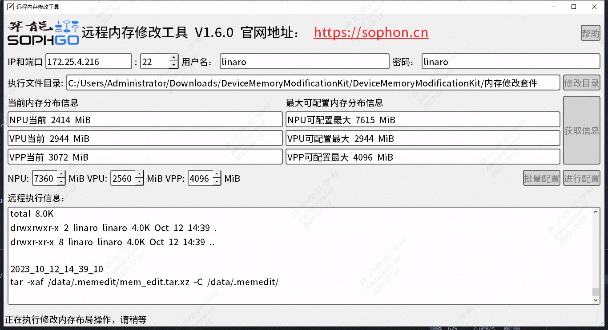

# ChatGLM2

## 目录
- [ChatGLM2](#chatglm2)
  - [目录](#目录)
  - [1. 简介](#1-简介)
  - [2. 运行环境准备](#2-运行环境准备)
    - [2.1 方式一](#21-方式一)
    - [2.1 方式二](#21-方式二)
  - [3. 准备模型](#3-准备模型)
  - [4. 例程测试](#4-例程测试)
  - [5. 程序性能测试](#5-程序性能测试)

## 1. 简介
ChatGLM2-6B 是开源中英双语对话模型 ChatGLM-6B 的第二代版本,相比于初代模型，具有更强大的性能，更长的上下文，更高的推理性能和更开放的协议，ChatGLM2-6B 权重对学术研究完全开放。

该例程支持在V23.03.01(libsophon_0.4.6)及以上的SDK上运行，提供C++、python版本，可以独立运行，支持在插有1684X系列加速卡的x86主机上运行，也可以SE7上运行。其中在SE7上运行需要额外进行环境配置，请参照[运行环境准备](#2-运行环境准备)完成环境部署。

## 2. 运行环境准备
以下为soc模式相关：
### 2.1 方式一
这是最推荐的方式，对于1684X系列设备（如SE7），都可以通过这种方式完成环境准备，使得满足chatGLM2运行条件。首先，下载根据[修改工具](https://doc.sophgo.com/sdk-docs/v23.07.01/docs_latest_release/docs/SophonSDK_doc/zh/html/appendix/2_mem_edit_tools.html)将设备的内存修改为：

NPU:7360 MiB

VPU:2560 MiB 

VPP:4096 MiB



**注意：**应该保留一定的系统内存用于设备编译。

### 2.1 方式二
这里特别提供SE7刷机包，刷机包已经完成环境部署，并且内置chatglm2_soc版本的程序，刷机包地址如下：
```
pip3 install dfss -i https://pypi.tuna.tsinghua.edu.cn/simple --upgrade
python3 -m dfss --url=open@sophgo.com:sophon-demo/chatglm/sdcard_chatglm2.zip
```
刷机方式可以参考[刷机问题](https://doc.sophgo.com/docs/3.0.0/docs_latest_release/faq/html/devices/SOC/soc_firmware_update.html?highlight=%E5%88%B7%E6%9C%BA),在完成刷机后，代码程序在`/data`目录下。当然，还是建议您使用sophon-demo下的程序,它是最新版本的。

## 3. 准备模型
该模型目前只支持在1684X上运行，已提供编译好的bmodel。
### 3.1 使用提供的模型

​本例程在`scripts`目录下提供了相关模型载脚本`download.sh`

**注意：**在下载模型前，应该保证存储空间大于25GB。

```bash
# 安装unzip，若已安装请跳过，非ubuntu系统视情况使用yum或其他方式安装
sudo apt install unzip
chmod -R +x scripts/
./scripts/download.sh
```

执行程序后，当前目录下的文件如下：

```
.
├── cpp                                 #cpp版本
│   ├── 3rdparty
│   │   └── sentencepiece               #sentencepiece三方库
│   ├── chatglm2.hpp                    #chatglm2推理base
│   ├── CMakeLists.txt
│   ├── main.cpp                        #主程序
│   └── README.md                       #使用说明
├── docs
│   └── ChatGLM2_Export_Guide.md
├── models
│   └── BM1684X                         #bmodel、token
│       ├── chatglm2-6b_f16.bmodel
│       ├── chatglm2-6b_int4.bmodel
│       ├── chatglm2-6b_int8.bmodel
│       └── tokenizer.model
├── pic
│   └── memory.png
├── python
│   ├── chatglm2.py                     #主程序
│   ├── README.md                       #使用说明
│   └── requirements.txt                
├── README.md
├── scripts
│   ├── download.sh                     #模型下载脚本 
│   ├── gen_fp16bmodel_mlir.sh          #编译模型相关的脚本
│   ├── gen_int4bmodel_mlir.sh
│   └── gen_int8bmodel_mlir.sh
└── tools
    └── export_onnx.py                  #导出onnx所需脚本
```


### 3.2 自行编译模型

此部分请参考[ChatGLM2模型导出与编译](./docs/ChatGLM2_Export_Guide.md)

## 4. 例程测试

本例程一共分为两个版本，分别是cpp、python，具体的编译和运行方法如下。

注：docker环境只与转模型有关，与运行环境无关。

- [C++例程](./cpp/README.md)
- [Python例程](./python/README.md)

## 5. 程序性能测试

|    测试平台   |     测试程序       |           测试模型             |first token latency(s)|token per second(tokens/s)| 
| -----------  | ---------------- | ---------------------------   | --------------------- | ----------------------- | 
| BM1684X SoC  | chatglm2.soc    | chatglm2-6b_f16.bmodel         | 1.21                  | 3.96                    | 
| BM1684X SoC  | chatglm2.soc    | chatglm2-6b_int8.bmodel         | 0.89                  | 8.64                    | 
| BM1684X SoC  | chatglm2.soc    | chatglm2-6b_int4.bmodel        | 0.89                  | 14.24                   | 
| BM1684X SoC  | chatglm2.py     | chatglm2-6b_f16.bmodel         | 1.59                  | 3.78                    | 
| BM1684X SoC  | chatglm2.py     | chatglm2-6b_int8.bmodel        | 1.22                  | 8.12                    | 
| BM1684X SoC  | chatglm2.py     | chatglm2-6b_int4.bmodel        | 1.22                  | 13.14                   | 

> **测试说明**：  
> 1. 输入为随机问题，性能测试结果具有一定的波动性，建议多次测试取平均值；
> 2. BM1684X SoC的主控处理器为8核 ARM A53 42320 DMIPS @2.3GHz。
