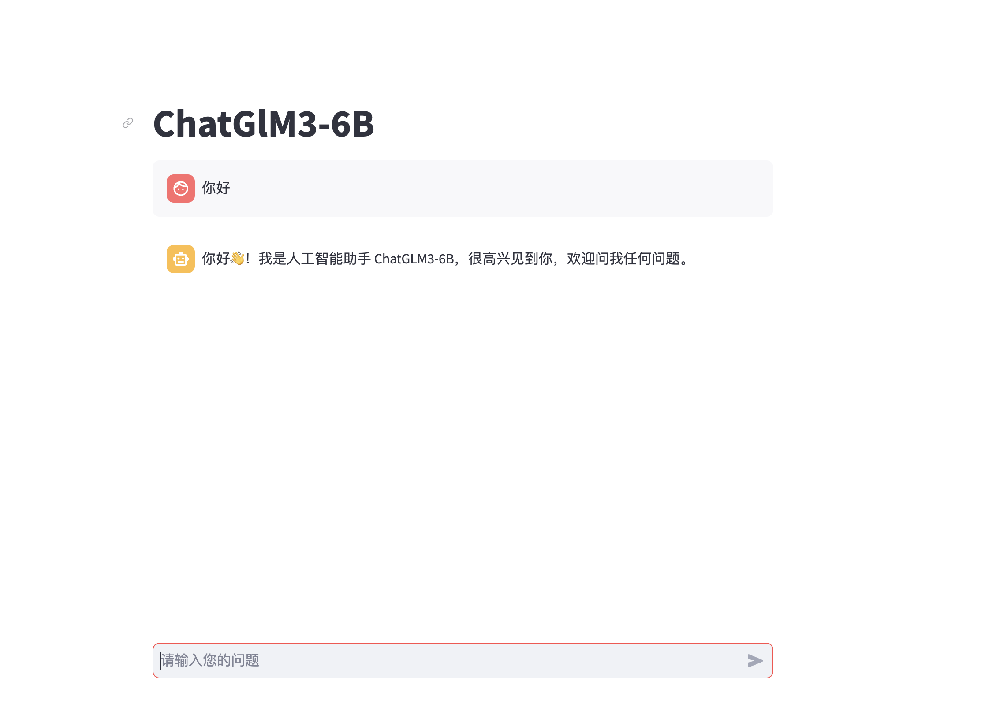
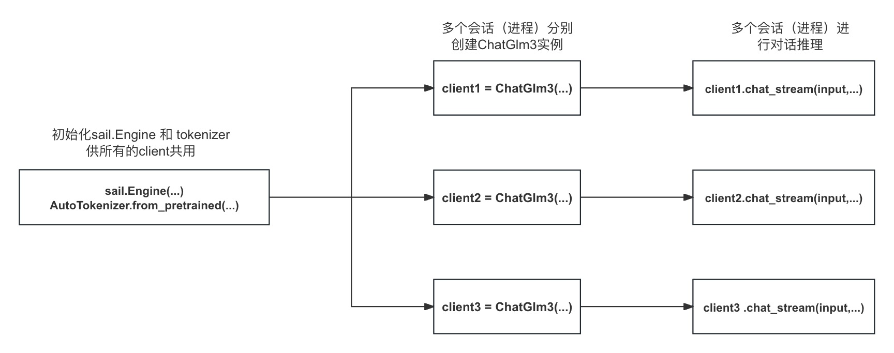
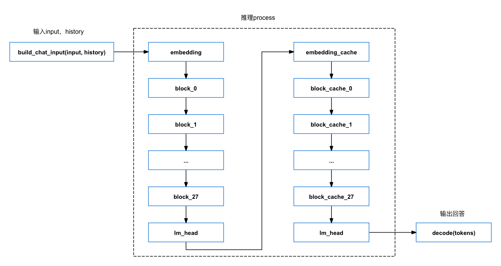

# Python例程

## 目录

* [1. 环境准备](#1-环境准备)
    * [1.1 x86/arm/riscv PCIe平台](#11-x86armriscv-pcie平台)
    * [1.2 SoC平台](#12-soc平台)
* [2. 推理测试](#2-推理测试)
    * [2.1 参数说明](#21-参数说明)
    * [2.2 测试图片](#22-测试图片)
* [3. 支持多会话的Web Demo](#3-支持多会话的Web-Demo)
    * [3.1 使用方式](#31-使用方式)
    * [3.2 程序流程图](#32-程序流程图)
    * [3.3 程序二次开发说明](#33-程序二次开发说明)

python目录下提供了一系列Python例程，具体情况如下：

| 序号 |  Python例程       | 说明                                |
| ---- | ---------------- | -----------------------------------  |
| 1    | chatglm3.py     | 使用SAIL推理 |
| 2    | web_demo.py     | 支持多会话的web demo |


## 1. 环境准备
### 1.1 x86/arm/riscv PCIe平台

如果您在x86/arm/riscv平台安装了PCIe加速卡（如SC系列加速卡），并使用它测试本例程，您需要安装libsophon、sophon-opencv、sophon-ffmpeg、sophon-sail（sail的版本>=v3.8.0，对应BM1684&BM1684x SDK>=v24.04.01，BM1688&CV186AH SDK>=v1.6.0），具体请参考[x86-pcie平台的开发和运行环境搭建](../../../docs/Environment_Install_Guide.md#3-x86-pcie平台的开发和运行环境搭建)或[arm-pcie平台的开发和运行环境搭建](../../../docs/Environment_Install_Guide.md#5-arm-pcie平台的开发和运行环境搭建)或[riscv-pcie平台的开发和运行环境搭建](../../../docs/Environment_Install_Guide.md#6-riscv-pcie平台的开发和运行环境搭建)。


此外您还需要安装其他第三方库：
```bash
pip3 install -r python/requirements.txt
```
您还需要安装，这里提供一个可用的sophon-sail版本，x86/arm/riscv PCIe环境可以通过下面的命令下载：
```bash
pip3 install dfss --upgrade #安装dfss依赖

#x86 pcie, py38
python3 -m dfss --url=open@sophgo.com:sophon-demo/ChatGLM3/sail/pcie/sophon-3.7.0-py3-none-any.whl 
pip3 install sophon-3.7.0-py3-none-any.whl

#arm pcie, py38
python3 -m dfss --url=open@sophgo.com:sophon-demo/ChatGLM3/sail/arm_pcie/sophon_arm_pcie-3.7.0-py3-none-any.whl
pip3 install sophon_arm_pcie-3.7.0-py3-none-any.whl

#riscv pcie, py38
python3 -m dfss --url=open@sophgo.com:sophon-demo/ChatGLM3/sail/riscv_pcie/sophon_riscv64-3.9.0-py3-none-any.whl
pip3 install sophon_riscv64-3.9.0-py3-none-any.whl
```

### 1.2 SoC平台

如果您使用SoC平台（如SE、SM系列边缘设备），并使用它测试本例程，刷机后在`/opt/sophon/`下已经预装了相应的libsophon、sophon-opencv和sophon-ffmpeg运行库包。

此外您还需要安装其他第三方库：
```bash
pip3 install -r python/requirements.txt
```
由于本例程需要的sophon-sail版本较新，这里提供一个可用的sophon-sail whl包，SoC环境可以通过下面的命令下载：
```bash
pip3 install dfss --upgrade
python3 -m dfss --url=open@sophgo.com:sophon-demo/ChatGLM3/sail/soc/sophon_arm-3.7.0-py3-none-any.whl #arm soc, py38, for SE7
python3 -m dfss --url=open@sophgo.com:sophon-demo/ChatGLM3/sail/soc/SE9/sophon-3.8.0-py3-none-any.whl #arm soc, py38, for SE9
```
如果您需要其他python版本的sophon-sail，可以参考[SoC平台交叉编译安装sophon-sail](../../../docs/Environment_Install_Guide.md#42-交叉编译安装sophon-sail)，到官网下载sophon-sail（sail的版本>=v3.8.0，对应BM1684&BM1684x SDK>=v24.04.01，BM1688&CV186AH SDK>=v1.6.0）自己编译。

## 2. 推理测试
python例程不需要编译，可以直接运行，PCIe平台和SoC平台的测试参数和运行方式是相同的。
### 2.1 参数说明

```bash
usage: chatglm3.py [--bmodel BMODEL] [--token TOKEN] [--dev_id DEV_ID]
--bmodel: 用于推理的bmodel路径；
--token: tokenizer目录路径；
--dev_id: 用于推理的tpu设备id；
--help: 输出帮助信息
```

### 2.2 使用方式

```bash
python3 python/chatglm3.py --bmodel models/BM1684X/chatglm3-6b_fp16.bmodel --token python/token_config --dev_id 0 
```
在读入模型后会显示"Question:"，然后输入就可以了。模型的回答会出现在"Answer"中。结束对话请输入"exit"。

## 3. 支持多会话的Web Demo
我们提供了基于[streamlit](https://streamlit.io/)的web demo，可同时进行多个会话的推理。

### 3.1 使用方式
首先安装第三方库
```bash
pip3 install -r python/requirements.txt
```
然后通过streamlit运行web_demo.py即可运行一个web_server

```bash
streamlit run python/web_demo.py
```

首次运行需要输入邮箱，输入邮箱后命令行输出以下信息则表示启动成功
```bash
 You can now view your Streamlit app in your browser.

  Network URL: http://172.xx.xx.xx:8501
  External URL: http://103.xx.xxx.xxx:8501
```

在浏览器中打开输出的地址即可使用，web页面如下，在底部对话框中输入问题。


### 3.2 程序流程图
通过将同一个sail.Engine, tokenizer传入不同ChatGLM3实例对象中，从而实现多会话同时推理的能力，具体流程如下：


其中chat_stream接收用户输入的问题input和历史消息history，通过sail.Engine进行推理，流式返回生成的文本，具体过程如下：


### 3.3 程序二次开发说明

查看web_demo.py的7-9行，参数说明如下：
```python
token_path = './python/token_config'
bmodel_path = './models/BM1684X/chatglm3-6b_int4.bmodel'
dev_id = 0
```
```bash
bmodel_path: 用于推理的bmodel路径；
token_path: tokenizer目录路径；
dev_id: 用于推理的tpu设备id；
```
通过修改对应参数可以改变demo的bmodel，tokenizer，dev_id。

当用户输入问题并提交后，程序会创建一个ChatGLM3实例，并开始推理过程，代码在web_demo.py中的52和57行
```python
client = ChatGLM3(st.session_state.handle, st.session_state.engine, st.session_state.tokenizer)
```
```python
stream = client.chat_stream(input = prompt,history = [{"role": m["role"], "content": m["content"]} for m in st.session_state.messages])
```

ChatGLM3实例的创建需要接收sail.Handle，sail.Engine，tokenizer，通过上面的bmodel_path， token_path， dev_id三个参数来控制。并实现了一个推理接口`chat_stream(input, history)`  input是用户输入的问题，history是历史消息。例如：
```python
input='用c++实现一个冒泡排序'
history = [
    {"role": "user", "content": "你好"},
    {"role": "assistant", "content": "你好👋！我是人工智能助手 ChatGLM3-6B，很高兴见到你，欢迎问我任何问题。"},
]
```

如果其他的模型的创建也可以接收sail.Handle，sail.Engine，tokenizer参数，并且实现了类似`chat_stream(input, history)` 的流式推理接口，则可以替换相应的模型。例如用Qwen进行替换：
```python
client = Qwen(st.session_state.handle, st.session_state.engine, st.session_state.tokenizer)
...
stream = client.chat_stream(...)
```