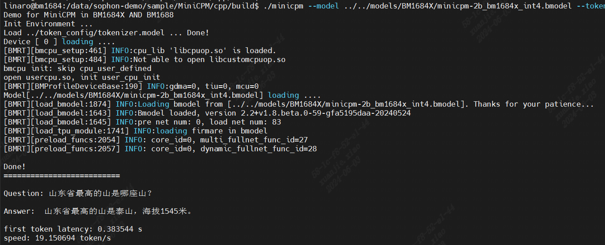

# MiniCPM-2B C++例程

## 目录
- [MiniCPM-2B C++例程](#MiniCPM-2B-C++例程)
  - [目录](#目录)
  - [1. 环境准备](#1-环境准备)
    - [1.1 x86/arm PCIe平台](#11-x86arm-pcie平台)
    - [1.2 SoC平台](#12-soc平台)
  - [2. 编译程序](#2-编译程序)
  - [3. 例程测试](#3-例程测试)
    - [3.1 参数说明](#31-参数说明)
    - [3.2 使用方式](#32-使用方式)
    - [3.3 程序运行效果](#33-程序运行效果)

## 1. 环境准备
### 1.1 x86/arm PCIe平台
如果您在x86/arm平台安装了PCIe加速卡（如SC系列加速卡），并使用它测试本例程，您需要安装libsophon，具体请参考[x86-pcie平台的开发和运行环境搭建](../../../docs/Environment_Install_Guide.md#3-x86-pcie平台的开发和运行环境搭建)或[arm-pcie平台的开发和运行环境搭建](../../../docs/Environment_Install_Guide.md#5-arm-pcie平台的开发和运行环境搭建)。

- 请确保您的驱动及libsophon版本满足本例程的要求，具体请参考[简介](../README.md#1-简介)

### 1.2 SoC平台

如果您使用SoC平台（如SE、SM系列边缘设备），并使用它测试本例程，刷机后在`/opt/sophon/`下已经预装了相应的libsophon运行库包。

## 2. 编译程序

PCIE环境下和SOC环境下都可以直接进行编译。

进行编译之前，请先确认之前已经执行过`MiniCPM-2B/scripts/download.sh`

在开发板上或者X86主机执行如下编译：
您需要根据您使用的开发板及芯片种类进行选择

- 如果您是 `soc BM1688芯片` 请将参数设置为 `-DTARGET_ARCH=soc_bm1688`；
- 如果您是 `soc BM1684x芯片` 请将参数设置为 `-DTARGET_ARCH=soc_bm1684x`；
- 如果您是 `pcie BM1684x芯片` 请将参数设置为 `-DTARGET_ARCH=pcie`；

下面以BM1684X PCIE环境下的编译为例：

当前路径 `{MiniCPM-2B}/cpp`

```shell
mkdir build
cd build
cmake .. -DTARGET_ARCH=pcie
make -j
```

- 如果在使用或者测试过程中遇到问题，可以先参考[常见问题说明](../docs/FAQ.md)

## 3. 例程测试

在编译完成后，会根据pcie或soc模式在项目路径下生成minicpm的可执行文件, tokenizer、bmodel路径以及chip id都可以可以通过下列参数来指定,设置好以后即可运行

### 3.1 参数说明
```bash
usage: ./minicpm [--model BMODEL] [--tokenizer TOKEN] [--devid DEV_ID]
--model: 用于推理的bmodel路径；
--tokenizer: tokenizer目录路径；
--devid: 用于推理的tpu设备id；
--help: 输出帮助信息
```

### 3.2 使用方式

运行`minicpm`，如运行BM1684X int4模型`minicpm-2b_bm1684x_int4.bmodel`:

```shell
./minicpm --model ../../models/BM1684X/minicpm-2b_bm1684x_int4.bmodel --tokenizer ../token_config/tokenizer.model --devid 0
```

### 3.3 程序运行效果

以下为BM1684X的INT4量化模式的运行效果：


