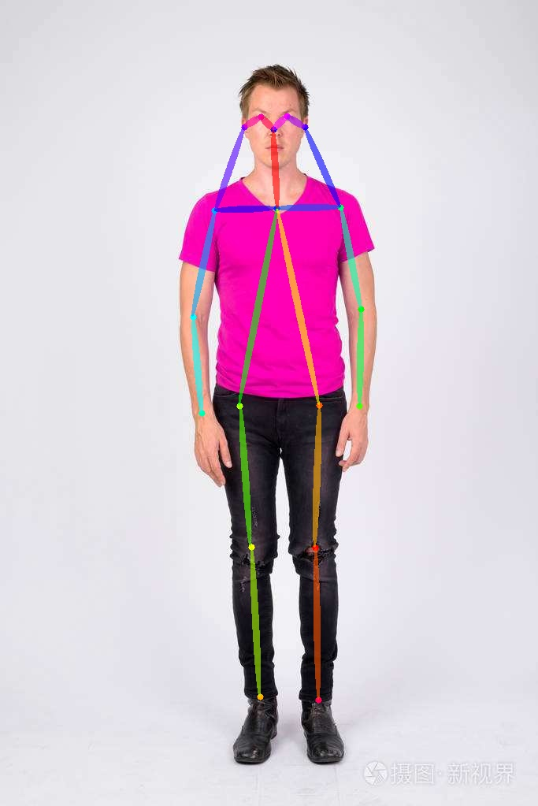

# Python例程
* [Python例程](#python例程)
    * [1. 环境准备](#1-环境准备)
        * [1.1 x86 PCIe平台](#11-x86-pcie平台)
        * [1.2 SoC平台](#12-soc平台)
    * [2. 推理测试](#2-推理测试)
        * [2.1 参数说明](#21-参数说明)
        * [2.2 测试图片](#22-测试图片)
        * [2.3 测试视频](#23-测试视频)

python目录下提供了一系列Python例程，具体情况如下：

| 序号   | Python例程      | 说明                                |
| ---- | ---------------- | -----------------------------------  |
| 1    | openpose_opencv.py | 使用OpenCV解码、OpenCV前处理、SAIL推理 |

## 1. 环境准备
### 1.1 x86 PCIe平台
如果您在x86平台安装了PCIe加速卡（如SC系列加速卡），您需要安装libsophon、sophon-opencv、sophon-ffmpeg和sophon-sail，具体请参考[x86-pcie平台的开发和运行环境搭建](../../docs/Environment_Install_Guide.md#2-x86-pcie平台的开发和运行环境搭建)。

此外您可能还需要安装其他第三方库：
```bash
pip3 install -r python/requirements.txt
```

### 1.2 SoC平台
如果您使用SoC平台（如SE、SM系列边缘设备），刷机后在`/opt/sophon/`下已经预装了相应的libsophon、sophon-opencv和sophon-ffmpeg运行库包。您还需要交叉编译安装sophon-sail，具体可参考[交叉编译安装sophon-sail](../../docs/Environment_Install_Guide.md#32-交叉编译安装sophon-sail)。

此外您可能还需要安装其他第三方库：
```bash
pip3 install -r python/requirements.txt
```

## 2. 推理测试
python例程不需要编译，可以直接运行，PCIe平台和SoC平台的测试参数和运行方式是相同的，下面主要以PCIe模式进行介绍。
### 2.1 参数说明
openpose_opencv.py的参数说明如下：
```bash
usage: openpose_opencv.py [--input INPUT] [--bmodel BMODEL] [--dev_id DEV_ID]
--input: 测试数据路径，可输入整个图片文件夹的路径或者视频路径；
--bmodel: 用于推理的bmodel路径，默认使用stage 0的网络进行推理；
--dev_id: 用于推理的tpu设备id。
```
### 2.2 测试图片
图片测试实例如下，支持对整个图片文件夹进行测试，模型支持fp32bmodel、int8bmodel，支持BM1684和BM1684X，支持单batch size或多batch size，通过传入相应的模型路径参数进行测试即可。
```bash
python3 python/openpose_opencv.py --input datasets/test --bmodel models/BM1684/pose_coco_fp32_1b.bmodel --dev_id 0
```
测试结束后，会将预测的图片保存在`results/images`下，预测的关键点坐标保存在`results/pose_coco_fp32_1b.bmodel_test_opencv_python_result.json`下，同时会打印预测结果、推理时间等信息。



### 2.3 测试视频
视频测试实例如下，支持对视频流进行测试，模型支持fp32bmodel、int8bmodel，支持BM1684和BM1684X，支持单batch size或多batch size，通过传入相应的模型路径参数进行测试即可。
```bash
python3 python/openpose_opencv.py --input datasets/dance_1080P.mp4 --bmodel models/BM1684/pose_coco_fp32_1b.bmodel --dev_id 0
```
测试结束后，会将预测的结果画在`results/dance_1080P.avi`中，同时会打印预测结果、推理时间等信息。