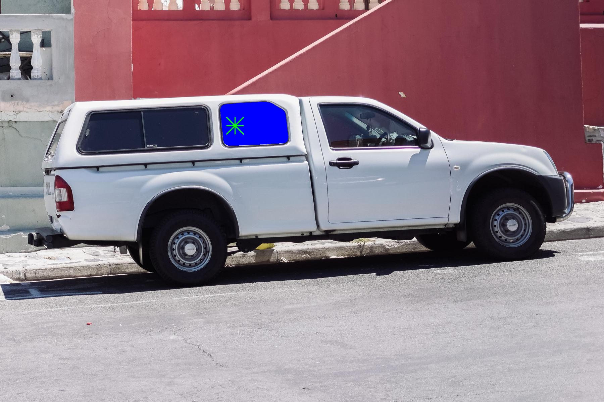
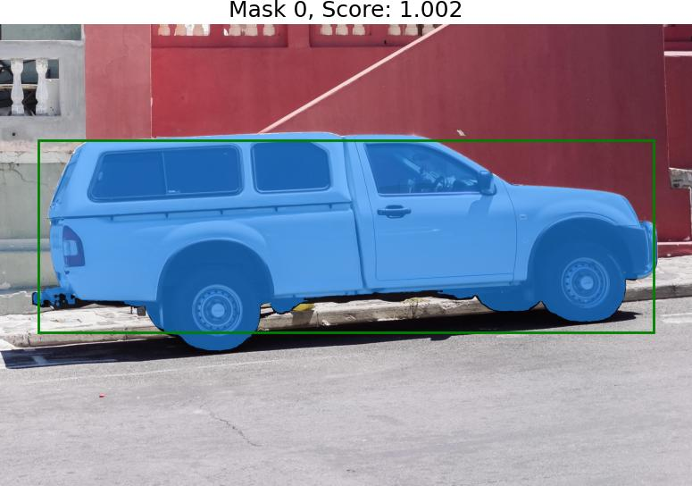
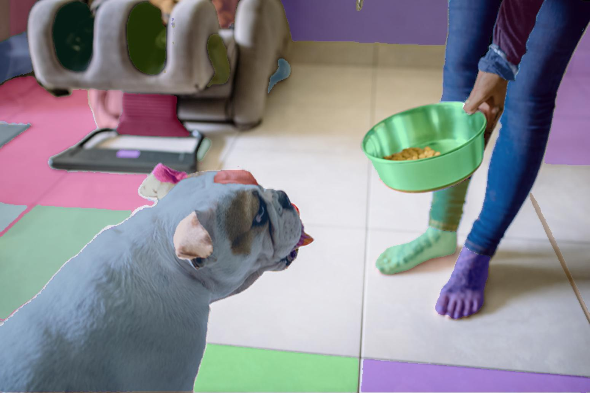

# Python例程

## 目录

* [1. 环境准备](#1-环境准备)
    * [1.1 x86/arm PCIe平台](#11-x86arm-pcie平台)
    * [1.2 SoC平台](#12-soc平台)
* [2. 推理测试](#2-推理测试)
    * [2.1 参数说明](#21-参数说明)
    * [2.2 测试图片](#22-测试图片)

python目录下提供了Python例程，具体情况如下：

| 序号 |  Python例程      | 说明                                                                 |
| ---- | ---------------- | -------------------------------------------------------------------- |
| 1    | sam_opencv.py    | 使用OpenCV解码、SAIL 图像压缩(embedding)、SAIL图像推理(mask_decoder) |

## 1. 环境准备
### 1.1 x86/arm PCIe平台

如果您在x86/arm平台安装了PCIe加速卡（如SC系列加速卡），并使用它测试本例程，您需要安装libsophon、sophon-opencv、sophon-ffmpeg和sophon-sail，具体请参考[x86-pcie平台的开发和运行环境搭建](../../../docs/Environment_Install_Guide.md#3-x86-pcie平台的开发和运行环境搭建)或[arm-pcie平台的开发和运行环境搭建](../../../docs/Environment_Install_Guide.md#5-arm-pcie平台的开发和运行环境搭建)。

设置环境变量，指定opencv为sophon-opencv，这将带来更快的解码速度：
```bash
export PYTHONPATH=$PYTHONPATH:/opt/sophon/libsophon-current/lib:/opt/sophon/sophon-opencv-latest/opencv-python/
```

此外您可能还需要安装其他第三方库：
```bash
pip3 install torch
pip3 install torchvision
```

### 1.2 SoC平台

如果您使用SoC平台（如SE、SM系列边缘设备），并使用它测试本例程，刷机后在`/opt/sophon/`下已经预装了相应的libsophon、sophon-opencv和sophon-ffmpeg运行库包。您还需要交叉编译安装sophon-sail，具体可参考[交叉编译安装sophon-sail](../../../docs/Environment_Install_Guide.md#42-交叉编译安装sophon-sail)。

设置环境变量，指定opencv为sophon-opencv，这将带来更快的解码速度：
```bash
export PYTHONPATH=$PYTHONPATH:/opt/sophon/libsophon-current/lib:/opt/sophon/sophon-opencv-latest/opencv-python/
```

此外您可能还需要安装其他第三方库：
```bash
pip3 install torch
pip3 install torchvision
```

## 2. 推理测试
python例程不需要编译，可以直接运行，PCIe平台和SoC平台的测试参数和运行方式是相同的。
### 2.1 参数说明
sam_opencv.py的参数说明如下：
```bash
usage: sam_opencv.py [--input_image INPUT_PATH] [--input_point INPOINT_POINT]
                     [--embedding_bmodel EMBEDDING_BMODEL] [--bmodel BMODEL] 
                     [--auto bool][--dev_id DEV_ID]
                        
--input_image: 测试图片路径，需输入图片路径；
--input_point: 输入点的坐标，输入格式为x,y；或者输入框坐标，格式为x1,y1,x2,y2
--embedding_bmodel 用于图像压缩(embedding)的bmodel路径；
--bmodel: 用于推理(mask_decode)的bmodel路径；
--dev_id: 用于推理的tpu设备id；
--auto: 是否启用自动分割，为bool，默认为0不开启，1为开启；
```
### 2.2 测试图片
图片测试实例如下：

点输入效果如下：
```bash
python3 python/sam_opencv.py --input_image datasets/truck.jpg --input_point 700,375 \
    --embedding_bmodel models/BM1684X/embedding_bmodel/SAM-ViT-B_embedding_fp16_1b.bmodel --bmodel models/BM1684X/decode_bmodel/SAM-ViT-B_decoder_fp16_1b.bmodel  --dev_id 0 
```
运行结束后，会将结果图保存在`results/`下，同时会打印推理时间等信息。

输出效果如图：


box输入效果如下：
```bash
python3 python/sam_opencv.py --input_image datasets/truck.jpg --input_point 100,300,1700,800 \
     --embedding_bmodel models/BM1684X/embedding_bmodel/SAM-ViT-B_embedding_fp16_1b.bmodel --bmodel models/BM1684X/decode_bmodel/SAM-ViT-B_decoder_fp16_1b.bmodel --dev_id 0 
```
运行结束后，会将结果图保存在`results/`下，同时会打印推理时间等信息。

输出效果如图：


若是要使用无需点和框输入的全自动掩码生成则需要设置输入参数auto为1,并设置--bmodel为auto的bmodel，操作如下：
```bash
python3 python/sam_opencv.py --input_image datasets/dog.jpg --embedding_bmodel models/BM1684X/embedding_bmodel/SAM-ViT-B_embedding_fp16_1b.bmodel --bmodel models/BM1684X/decode_bmodel/SAM-ViT-B_auto_decoder_fp32_1b.bmodel --dev_id 0 --auto 1
```
运行结束后，会将结果图保存在`results/`下，同时会打印推理时间等信息。

输出效果如图：

