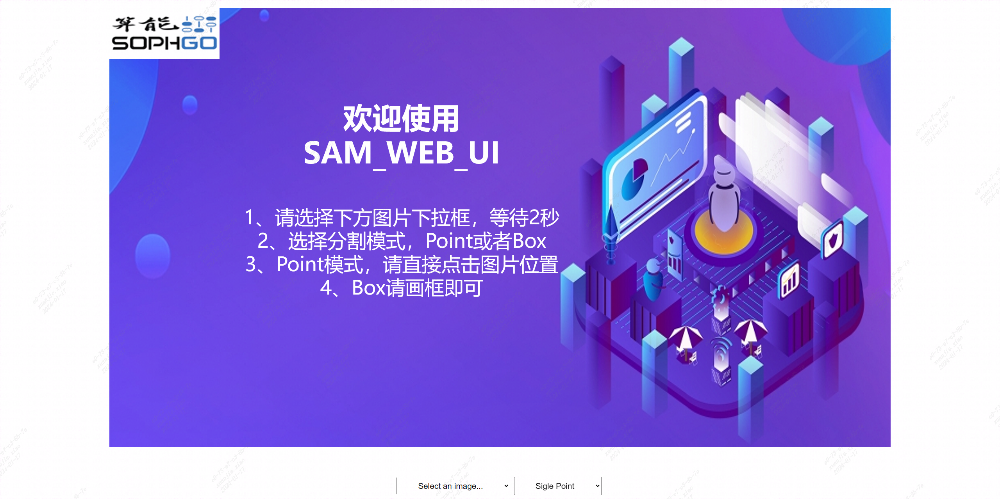
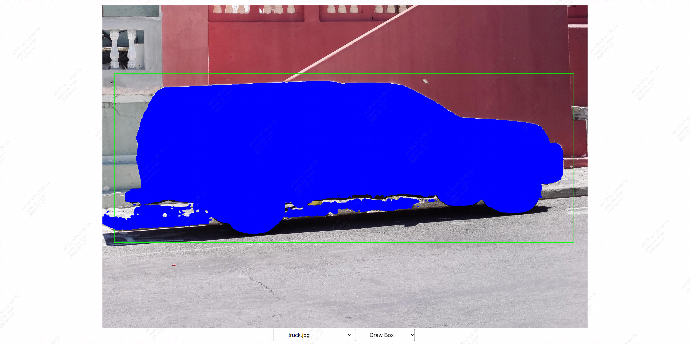

# SAM_WEB_UI例程

## 简介
SAM_WEB_UI例程是一个SAM前后端交互的应用，允许用户在前端界面上的图片上绘制矩形框或者单次点击得到坐标。

前端应用：用户通过鼠标点击和拖动来定义矩形框的位置和大小，这种交互方式直观且用户友好。当处于画框的模式时，前端通过监听鼠标事件，记录用户的点击（mousedown）和释放（mouseup）坐标，同时在鼠标移动（mousemove）过程中实时更新矩形框的显示。矩形框的数据，包括起始点和终点坐标，可以通过请求发送到后端服务器。同时，当选择为单点模式时，单击鼠标左键的坐标也可以通过请求发送给后端服务器。

后端服务：后端服务器接收到坐标数据后，可以进一步的处理，调用SAM的接口，实现对前端传输过来的单点坐标或者矩形框的左上角和右下角坐标解析，并推理，得到mask的值，并传输给前端进行显示。


## 目录

* [1. 工程目录](#1-工程目录)
* [2. 环境准备](#2-环境准备)
* [3. 启动后端程序](#3-启动后端程序)
* [3. 启动前端程序](#3-启动前端程序)


## 1. 工程目录
```
.
├── components
│   └── firstPage.png    # 初始页面图片
├── css
│   └── styles.css       # 页面组件格式
├── images               # 程序分割实例图片
│   ├── dog.jpg
│   ├── groceries.jpg
│   └── truck.jpg
├── index.html           # 页面源文件
├── README.md            # 程序说明
└── scripts
    └── main.js          # 页面源代码
```
## 2. 环境准备
1、为了运行使用 Flask 的后端程序，您需要安装以下依赖包：
```
pip3 install flask flask-cors
```
2、请大家将需要分割的图片放置在/sophon-demo/sample/SAM/web_ui/images目录下，程序会自动读取目录下所有*.jpg的所有图片，并在前端页面下拉框中显示图片名。

## 3. 启动后端程序
后端程序位于sophon-demo/sample/SAM/python ，脚本名字叫 backend.py
```
cd sophon-demo/sample/SAM
python3 python/backend.py
```
## 3. 启动前端程序
前端程序放在sophon-demo/sample/SAM/web_ui 里面，可以通过 python 启动
```
cd sophon-demo/sample/SAM/web_ui
python3 -m http.server 8080
```

接下来，您就可以直接通过  http://0.0.0.0:8080/  或者  http://localhost:8080  访问演示页面

下面是演示的页面展示：




