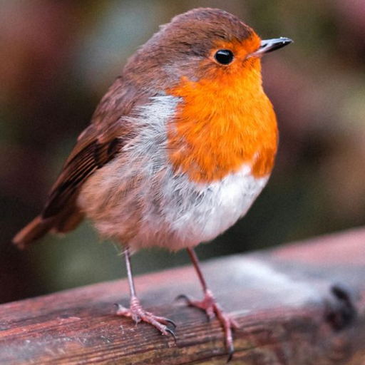
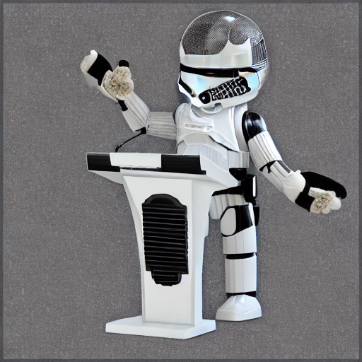
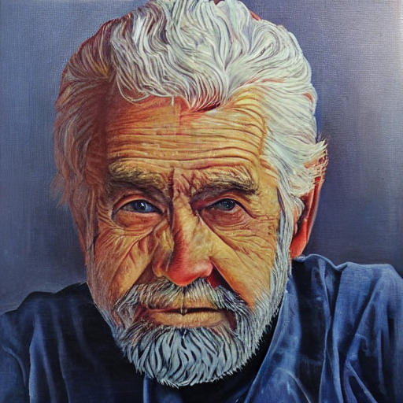
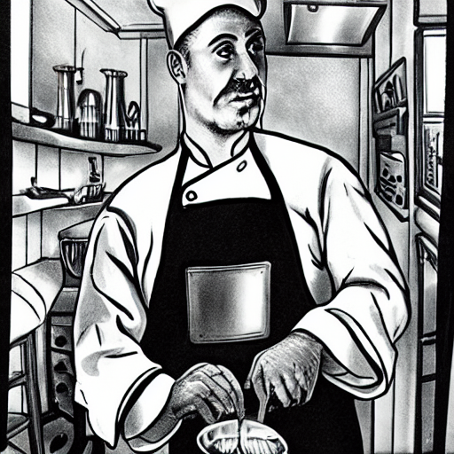
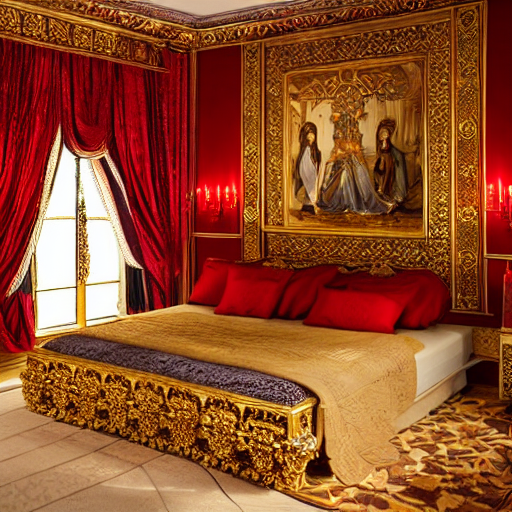
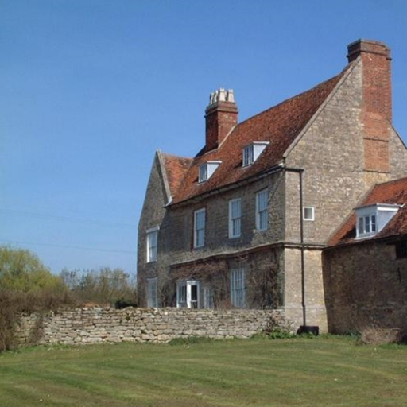

# Export ControlNet

## 目录

* [1. ControlNet介绍](#1-ControlNet介绍)
* [2. 模型导出教程](#2-模型导出教程)
  * [2.1 processor net导出](#21-processor-net导出)
  * [2.2 ControlNet导出](#22-ControlNet导出)
* [3. 准备模型和测试图像](#3-准备模型和测试图像)
  * [3.1 导出并编译模型](#31-导出并编译模型)
  * [3.2 下载编译好的模型](#32-下载编译好的模型)
  * [3.3 准备测试图像](#33-准备测试图像)
* [4. 相关参数说明](#4-相关参数说明)
* [5. 效果展示](#5-效果展示)

## 1. ControlNet介绍

Stable Diffusion是一种基于文本或图像来生成图像的扩散模型，但用户很难精准地控制Stable Diffusion生成的图像。为了使Stable Diffusion生成更符合预期的图像，[ControlNet](https://arxiv.org/pdf/2302.05543.pdf)神经网络模型作为插件被引入Stable Diffusion中，用户可以通过control imge和 ControlNet引入额外的条件输入来干预图像的生成过程，例如canny边缘、深度图、语义分割图或骨架等，使生成的图像在边缘、深度或其他方面与control image较为接近，增强了Stable Diffusion的可控性。

ControlNet模型导出需要安装第三方包：

```bash
pip3 install controlnet-aux==0.0.5
```

## 2. 模型导出教程

如果用户不想了解技术细节，可直接跳转到[3.准备模型和测试图像](#3-准备模型和测试图像)。模型导出主要分为processor net的导出和ControlNet导出两个部分。processor net是将control image转化为深度图、语义分割图、骨架图等额外条件输入的神经网络模型（canny边缘这种图像底层特征不需要用神经网络进行提取，因此没有processor net），ControlNet则接收深度图、语义分割图等条件输入，ControlNet的输出用来辅助控制Stable Diffusion的生成过程。

### 2.1 processor net导出

processor net是提取control image的深度、语义分割信息、软边缘等特征的神经网络，用户可以使用HuggingFace官网提供的模型，也可以使用自己训练的模型，只要具有相应的特征提取功能即可。

processor net的输入是control image，输出是control image的深度图、语义分割图等高层特征。它通常包含对control image的预处理，神经网络推断，神经网络输出后处理三个部分。用户需要将神经网络模型导出为bmodel，并在部署程序中对齐预处理和后处理操作。

*以HuggingFace提供的HEDdetector（提取图像软边缘）的导出为例：*

```python
from controlnet_aux import HEDdetector
import pdb
hed = HEDdetector.from_pretrained('lllyasviel/ControlNet')
# 本demo使用(512,512)的图像
image = load_image("../../pics/hed.png")
pdb.set_trace()
image = hed(image)
```

跳转到HEDdetector的定义处可发现，HEDdetector包含netNetwork成员(pyTorch神经网络模型，nn.Module的子类)，模型加载方法和\_\_call\_\_()方法。HEDdetector不是nn.Module的子类，\_\_call\_\_()方法中的预处理和后处理包含对numpy类型数据的操作，而numpy类型的数据被torch.jit.trace追踪时会被视为常量。因此，不能直接追踪HEDdetector的\_\_call()\_\_方法，只能追踪HEDdetector.\_\_call()\_\_中处理torch.Tensor输入并输出torch.Tensor的部分，即HEDdetector.netNetwork.forward()部分。用户需要导出netNetwork.forward()，并对齐HEDdetector的\_\_call()\_\_方法中的预处理和后处理。

```python
class HEDdetector:
    def __init__(self, netNetwork):
        self.netNetwork = netNetwork.eval()
    @classmethod
    def from_pretrained(...):...
    def __call__(...):...
```

通过断点调试进入HEDdetector的\_\_call\_\_()方法，可以发现\_\_call\_\_()包括三部分：

- torch.Tensor图像预处理：包括图像转为numpy数据，通道扩充，维度顺序转换，图像的高宽调整，基于均值和标准差进行归一化，numpy转torch.Tensor等操作。由于bmodel接收的输入是numpy数据，**因此不需要numpy转torch.Tensor的操作，用户在部署程序中只需对齐其他的预处理步骤。**
- 神经网络的推理：hed.netNetwork是预先定义并加载了权重的神经网络模型，接收的输入是图像预处理步骤产生的结果，获取的输出经过后处理得到hed软边缘图。hed.netNetwork是需要导出为bmodel的部分，此处用户需要记录输入到hed.netNetwork的torch.Tensor的shape，如[1, 3, 512, 512]。
- 后处理：torch.Tensor转numpy，反归一化，数据截断，维度顺序转换，高宽调整为control image的形状等操作。除了torch.Tensor转numpy的步骤，用户在部署程序中需要对齐其他的后处理操作。

*通过torch.jit.trace()导出：*

torch.jit.trace()可以追踪函数或神经网络模型，函数或模型的输入输出类型都必须是torch.Tensor，且输入要包装为元组或字典，具体如下。

```python
def export_hed_processor():

# hed.netNetwork是要导出的神经网络模型
    hed_processor = hed.netNetwork

# 避免trace()过程报错
    hed_processor.eval()

    for parameter in hed_processor.parameters():
        parameter.requires_grad=False

# 调试HEDdetector的__call__()方法时，记录的hed.netNetwork的输入Tensor的形状
    input = torch.randn(1, 3, 512, 512)

# input 和 out 都必须是torch.Tensor
    def build_hed_flow(input):
        with torch.no_grad():
        # 源代码中，后处理只用到out的第0个维度
            out =hed_processor(input)[0]
        return out

# input包装为元组
    traced_model=torch.jit.trace(build_hed_flow, (input))

# 导出pt模型，用于后续使用mlir转为bmodel
    traced_model.save("hed_processor.pt")
export_hed_processor()
```

hed_processor.pt后续可用tpu-mlir转换为bmodel。部署程序中，对输入的control image进行预处理，预处理的结果传给bmodel进行推理，推理结果再进行后处理操作，即与HEDdetector的作用一致。

*部署程序中需要对齐HEDdetector中的预处理和后处理：*

以下是预处理、后处理示例，以及sail python接口进行bmodel推理示例

```python
import sophon.sail as sail
import numpy as np
from PIL import Image


# controlnet_img是用户提供的control image，HedModel是用户导出的processor net的路径
def _prepare_hed_image(controlnet_img, HedModel):

#前处理部分，与源代码对齐，去除numpy数据转为torch.Tensor的步骤
    if not isinstance(controlnet_img, np.ndarray):
        controlnet_img = np.array(controlnet_img, dtype=np.uint8)
    assert controlnet_img.dtype == np.uint8
    if controlnet_img.ndim == 2:
        controlnet_img = controlnet_img[:, :, None]
    assert controlnet_img.ndim == 3
    H, W, C = controlnet_img.shape
    assert C == 1 or C == 3
    if C == 3:
        pass
    if C == 1:
        controlnet_img = np.concatenate([controlnet_img, controlnet_img, controlnet_img], axis=2)
    controlnet_img = controlnet_img[:, :, ::-1].copy()

    image_hed = controlnet_img.astype(float)
# 归一化方式，不同的processor net有不同的归一化方法和参数，需要调试源代码获取这些超参数，此处mean为0，std为1/255
    image_hed = image_hed / 255.0
    image_hed = image_hed.transpose((2,0,1)).reshape(1, 3, 512, 512)
# 前处理部分结束

# 加载bmodel，需要用device_id指定1684x.
    HedModel = sail.Engine(model_path, device_id, sail.IOMode.SYSIO)
#准备输入数据
    graph_name = HedModel.get_graph_names()[0]
    input_name = HedModel.model.get_input_names(graph_name)
    output_name= HedModel.get_output_names(graph_name)
    args = {}
    args[input_name[0]] = image_hed
#bmodel推断
    output = HedModel.process(graph_name, args)
    edge = output[output_name]

#后处理部分，与源代码对齐，去除torch.Tensor转为numpy数据的步骤
    edge = (edge * 255.0).clip(0, 255).astype(np.uint8)
    detected_map = edge[0]
    detected_map = HWC3(detected_map)

    detected_map = Image.fromarray(detected_map)

    detected_map = detected_map.convert("RGB")
    # pil to numpy
    detected_map = np.array(detected_map).astype(np.float32) / 255.0
    detected_map = [detected_map]
    detected_map = np.stack(detected_map, axis = 0)

    # (batch, channel, height, width)
    detected_map = detected_map.transpose(0, 3, 1, 2)

    detected_map_copy = np.copy(detected_map)
    detected_map = np.concatenate((detected_map,detected_map_copy), axis = 0)
#后处理结束
    return detected_map

def HWC3(x):
    assert x.dtype == np.uint8
    if x.ndim == 2:
        x = x[:, :, None]
    assert x.ndim == 3
    H, W, C = x.shape
    assert C == 1 or C == 3 or C == 4
    if C == 3:
        return x
    if C == 1:
        return np.concatenate([x, x, x], axis=2)
    if C == 4:
        color = x[:, :, 0:3].astype(np.float32)
        alpha = x[:, :, 3:4].astype(np.float32) / 255.0
        y = color * alpha + 255.0 * (1.0 - alpha)
        y = y.clip(0, 255).astype(np.uint8)
        return y
```

### 2.2 ControlNet导出

ControlNet接收canny边缘图、深度图、语义分割图等额外的条件输入，控制Stable Diffusion生成的图像。各类ControlNet的网络结构是相同的，区别是训练ControlNet时所用的图像数据不同，导致各类ControlNet模型参数的数值不同，但导出方式是相同的。

*以HuggingFace提供的HED ControlNet的导出为例：*

```python
from diffusers import (
    ControlNetModel,
    StableDiffusionControlNetPipeline,
    UniPCMultistepScheduler,
)
from controlnet_aux import HEDdetector
import pdb

# 导入hed controlnet的参数
controlnet = ControlNetModel.from_pretrained("lllyasviel/sd-controlnet-hed", torch_dtype=dtype)

# Stable diffusion导入hed controlnet
pipe = StableDiffusionControlNetPipeline.from_pretrained(
    "runwayml/stable-diffusion-v1-5", controlnet=controlnet, torch_dtype=dtype
)
# 设定time step
pipe.scheduler = UniPCMultistepScheduler.from_config(pipe.scheduler.config)

hed = HEDdetector.from_pretrained('lllyasviel/ControlNet')
# 本demo使用高宽为(512, 512)的彩色图像。
image = load_image("../../pics/hed.png")
image = hed(image)
pdb.set_trace()
result = pipe(image)
```

断点调试进入ControlNetModel可发现，ControlNetModel是nn.Module的子类，是一个由若干神经网络子模块构成的较复杂的神经网络模型，包含forward()方法，输入和输出都是torch.Tensor类型，可以直接用torch.jit.trace进行模型计算过程追踪，调试时调用ControlNetModel的forward()方法，可以发现输入为四个torch.Tensor类型的数据，用户需要记录这4个torch.Tensor的shape。在本demo中，分别为latent space的sample，形状为[2, 4, 64, 64]；时间戳timestep，形状为[1]；提示词编码向量，形状为[2, 77, 768]；以及processor net的输出，即hed边缘图，形状为[2, 3, 512, 512]（两个相同的hed图沿dim = 0通道拼接而成）。

*通过torch.jit.trace()导出：*

```python
def build_controlnet_input():
  # 调试时记录ControlNetModel的forward()方法的各输入Tensor的形状
    control_model_input = torch.randn(2, 4, 64, 64)
    t = torch.tensor([99])
    controlnet_prompt_embeds = torch.randn(2, 77, 768)
    image = torch.randn(2, 3, 512, 512)
    return control_model_input, t, controlnet_prompt_embeds, image

# 保证torch.jit.trace要追踪的函数或模型与输入在同一device上，且具有同精度
def convert_tensor_into_torch(args):
    return [arg.to(device).to(dtype) for arg in args]

def export_controlnet():

    controlnet = pipe.controlnet
    controlnet = controlnet.eval()
    for para in controlnet.parameters():
        para.requires_grad = False
    control_model_input,t,controlnet_prompt_embeds,image = convert_tensor_into_torch(build_controlnet_input())

    def build_controlnet(latent,t,prompt_embeds,image):
        with torch.no_grad():
            res, mid = controlnet(latent,
                             t,
                             encoder_hidden_states=prompt_embeds,
                             controlnet_cond=image,
                             conditioning_scale=1,
                             guess_mode=None,
                             return_dict=False)
            return res[0], res[1], res[2], res[3], res[4], res[5], res[6], res[7], res[8], res[9], res[10], res[11], mid

    traced_model = torch.jit.trace(build_controlnet, (control_model_input,t,controlnet_prompt_embeds,image))
    traced_model.save("hed_controlnet.pt")
export_controlnet()
```

hed_controlnet.pt后续可用tpu-mlir转换为bmodel，作为插件干预Stable Diffusion生成图像的过程。

## 3. 准备模型和测试图像

### 3.1 导出并编译模型

在tools/export_controlnet路径下，包含各类controlnet的导出脚本所在的路径（用户需要能连接HuggingFace官网），若用户没有nvidia显卡和cuda，不建议自行导出和编译模型。

用户有cuda的情况下，可以根据自己的需要，进入所需的controlnet的路径，运行路径下的export\*controlnet.py即可导出controlnet的pt模型，若controlnet包含对应的processor net，还需执行export\*processor.py导出processor net的pt/onnx模型;

导出所需的pt/onnx模型后，可参考[自己下载并且编译模型](../README.md#31-自己下载并且编译模型)准备好TPU-MLIR环境，然后在所需的controlnet路径下执行相应的controlnet模型的编译脚本get\*bmodel.sh，若存在对应的processor net，还需执行get\*processor.sh，执行完毕后会在../../../models/BM1684X/下生成相应的controlnets和processors文件夹，和编译后的bmodel文件。

### 3.2 下载编译好的模型

在script路径下，执行download_controlnet_bmodel.sh，运行结束后会在 ../models/controlnets路径下载本demo包含的所有controlnet的bmodels，同时会在 ../models/processors路径下下载所有controlnet对应的processor net的bmodels。

### 3.3 准备测试图像

在pics路径下，已经准备好各类ControlNet对应的控制图像的样例，用户使用控制图像时，建议将图像的高宽比调整至与生成图像的高宽比相近的值。

## 4. 相关参数说明

本demo只包含python版本，在x86上需要配置好sophon sdk环境，在soc上由于环境已经配置完毕，可以直接使用。

两者使用方式相同，进入pythons文件夹下，执行run.py即可，以下是与controlnet有关的参数的说明：

```bash
usage: run.py
--model_path: 各模型的总路径
--controlnet_name: controlnet的文件名
--processor_name: processor net的文件名
--controlnet_img: controlnet的图像路径
--prompt: 提示词，希望图像中出现的内容，越靠前的词权重越大
--neg_prompt: 负面提示词，不希望图像中出现的内容
```

## 5. 效果展示

本demo参照官网提供的图像生成样例，提供如下脚本参数，第一张为control image，第二张为生成的图像。

首先进入pythons文件夹，然后执行如下指令：

```python
python3 run.py --stage multilize --controlnet_name canny_controlnet_fp16.bmodel --controlnet_img ../pics/canny.png --prompt "bird"
```



```python
python3 run.py --stage multilize --controlnet_name depth_controlnet_fp16.bmodel --processor_name depth_processor_fp16.bmodel --controlnet_img ../pics/depth.png --prompt "Stormtrooper's lecture"
```



```python
python3 run.py --stage multilize --controlnet_name hed_controlnet_fp16.bmodel --processor_name hed_processor_fp16.bmodel --controlnet_img ../pics/hed.png --prompt "oil painting of handsome old man, masterpiece"
```



```python
python3 run.py --stage multilize --controlnet_name openpose_controlnet_fp16.bmodel --processor_name openpose_body_processor_fp16.bmodel --controlnet_img ../pics/openpose.png --prompt "chef in the kitchen"
```



```python
python3 run.py --stage multilize --controlnet_name scribble_controlnet_fp16.bmodel --processor_name scribble_processor_fp16.bmodel --controlnet_img ../pics/scribble.png --prompt "royal chamber with fancy bed"
```



```python
python3 run.py --stage multilize --controlnet_name segmentation_controlnet_fp16.bmodel --processor_name segmentation_processor_fp16.bmodel --controlnet_img ../pics/segmentation.png --prompt "old house in stormy weather with rain and wind"
```



每条指令执行完成后，会在pythons文件夹下生成名为result.png的结果。
