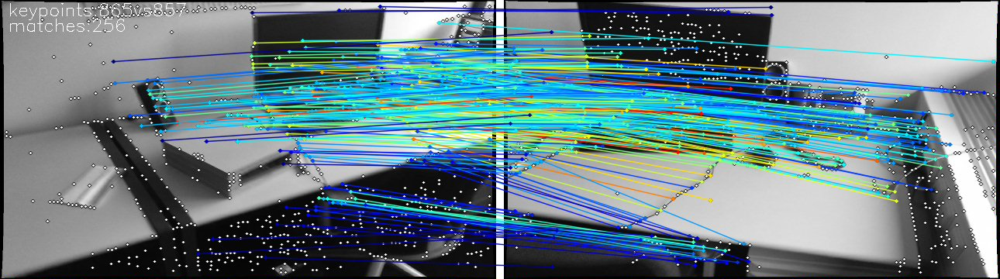

# C++例程

## 目录

* [1. 环境准备](#1-环境准备)
    * [1.1 x86 PCIe平台](#11-x86-pcie平台)
    * [1.2 SoC平台](#12-soc平台)
* [2. 程序编译](#2-程序编译)
    * [2.1 x86 PCIe平台](#21-x86-pcie平台)
    * [2.2 SoC平台](#22-soc平台)
* [3. 推理测试](#3-推理测试)
    * [3.1 参数说明](#31-参数说明)
    * [3.2 测试图片](#32-测试图片)

cpp目录下提供了C++例程以供参考使用，具体情况如下：
| 序号  | C++例程      | 说明                                 |
| ---- | ------------- | -----------------------------------  |
| 1    | superglue_bmcv   | 使用OpenCV解码、BMCV前处理、BMRT推理   |

## 1. 环境准备
### 1.1 x86PCIe平台
如果您在x86/arm平台安装了PCIe加速卡（如SC系列加速卡），可以直接使用它作为开发环境和运行环境。您需要安装libsophon、sophon-opencv和sophon-ffmpeg，具体步骤可参考[x86-pcie平台的开发和运行环境搭建](../../../docs/Environment_Install_Guide.md#3-x86-pcie平台的开发和运行环境搭建)。

### 1.2 SoC平台
如果您使用SoC平台（如SE、SM系列边缘设备），刷机后在`/opt/sophon/`下已经预装了相应的libsophon、sophon-opencv和sophon-ffmpeg运行库包，可直接使用它作为运行环境。通常还需要一台x86主机作为开发环境，用于交叉编译C++程序。

## 2. 程序编译
C++程序运行前需要编译可执行文件。
### 2.1 x86 PCIe平台

安装以下第三方依赖：
```bash
sudo apt install libopenblas-dev
```

可以直接在PCIe平台上编译程序：

#### 2.1.1 bmcv

```bash
cd cpp/superglue_bmcv
mkdir build && cd build
cmake .. 
make
cd ..
```
编译完成后，会在superglue_bmcv目录下生成superglue_bmcv.pcie。

### 2.2 SoC平台

通常在x86主机上（**本例程使用ubuntu20.04系统**）交叉编译程序，您需要在x86主机上使用SOPHON SDK搭建交叉编译环境，将程序所依赖的头文件和库文件打包至soc-sdk目录中，具体请参考[交叉编译环境搭建](../../../docs/Environment_Install_Guide.md#41-交叉编译环境搭建)。本例程主要依赖libsophon、sophon-opencv和sophon-ffmpeg运行库包以及一些第三方库，为了在x86上下载这些arm64架构的第三方库，您可能需要更换apt源，将如下源替换掉您`/etc/apt/source.list`里的源，**注意对原来的源做好备份**。

```bash
deb [arch=amd64] https://mirrors.aliyun.com/ubuntu/ focal main restricted universe multiverse
deb [arch=amd64] https://mirrors.aliyun.com/ubuntu/ focal-security main restricted universe multiverse
deb [arch=amd64] https://mirrors.aliyun.com/ubuntu/ focal-updates main restricted universe multiverse
deb [arch=amd64] https://mirrors.aliyun.com/ubuntu/ focal-backports main restricted universe multiverse
```

然后在`/etc/apt/sources.list.d/`目录下新建`arm-cross-compile-sources.list`文件，写入如下内容：
```bash
deb [arch=arm64] https://mirrors.aliyun.com/ubuntu-ports/ focal main restricted universe multiverse
deb [arch=arm64] https://mirrors.aliyun.com/ubuntu-ports/ focal-security main restricted universe multiverse
deb [arch=arm64] https://mirrors.aliyun.com/ubuntu-ports/ focal-updates main restricted universe multiverse
deb [arch=arm64] https://mirrors.aliyun.com/ubuntu-ports/ focal-backports main restricted universe multiverse
```

然后运行如下命令，下载第三方依赖：

```bash
sudo dpkg --add-architecture arm64
sudo apt update
sudo apt install libopenblas-dev:arm64
sudo apt install ccache:arm64
sudo apt install numactl:arm64
sudo apt install libhwloc-dev:arm64
sudo apt install libevent-dev:arm64
```

交叉编译环境搭建好后，使用交叉编译工具链编译生成可执行文件：

#### 2.2.1 bmcv

```bash
cd cpp/superglue_bmcv
mkdir build && cd build
#请根据实际情况修改-DSDK的路径，需使用绝对路径。
cmake -DTARGET_ARCH=soc -DSDK=/path_to_sdk/soc-sdk ..  
make
```
编译完成后，会在superglue_bmcv目录下生成superglue_bmcv.soc。

## 3. 推理测试
对于PCIe平台，可以直接在PCIe平台上推理测试；对于SoC平台，需将交叉编译生成的可执行文件及所需的模型、测试数据拷贝到SoC平台中测试。测试的参数及运行方式是一致的，下面主要以PCIe模式进行介绍。

### 3.1 参数说明
可执行程序默认有一套参数，请注意根据实际情况进行传参，superglue_bmcv.pcie为例，具体参数说明如下：
```bash
Usage: superglue_bmcv.pcie [params] 

        --bmodel_superglue (value:../../models/BM1688/superglue_fp32_1b_1024.bmodel)
                Path to bmodel.
        --bmodel_superpoint (value:../../models/BM1688/superpoint_fp32_1b.bmodel)
                Path to bmodel.
        --dev_id (value:0)
                TPU device id.
        --help (value:true)
                Print help information.
        --input_dir (value:../../datasets/scannet_sample_images)
                Path to the directory that contains the images.
        --input_pairs (value:../../datasets/scannet_sample_pairs_with_gt.txt)
                Path to the list of image pairs.
        --keypoint_thresh (value:0.0002)
                Keypoint threshold.
        --matching_thresh (value:0.002)
                Matching threshold.
        --max_keypoint_size (value:1024)
                Max keypoint size.
        --nms_radius (value:4)
                Nms radius.
```

### 3.2 测试图片

如果是在SoC平台上进行测试，需要安装如下第三方依赖并设置环境变量：
```bash
sudo apt install libopenblas-dev
export LD_LIBRARY_PATH=$PWD/../aarch64_lib/libtorch/lib:$LD_LIBRARY_PATH
```

图片测试实例如下：
```bash
./superglue_bmcv.pcie --bmodel_superglue=../../models/BM1688/superglue_fp32_1b_1024.bmodel --bmodel_superpoint=../../models/BM1688/superpoint_fp32_1b.bmodel --input_dir=../../datasets/scannet_sample_images --input_pairs=../../datasets/scannet_sample_pairs_with_gt.txt
```
测试结束后，会将图片保存在`results/images`下，匹配结果保存在`results/result.json`下，同时会打印性能信息。


