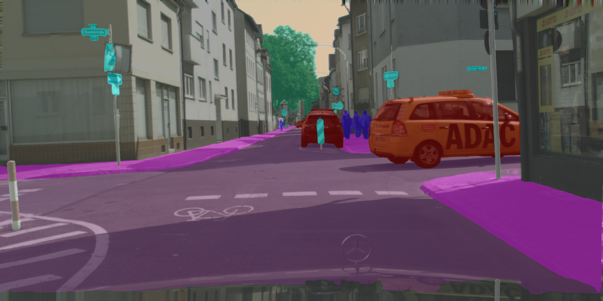

# C++例程
- [C++例程](#c例程)
  - [1. 环境准备](#1-环境准备)
    - [1.1 x86/arm PCIe平台](#11-x86arm-pcie平台)
    - [1.2 SoC平台](#12-soc平台)
  - [2. 程序编译](#2-程序编译)
    - [2.1 x86/arm PCIe平台](#21-x86arm-pcie平台)
    - [2.2 SoC平台](#22-soc平台)
  - [3. 推理测试](#3-推理测试)
    - [3.1 参数说明](#31-参数说明)
    - [3.2 测试图片](#32-测试图片)
    - [3.3 测试视频](#33-测试视频)

cpp 目录下提供了 C++ 例程以供参考使用，具体情况如下：
| 序号 | C++例程            | 说明                                      |
| ---- | ------------------ | ---------------------------------------- |
| 1    | yolo26_sem_bmcv    | 使用 SOPHON-OPENCV 解码、BMCV 前处理、BMRT 推理 |

## 1. 环境准备
### 1.1 x86/arm PCIe平台
如果您在 x86/arm/riscv 平台安装了 PCIe 加速卡（如 SC 系列加速卡），可以直接使用它作为开发环境和运行环境。您需要安装 libsophon、sophon-opencv 和 sophon-ffmpeg，具体步骤可参考 [x86-pcie平台的开发和运行环境搭建](../../../docs/Environment_Install_Guide.md#3-x86-pcie平台的开发和运行环境搭建) 或 [arm-pcie平台的开发和运行环境搭建](../../../docs/Environment_Install_Guide.md#5-arm-pcie平台的开发和运行环境搭建)。

### 1.2 SoC平台
如果您使用 SoC 平台（如 SE、SM 系列边缘设备），刷机后在 `/opt/sophon/` 下已经预装了相应的 libsophon、sophon-opencv 和 sophon-ffmpeg 运行库包，可直接使用它作为运行环境。通常还需要一台 x86 主机作为开发环境，用于交叉编译 C++ 程序。

## 2. 程序编译
C++ 程序运行前需要编译可执行文件。
### 2.1 x86/arm PCIe平台
可以直接在 PCIe 平台上编译程序：

```bash
cd cpp/yolo26_sem_bmcv
mkdir build && cd build
cmake ..
make
cd ..
```
编译完成后，会在 `yolo26_sem_bmcv` 目录下生成 `yolo26_sem_bmcv.pcie`。

### 2.2 SoC平台
通常在 x86 主机上交叉编译程序，您需要在 x86 主机上使用 SOPHON SDK 搭建交叉编译环境，将程序所依赖的头文件和库文件打包至 soc-sdk 目录中，具体请参考 [交叉编译环境搭建](../../../docs/Environment_Install_Guide.md#41-交叉编译环境搭建)。本例程主要依赖 libsophon、sophon-opencv 和 sophon-ffmpeg 运行库包。

交叉编译环境搭建好后，使用交叉编译工具链编译生成可执行文件：

```bash
cd cpp/yolo26_sem_bmcv
mkdir build && cd build
# 请根据实际情况修改 -DSDK 的路径，需使用绝对路径
cmake -DTARGET_ARCH=soc -DSDK=/path_to_sdk/soc-sdk ..
make
```
编译完成后，会在 `yolo26_sem_bmcv` 目录下生成 `yolo26_sem_bmcv.soc`。

## 3. 推理测试
对于 PCIe 平台，可以直接在 PCIe 平台上推理测试；对于 SoC 平台，需将交叉编译生成的可执行文件及所需的模型、测试数据拷贝到 SoC 平台中测试。测试的参数及运行方式是一致的，下面主要以 SoC 模式进行介绍。

### 3.1 参数说明
可执行程序默认有一套参数，请注意根据实际情况进行传参，具体参数说明如下：
```bash
Usage: yolo26_sem_bmcv.soc [params]

        --bmodel (value:../../models/BM1684X/yolo26s_fp32_1b.bmodel)
                bmodel file path
        --dev_id (value:0)
                TPU device id
        --help (value:true)
                print help information.
        --input (value:../../datasets/test)
                input path, images direction or video.
```
**注意：** CPP 传参与 python 不同，需要用等于号，例如 `./yolo26_sem_bmcv.soc --bmodel=xxx`。

### 3.2 测试图片
图片测试实例如下，支持对整个图片文件夹进行测试（递归）。
```bash
./yolo26_sem_bmcv.soc --input=../../datasets/test --bmodel=../../models/BM1688/yolo26s_fp32_1b.bmodel --dev_id=0
```
测试结束后，会把融合可视化的结果图保存在 `results/images/` 下，逐像素类别图（灰度 segmap，用于精度评测）保存在 `results/segmaps/` 下，同时打印推理时间等信息。



### 3.3 测试视频
视频测试实例如下，支持对视频流进行测试。
```bash
./yolo26_sem_bmcv.soc --input=../../datasets/cityscapes_video.avi --bmodel=../../models/BM1688/yolo26s_fp32_1b.bmodel --dev_id=0
```
测试结束后，会把融合后的结果保存在 `results/output.mp4` 中，同时打印推理时间等信息。