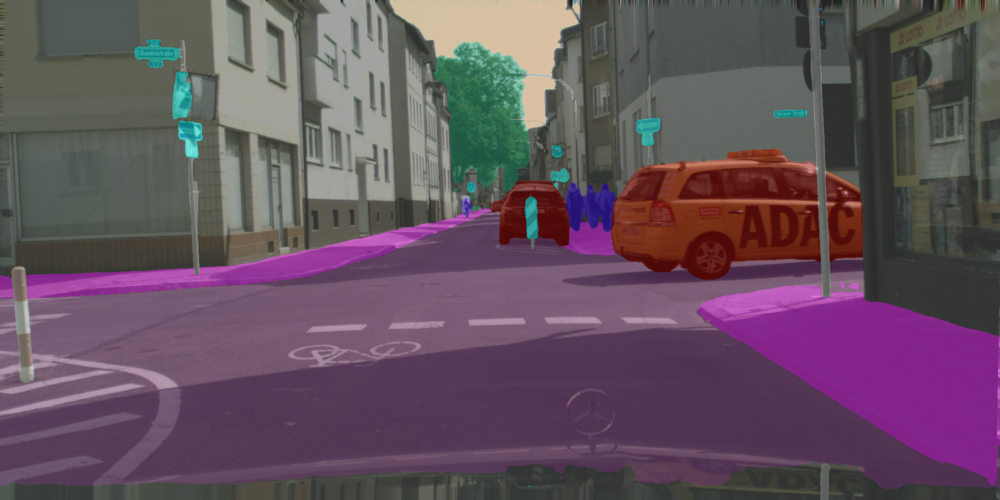

# Python例程
- [Python例程](#python例程)
  - [1. 环境准备](#1-环境准备)
    - [1.1 x86/arm PCIe平台](#11-x86arm-pcie平台)
    - [1.2 SoC平台](#12-soc平台)
  - [2. 推理测试](#2-推理测试)
    - [2.1 参数说明](#21-参数说明)
    - [2.2 测试图片](#22-测试图片)
    - [2.3 测试视频](#23-测试视频)

python 目录下提供了一系列 Python 例程，具体情况如下：

| 序号 | Python例程            | 说明                                |
| ---- | --------------------- | ----------------------------------- |
| 1    | yolo26_sem_opencv.py  | 使用 OpenCV 解码、OpenCV 前处理、SAIL 推理 |
| 2    | yolo26_sem_bmcv.py    | 使用 SAIL 解码、BMCV 前处理、SAIL 推理 |

## 1. 环境准备
### 1.1 x86/arm PCIe平台

如果您在 x86/arm 平台安装了 PCIe 加速卡（如 SC 系列加速卡），并使用它测试本例程，您需要安装 libsophon、sophon-opencv、sophon-ffmpeg 和 sophon-sail，具体请参考 [x86-pcie平台的开发和运行环境搭建](../../../docs/Environment_Install_Guide.md#3-x86-pcie平台的开发和运行环境搭建) 或 [arm-pcie平台的开发和运行环境搭建](../../../docs/Environment_Install_Guide.md#5-arm-pcie平台的开发和运行环境搭建)。

此外您可能还需要安装其他第三方库：
```bash
pip3 install opencv-python-headless
```

### 1.2 SoC平台

如果您使用 SoC 平台（如 SE、SM 系列边缘设备），并使用它测试本例程，刷机后在 `/opt/sophon/` 下已经预装了相应的 libsophon、sophon-opencv 和 sophon-ffmpeg 运行库包。

此外您可能还需要安装 `sophon-sail` 和其他第三方库：
```bash
pip3 install dfss --upgrade
python3 -m dfss --install sail
pip3 install opencv-python-headless
```

> **注：**
>
> 上述命令安装的 opencv 是公版 opencv，如果您希望使用 sophon-opencv，可以设置如下环境变量：
> ```bash
> export PYTHONPATH=$PYTHONPATH:/opt/sophon/sophon-opencv-latest/opencv-python/
> ```
> **若使用 sophon-opencv 需要保证 python 版本小于等于 3.8。**

## 2. 推理测试
python 例程不需要编译，可以直接运行，PCIe 平台和 SoC 平台的测试参数和运行方式是相同的。

### 2.1 参数说明
`yolo26_sem_opencv.py` 和 `yolo26_sem_bmcv.py` 的参数一致，以 `yolo26_sem_opencv.py` 为例：
```bash
usage: yolo26_sem_opencv.py [--input INPUT_PATH] [--bmodel BMODEL] [--dev_id DEV_ID]
--input:  测试数据路径，可输入整个图片文件夹的路径或视频路径；
--bmodel: 用于推理的 bmodel 路径；
--dev_id: 用于推理的 tpu 设备 id；
```

### 2.2 测试图片
图片测试实例如下，支持对整个图片文件夹进行测试。
```bash
# 在例程根目录（sample/YOLO26_sem）下执行
python3 python/yolo26_sem_opencv.py --input ./datasets/test --bmodel models/BM1684X/yolo26s_fp32_1b.bmodel --dev_id 0
python3 python/yolo26_sem_bmcv.py   --input ./datasets/test --bmodel models/BM1684X/yolo26s_fp32_1b.bmodel --dev_id 0
```
测试结束后，会把融合可视化的结果图保存在 `results/images/` 下，逐像素类别图（灰度 segmap）保存在 `results/segmaps/` 下，同时打印推理时间等信息。



### 2.3 测试视频
视频测试实例如下，支持对视频流进行测试。
```bash
python3 python/yolo26_sem_opencv.py --input datasets/cityscapes_video.avi --bmodel models/BM1684X/yolo26s_fp32_1b.bmodel --dev_id 0
python3 python/yolo26_sem_bmcv.py   --input datasets/cityscapes_video.avi --bmodel models/BM1684X/yolo26s_fp32_1b.bmodel --dev_id 0
```
测试结束后，`yolo26_sem_opencv.py` 会把融合结果写在 `results/cityscapes_video.avi` 中，`yolo26_sem_bmcv.py` 会把融合结果写在 `results/output.mp4` 中，同时打印推理时间等信息。