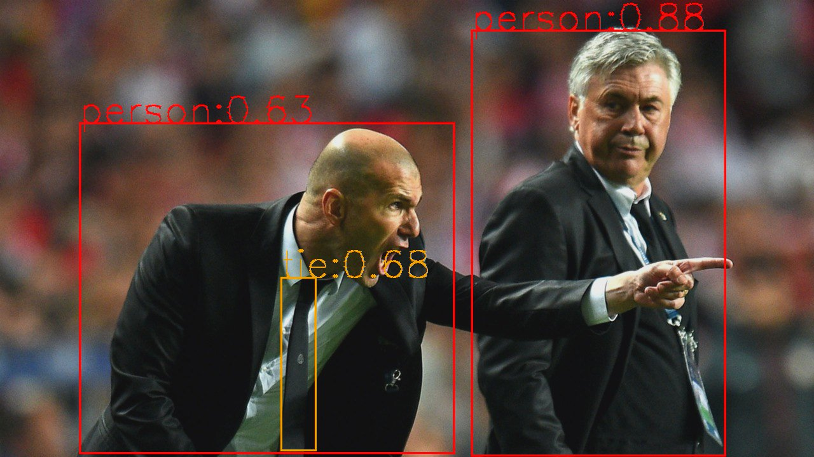
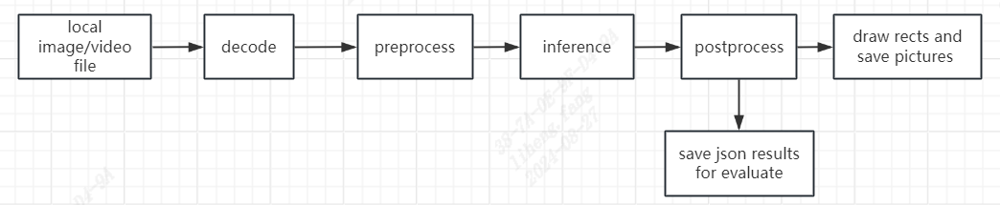

[简体中文](./README.md) | [English](./README_EN.md)

# C++例程

## 目录

- [C++例程](#c例程)
  - [目录](#目录)
  - [1. 环境准备](#1-环境准备)
    - [1.1 x86 PCIe平台](#11-x86-pcie平台)
  - [2. 程序编译](#2-程序编译)
    - [2.1 x86 PCIe平台](#21-x86-pcie平台)
      - [2.1.1 bmcv](#211-bmcv)
  - [3. 推理测试](#3-推理测试)
    - [3.1 参数说明](#31-参数说明)
    - [3.2 测试图片](#32-测试图片)
    - [3.3 测试视频](#33-测试视频)
    - [4. 流程图](#4-流程图)

cpp目录下提供了C++例程以供参考使用，具体情况如下：
| 序号  | C++例程      | 说明                                 |
| ---- | ------------- | -----------------------------------  |
| 1    | yolov5_bmcv   | 使用FFmpeg解码、BMCV前处理、tpuv7-rt推理   |

## 1. 环境准备
### 1.1 x86 PCIe平台
目前仅支持在x86 PCIe平台测试本例程。运行本例程需要安装tpuv7-driver、tpuv7-runtime、sophon-bmcv、sophon-ffmpeg和sophon-opencv。

## 2. 程序编译
C++程序运行前需要编译可执行文件。
### 2.1 x86 PCIe平台
可以直接在PCIe平台上编译程序：
#### 2.1.1 bmcv
```bash
cd cpp/yolov5_bmcv
mkdir build && cd build
cmake .. 
make
cd ..
```
编译完成后，会在yolov5_bmcv目录下生成yolov5_bmcv.pcie。


## 3. 推理测试
对于PCIe平台，可以直接在PCIe平台上推理测试；对于SoC平台，需将交叉编译生成的可执行文件及所需的模型、测试数据拷贝到SoC平台中测试。测试的参数及运行方式是一致的，下面主要以PCIe模式进行介绍。

### 3.1 参数说明
可执行程序默认有一套参数，请注意根据实际情况进行传参，以yolov5_bmcv.pcie为例，具体参数说明如下：
```bash
Usage: yolov5_bmcv.pcie [params]

        --bmodel (value:../../models/BM1690/yolov5s_v6.1_3output_fp32_1b.bmodel)
                bmodel file path
        --classnames (value:../../datasets/coco.names)
                class names file path
        --conf_thresh (value:0.001)
                confidence threshold for filter boxes
        --dev_id (value:0)
                TPU device id
        --help (value:true)
                print help information.
        --input (value:../../datasets/test)
                input path, images direction or video file path
        --nms_thresh (value:0.6)
                iou threshold for nms
        --use_cpu_opt (value:false)
                accelerate cpu postprocess
```
> **注意：** cpp例程传参与python不同，需要用等于号，例如`./yolov5_bmcv.pcie --bmodel=xxx`。cpp可以使用`--use_cpu_opt=true`开启后处理cpu加速，`use_cpu_opt`仅限输出维度为5的模型(一般是3输出，别的输出个数可能需要用户自行修改后处理代码)。

### 3.2 测试图片
图片测试实例如下，支持对整个图片文件夹进行测试。
```bash
./yolov5_bmcv.pcie --input=../../datasets/test --bmodel=../../models/BM1690/yolov5s_v6.1_3output_fp32_1b.bmodel --dev_id=0 --conf_thresh=0.5 --nms_thresh=0.5 --classnames=../../datasets/coco.names 
```
测试结束后，会将预测的图片保存在`results/images`下，预测的结果保存在`results/yolov5s_v6.1_3output_fp32_1b.bmodel_test_bmcv_cpp_result.json`下，同时会打印预测结果、推理时间等信息。



> **注意**：  
> 1.cpp例程暂时没有在图片上写字。

### 3.3 测试视频
视频测试实例如下，支持对视频流进行测试。
```bash
./yolov5_bmcv.pcie --input=../../datasets/test_car_person_1080P.mp4 --bmodel=../../models/BM1690/yolov5s_v6.1_3output_fp32_1b.bmodel --dev_id=0 --conf_thresh=0.5 --nms_thresh=0.5 --classnames=../../datasets/coco.names
```
测试结束后，会将预测结果画在图片上并保存在`results/images`中，同时会打印预测结果、推理时间等信息。

### 4. 流程图

`yolov5_bmcv`的处理流程，遵循以下流程图：

