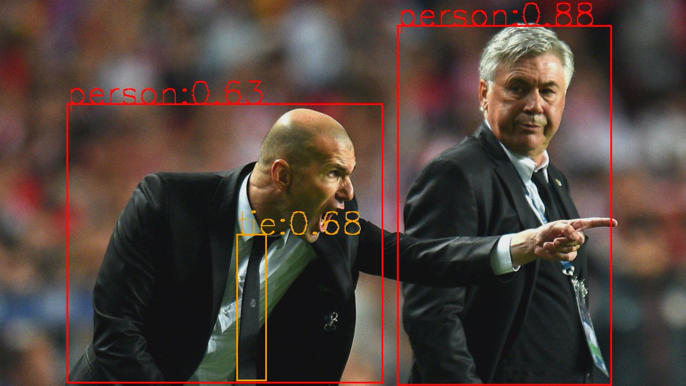

[简体中文](./README.md) | [English](./README_EN.md)

# C++ Demo
* [C++ Demo](#c-demo)
    * [1. Environments Preparation](#1-environments-preparation)
        * [1.1 x86/arm PCIe Platform](#11-x86arm-pcie-platform)
        * [1.2 SoC Platform](#12-soc-platform)
    * [2. Program Compilation](#2-program-compilation)
        * [2.1 x86/arm PCIe Platform](#21-x86arm-pcie-platform)
        * [2.2 SoC Platform](#22-soc-platform)
    * [3. Inference Test](#3-inference-test)
        * [3.1 Parameter Description](#31-parameter-description)
        * [3.2 Image Test Demo](#32-image-test-demo)
        * [3.3 Video Test Demo](#33-video-test-demo)

C++ demo is provided in the cpp directory for reference, the details are as follows:
| No.  | C++ demo      | Description                                 |
| ---- | ------------- | -----------------------------------  |
| 1    | yolov5_bmcv   | Decoding with FFmpeg, preprocessing with BMCV, inference with BMRT   |
| 2    | yolov5_sail   | Decoding with SAIL, preprocessing with SAIL, inference with SAIL   |

## 1. Environments Preparation
### 1.1 x86/arm PCIe Platform
If you have installed a PCIe accelerator card (such as an SC series accelerator card) on the x86/arm platform, you can directly use it as a development environment and a runtime environment. You need to install libsophon, sophon-opencv and sophon-ffmpeg. For specific steps, please refer to [Construction of Development and Runtime Environment of x86-PCIe Platform](../../../docs/Environment_Install_Guide_EN.md#3-x86-pcie-platform-development-and-runtime-environment-construction) or [Construction of Development and Runtime Environment of arm-PCIe Platform](../../../docs/Environment_Install_Guide_EN.md#5-arm-pcie-platform-development-and-runtime-environment-construction).

### 1.2 SoC Platform
If you use the SoC platform (such as SE, SM series edge devices), the corresponding libsophon, sophon-opencv and sophon-ffmpeg runtime packages have been pre-installed under `/opt/sophon/` after resetting the operating system, and you can use it directly as runtime environment. Usually an x86 host is also required as a development environment for cross-compiling C++ programs.


## 2. Program Compilation
C++ programs need to compile executable files before running.
### 2.1 x86/arm PCIe Platform
Programs can be compiled directly on the PCIe platform:
#### 2.1.1 bmcv
```bash
cd cpp/yolov5_bmcv
mkdir build && cd build
cmake .. 
make
cd ..
```
After the compilation is complete, yolov5_bmcv.pcie will be generated in the yolov5_bmcv directory.

#### 2.1.2 sail
If you use sophon-sail, you should refer to [sophon-sail install guide](../../../docs/Environment_Install_Guide_EN.md#33-compilation-and-installation-of-sophon-sail)，configure sophon-sail for your sys，then:
```bash
cd cpp/yolov5_sail
mkdir build && cd build
cmake ..
make
cd ..
```
After the compilation is complete, yolov5_sail.pcie will be generated in the yolov5_bmcv directory.
### 2.2 SoC Platform
The cross-compilation program is usually on the x86 host. User need to use the SOPHON SDK to build a cross compilation environment on the x86 host, and package the header files and library files that the program depends on into the soc-sdk directory. For details, please refer to [Cross-Compilation Environment Construction](../../../docs/Environment_Install_Guide_EN.md#41-cross-compiling-environment-construction). This demo mainly depends on libsophon, sophon-opencv and sophon-ffmpeg runtime library packages.

After the cross compilation environment is set up, use the cross compilation toolchain to compile and generate executable files:
#### 2.2.1 bmcv
```bash
cd cpp/yolov5_bmcv
mkdir build && cd build
#Please modify the path of -DSDK according to the actual situation, here need to use the absolute path.
cmake -DTARGET_ARCH=soc -DSDK=/path_to_sdk/soc-sdk ..  
make
```
After the compilation is complete, yolov5_bmcv.soc will be generated in the yolov5_bmcv directory.
#### 2.2.2 sail
If you use sophon-sail, you should refer to [cross compile sophon-sail](../../../docs/Environment_Install_Guide_EN.md#42-cross-compiling-and-sophon-sail-installation)，configure sophon-sail for your soc，then:
```bash
cd cpp/yolov5_sail
mkdir build && cd build
#Please modify the path of -DSDK and -DSAIL according to the actual situation, here need to use the absolute path.
cmake -DTARGET_ARCH=soc -DSDK=/path_to_sdk/soc-sdk -DSAIL_PATH=/path_to_sail/sophon-sail/build_soc/sophon-sail ..
make
```
After the compilation is complete, yolov5_sail.soc will be generated in the yolov5_bmcv directory.

## 3. Inference Test
For the PCIe platform, user can directly reason and test on the PCIe platform. For the SoC platform, the executable file generated by cross compilation and the required model and test data need to be copied to the SoC platform for testing. The parameters and operation modes of the inference tests on the two platforms are the same, and the following will mainly introduce the PCIe mode.

### 3.1 Parameter Description
The executable program has a set of parameters by default. Please pay attention to pass the parameters according to the actual situation. `yolov5_bmcv.pcie and yolov5_sail.pcie has same parameters.` The specific parameters are described as follows:
```bash
Usage: yolov5_bmcv.pcie [params]

        --bmodel (value:../../models/BM1684/yolov5s_v6.1_3output_fp32_1b.bmodel)
                bmodel file path
        --classnames (value:../../datasets/coco.names)
                class names file path
        --conf_thresh (value:0.5)
                confidence threshold for filter boxes
        --dev_id (value:0)
                TPU device id
        --help (value:true)
                print help information.
        --input (value:../../datasets/test)
                input path, images direction or video file path
        --nms_thresh (value:0.5)
                iou threshold for nms
        --obj_thresh (value:0.5)
                object score threshold for filter boxes
```
> **Note:** The method of passing parameters in C++ is different from that in Python. The method of passing parameters in C++ needs to use the equal sign. For example `./yolov5_bmcv.pcie --bmodel=xxx`.

### 3.2 Image Test Demo
The image test demo is as follows. It supports testing the entire image folder. The model supports fp32bmodel and int8bmodel, supports BM1684 and BM1684X, and supports single batch size or multiple batch sizes. Users can run model testing by passing in the corresponding model path parameters.
```bash
./yolov5_bmcv.pcie --input=../../datasets/test --bmodel=../../models/BM1684/yolov5s_v6.1_3output_fp32_1b.bmodel --dev_id=0 --conf_thresh=0.5 --nms_thresh=0.5 --obj_thresh=0.5 --classnames=../../datasets/coco.names 
```
After the test, the predicted images will be saved in `results/images`, the predicted results will be saved in `results/yolov5s_v6.1_3output_fp32_1b.bmodel_test_bmcv_cpp_result.json`, and the prediction results, inference time and other information will be printed at the same time.




### 3.3 Video Test Demo
The video test demo is as follows, which supports testing of video streams. The model supports fp32bmodel and int8bmodel, supports BM1684 and BM1684X, and supports single batch size or multiple batch sizes. Users can run model testing by passing in the corresponding model path parameters.
```bash
./yolov5_bmcv.pcie --input=../../datasets/test_car_person_1080P.mp4 --bmodel=../../models/BM1684/yolov5s_v6.1_3output_fp32_1b.bmodel --dev_id=0 --conf_thresh=0.5 --nms_thresh=0.5 --obj_thresh=0.5 --classnames=../../datasets/coco.names
```
After the test, the prediction results will be drawn on the images and saved in `results/images`, and the prediction results, inference time and other information will be printed at the same time.

>**Note:**

If this error is reported on SoC:
```bash
./yolov5_sail.soc: error while loading shared libraries: libsail.so: cannot open shared object file: No such file or directory
```
Please do this:
```bash
export LD_LIBRARY_PATH=$LD_LIBRARY_PATH:/opt/sophon/sophon-sail/lib
```
