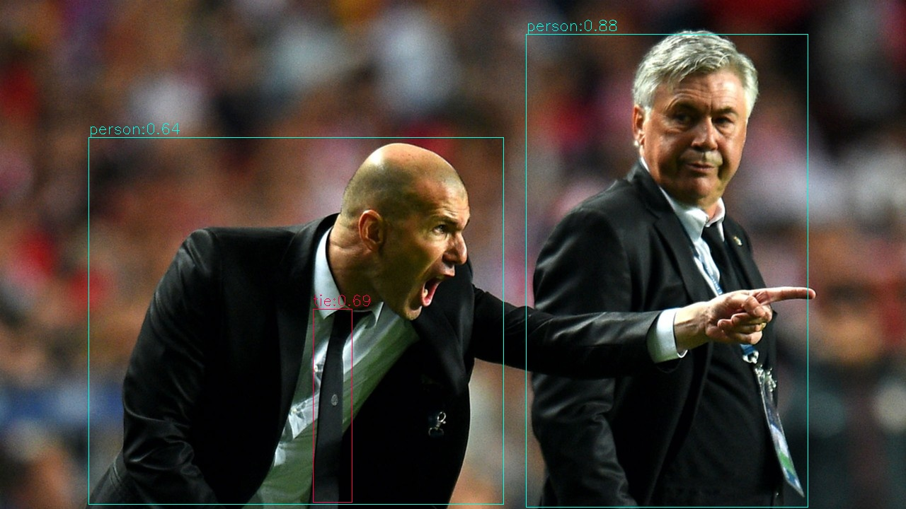

[简体中文](./README.md) | [English](./README_EN.md)

# Python例程

## 目录

- [Python例程](#python例程)
  - [目录](#目录)
  - [1. 环境准备](#1-环境准备)
    - [1.1 x86 PCIe / riscv64 SoC平台](#11-x86-pcie--riscv64-Soc平台)
  - [2. 推理测试](#2-推理测试)
    - [2.1 参数说明](#21-参数说明)
    - [2.2 测试图片](#22-测试图片)
    - [2.3 测试视频](#23-测试视频)
    - [3. 流程图](#3-流程图)

python目录下提供了一系列Python例程，具体情况如下：

| 序号 |  Python例程      | 说明                                |
| ---- | ---------------- | -----------------------------------  |
| 1    | yolov5_opencv.py | 使用OpenCV解码、OpenCV前处理、SAIL推理 |

## 1. 环境准备
### 1.1 x86 PCIe / riscv64 SoC平台

目前支持在x86 PCIe和riscv64 SoC平台测试本例程。除了安装tpuv7-driver、tpuv7-runtime和sophon-sail之外，您还需要配置opencv等其他第三方库。

在x86 PCIe平台，您可以直接安装第三方库：

```bash
pip3 install opencv-python-headless
```

而在riscv64平台，如果您使用的是openEuler或fedora系统，在安装opencv-python-headless第三方库之前，您还需要安装必要的构建工具：

```bash
sudo dnf install ninja-build
sudo dnf groupinstall "Development Tools"
sudo dnf install cmake automake autoconf libtool
sudo dnf install openssl-devel
pip3 install opencv-python-headless #尝试使用pip安装第三方包。
```

## 2. 推理测试
python例程不需要编译，可以直接运行。
### 2.1 参数说明

yolov5_bmcv.py的参数与yolov5_opencv.py相同，但**目前只支持测试视频文件和batch size=1的模型**。

以下命令均使用yolov5_opencv.py作为示例。

yolov5_opencv.py的运行方法：
```bash
usage: yolov5_opencv.py [-h] [--input INPUT] [--bmodel BMODEL] [--dev_id DEV_ID] [--conf_thresh CONF_THRESH] [--nms_thresh NMS_THRESH]

optional arguments:
  -h, --help            打印这个帮助日志然后退出
  --input INPUT         测试数据路径，可输入整个图片文件夹的路径或者视频路径
  --bmodel BMODEL       用于推理的bmodel路径，默认使用stage 0的网络进行推理
  --dev_id DEV_ID       用于推理的tpu设备id
  --conf_thresh CONF_THRESH
                        置信度阈值
  --nms_thresh NMS_THRESH
                        nms阈值
```


### 2.2 测试图片
图片测试实例如下，支持对整个图片文件夹进行测试。
```bash
python3 python/yolov5_opencv.py --input datasets/coco/val2017_1000 --bmodel models/BM1690/yolov5s_v6.1_3output_int8_1b.bmodel --dev_id 0 --conf_thresh 0.001 --nms_thresh 0.6
```
测试结束后，会将预测的图片保存在`results/images`下，预测的结果保存在`results/yolov5s_v6.1_3output_int8_1b.bmodel_val2017_1000_opencv_python_result.json`下，同时会打印预测结果、推理时间等信息。




### 2.3 测试视频
视频测试实例如下，支持对视频流进行测试。
```bash
python3 python/yolov5_opencv.py --input datasets/test_car_person_1080P.mp4 --bmodel models/BM1690/yolov5s_v6.1_3output_int8_1b.bmodel --dev_id 0 --conf_thresh 0.5 --nms_thresh 0.5
```
测试结束后，会将预测的结果画在`results/test_car_person_1080P.avi`中，同时会打印预测结果、推理时间等信息。  
本目录提供的例程不会保存视频，而是会将预测结果画在图片上并保存在`results/images`中。


### 3. 流程图

`yolov5_opencv.py`中的处理流程遵循下图：

