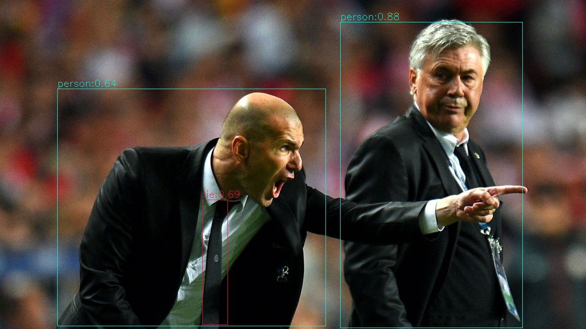

[简体中文](./README.md) | [English](./README_EN.md)

# Python Demo
* [Python Demo](#python-demo)
    * [1. Environments Preparation](#1-environments-preparation)
        * [1.1 x86/arm PCIe Platform](#11-x86arm-pcie-platform)
        * [1.2 SoC Platform](#12-soc-platform)
    * [2. Inference Test](#2-inference-test)
        * [2.1 Parameter Description](#21-parameter-description)
        * [2.2 Image Test Demo](#22-image-test-demo)
        * [2.3 Video Test Demo](#23-video-test-demo)

A series of Python demos are provided under the python directory, the details are as follows:

| No. |  Python Demo      | Description                     |
| ---- | ---------------- | -----------------------------------  |
| 1    | yolov5_opencv.py | Decoding and preprocessing with OpenCV, Inference with SAIL |
| 2    | yolov5_bmcv.py   | Decoding with SAIL, preprocessing with BMCV, Inference with SAIL |

## 1. Environments Preparation
### 1.1 x86/arm PCIe Platform

If you have installed a PCIe accelerator card (such as SC series accelerator card) on the x86/arm platform and use it to test these demos, you need to install libsophon, sophon-opencv, sophon-ffmpeg and sophon-sail. For specific steps, please refer to [Construction of Development and Runtime Environment of x86-PCIe Platform](../../../docs/Environment_Install_Guide_EN.md#3-x86-pcie-platform-development-and-runtime-environment-construction) or [Construction of Development and Runtime Environment of arm-PCIe Platform](../../../docs/Environment_Install_Guide_EN.md#5-arm-pcie-platform-development-and-runtime-environment-construction).

In addition, you need to install other third-party libraries:
```bash
pip3 install opencv-python-headless
```

### 1.2 SoC Platform

If you use the SoC platform (such as SE, SM series edge devices), the corresponding libsophon, sophon-opencv and sophon-ffmpeg runtime packages have been pre-installed under `/opt/sophon/` after resetting the operating system. You also need to cross compile and install sophon-sail, for details, please refer to [Cross Compile and Install sophon-sail](../../../docs/Environment_Install_Guide_EN.md#42-cross-compiling-and-sophon-sail-installation)。

In addition, you need to install other third-party libraries:
```bash
pip3 install opencv-python-headless
```

## 2. Inference Test
The python demo does not need to be compiled and can be run directly. The test parameters and operation methods of PCIe platform and SoC platform are the same.
### 2.1 Parameter Description
The parameters of yolov5_opencv.py and yolov5_bmcv.py are the same. Here we take yolov5_opencv.py as an example:
```bash
usage: yolov5_opencv.py [--input INPUT_PATH] [--bmodel BMODEL] [--dev_id DEV_ID]
                        [--conf_thresh CONF_THRESH] [--nms_thresh NMS_THRESH]
--input: The test data path. User can enter the path of the entire picture folder or video path;
--bmodel: bmodel path for inference. By default, the stage 0 network is used for inference;
--dev_id: tpu device id for inference;
--conf_thresh: confidence threshold;
--nms_thresh: Non-Maximum Suppression threshold;
--use_cpu_opt: Whether to use nms acceleration.
```

> **Note:** Currently, both CPP and Python default to disable nms acceleration. The optimization interface called by Python relies on SOPHON sail after version 3.7.0. If your SOPHON sail version has this interface, you can use the parameter `--use_cpu_opt` to enable the optimization.

### 2.2 Image Test Demo
The image test demo is as follows. It supports testing the entire image folder. The model supports fp32bmodel and int8bmodel, supports BM1684 and BM1684X, and supports single batch size or multiple batch sizes. Users can run model testing by passing in the corresponding model path parameters.
```bash
python3 python/yolov5_opencv.py --input datasets/test --bmodel models/BM1684/yolov5s_v6.1_3output_fp32_1b.bmodel --dev_id 0 --conf_thresh 0.5 --nms_thresh 0.5 --use_cpu_opt
```
After the test, the predicted image will be saved in `results/images`, the predicted result will be saved in `results/yolov5s_v6.1_3output_fp32_1b.bmodel_test_opencv_python_result.json`, and information such as predicted results and inference time will be printed at the same time.


> **Note**：  
> 1.cpp example do not write on frame.


### 2.3 Video Test Demo
The video test demo is as follows, which supports testing of video streams. The model supports fp32bmodel and int8bmodel, supports BM1684 and BM1684X, and supports single batch size or multiple batch sizes. Users can run model testing by passing in the corresponding model path parameters.
```bash
python3 python/yolov5_opencv.py --input datasets/test_car_person_1080P.mp4 --bmodel models/BM1684/yolov5s_v6.1_3output_fp32_1b.bmodel --dev_id 0 --conf_thresh 0.5 --nms_thresh 0.5 --use_cpu_opt
```
After the test, the predicted results will be drawn in `results/test_car_person_1080P.avi`, and information such as predicted results and inference time will be printed at the same time.
`yolov5_bmcv.py` do not save results as video, it will save results as images in `results/images` instead. 
