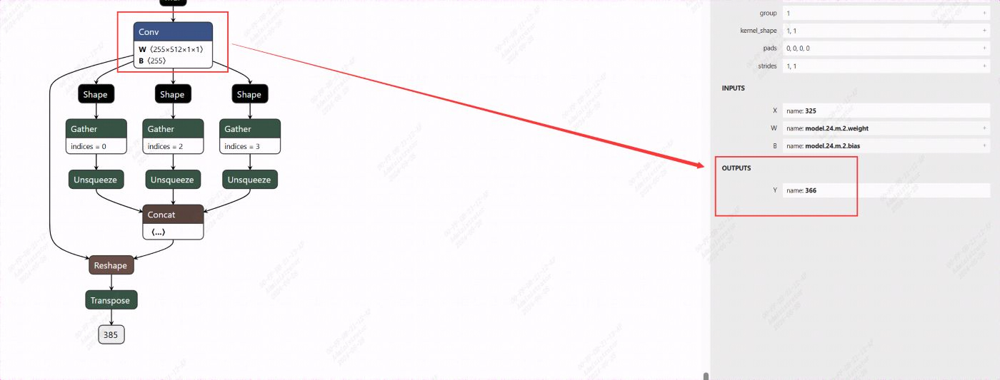

[简体中文](./README.md)

# YOLOv5_fuse

## 目录

- [YOLOv5\_fuse](#yolov5_fuse)
  - [目录](#目录)
  - [1. 简介](#1-简介)
  - [2. 特性](#2-特性)
  - [3. 准备模型与数据](#3-准备模型与数据)
  - [4. 模型编译](#4-模型编译)
  - [5. 例程测试](#5-例程测试)
  - [6. 精度测试](#6-精度测试)
    - [6.1 测试方法](#61-测试方法)
    - [6.2 测试结果](#62-测试结果)
  - [7. 性能测试](#7-性能测试)
    - [7.1 bmrt\_test](#71-bmrt_test)
    - [7.2 程序运行性能](#72-程序运行性能)
    - [7.3 程序运行端到端性能对比](#73-程序运行端到端性能对比)
  - [8. FAQ](#8-faq)
  
## 1. 简介
本例程基于[YOLOv5](../YOLOv5/README.md)，将前处理和后处理融合到模型中，使用tpu硬件对前后处理进行加速，可以有效提升前后处理的速度。

## 2. 特性
* 将前后处理融入模型中
* 支持使用tpu硬件进行前后处理加速
* 支持BM1684X(x86 PCIe、SoC)、BM1688/CV186X(SoC)
* 支持FP32、FP16、INT8模型编译和推理
* 支持python和C++推理
* 支持单batch和多batch模型推理
* 支持图片和视频测试

## 3. 准备模型与数据
建议使用TPU-MLIR编译BModel，Pytorch模型在编译前要导出成onnx模型，如果您使用的tpu-mlir版本>=v1.6.0，可以直接使用torchscript模型。具体可参考[YOLOv5模型导出](./docs/YOLOv5_Export_Guide.md)。

​同时，您需要准备用于测试的数据集，如果量化模型，还要准备用于量化的数据集。

​本例程在`scripts`目录下提供了相关模型和数据的下载脚本`download.sh`，您也可以自己准备模型和数据集，并参考[4. 模型编译](#4-模型编译)进行模型转换。

```bash
# 安装unzip，若已安装请跳过，非ubuntu系统视情况使用yum或其他方式安装
sudo apt install unzip
chmod -R +x scripts/
./scripts/download.sh
```

下载的模型包括：
```
./models
├── BM1684X
│   ├── yolov5s_v6.1_fuse_fp16_1b.bmodel
│   ├── yolov5s_v6.1_fuse_fp32_1b.bmodel
│   ├── yolov5s_v6.1_fuse_int8_1b.bmodel
│   └── yolov5s_v6.1_fuse_int8_4b.bmodel
├── CV186X
│   ├── yolov5s_v6.1_fuse_fp16_1b.bmodel
│   ├── yolov5s_v6.1_fuse_fp32_1b.bmodel
│   ├── yolov5s_v6.1_fuse_int8_1b.bmodel
│   └── yolov5s_v6.1_fuse_int8_4b.bmodel
├── BM1688
│   ├── yolov5s_v6.1_fuse_fp16_1b_2core.bmodel
│   ├── yolov5s_v6.1_fuse_fp16_1b.bmodel
│   ├── yolov5s_v6.1_fuse_fp32_1b_2core.bmodel
│   ├── yolov5s_v6.1_fuse_fp32_1b.bmodel
│   ├── yolov5s_v6.1_fuse_int8_1b_2core.bmodel
│   ├── yolov5s_v6.1_fuse_int8_1b.bmodel
│   ├── yolov5s_v6.1_fuse_int8_4b_2core.bmodel
│   └── yolov5s_v6.1_fuse_int8_4b.bmodel
└── onnx
  └── yolov5s_v6.1_3output.onnx            # 导出的onnx动态模型 
```
以上bmodel模型均由yolov5s_v6.1_3output.onnx模型通过TPU-MLIR编译，bmodel模型名称中`1b`表示batch_size=1, `2core`表示num_core=2（适配BM1688）。

下载的数据包括：
```
./datasets
├── test                                      # 测试图片
├── test_car_person_1080P.mp4                 # 测试视频
├── coco.names                                # coco类别名文件
├── coco128                                   # coco128数据集，用于模型量化
└── coco                                      
    ├── val2017_1000                          # coco val2017_1000数据集：coco val2017中随机抽取的1000张样本
    └── instances_val2017_1000.json           # coco val2017_1000数据集标签文件，用于计算精度评价指标  
```

## 4. 模型编译
导出的模型需要编译成BModel才能在SOPHON TPU上运行，建议使用TPU-MLIR编译BModel。

模型编译前需要安装TPU-MLIR，具体可参考[TPU-MLIR环境搭建](../../docs/Environment_Install_Guide.md#1-tpu-mlir环境搭建)。安装好后需在TPU-MLIR环境中进入例程目录。使用TPU-MLIR将onnx模型编译为BModel，具体方法可参考《TPU-MLIR快速入门手册》的“3. 编译ONNX模型”(请从[算能官网](https://developer.sophgo.com/site/index/material/all/all.html)相应版本的SDK中获取)。  

本例程在模型生成过程中，需要先执行`./scripts/gen_mlir.sh`生成mlir文件（`yolov5s_v6.1_3output_1b.mlir`、`yolov5s_v6.1_3output_4b.mlir`）， 请注意修改`gen_mlir.sh`中的onnx模型路径、生成模型目录和输入大小shapes等参数，并在执行时指定BModel运行的目标平台（**支持BM1684/BM1684X/BM1688/CV186X**）,gen_mlir.sh内容如下：
```bash
model_transform \
    --model_name yolov5s \
    --model_def ../models/onnx/yolov5s_v6.1_3output.onnx \
    --input_shapes [[$1,3,640,640]] \
    --output_names 366,326,346   #--output_names 每个输出最后的卷积层output name
    --add_postprocess yolov5 #添加yolov5标准模型的后处理
    --pixel_format rgb #图片以rgb格式输入模型
    --scale 0.0039216,0.0039216,0.0039216 \
    --mean 0.0,0.0,0.0 \
    --keep_aspect_ratio #保持纵横比
    --mlir yolov5s_v6.1_3output_$1b.mlir
```
其中，`output_names`参数可以使用[netron](https://netron.app/)工具查看

执行完上述脚本后生成的mlir文件最后被插入了一个`top.YoloDetection`,如下:
```
    %263 = "top.YoloDetection"(%256, %259, %262) {agnostic_nms = false, anchors = [10, 13, 16, 30, 33, 23, 30, 61, 62, 45, 59, 119, 116, 90, 156, 198, 373, 326], class_num = 80 : i64, keep_topk = 200 : i64, net_input_h = 640 : i64, net_input_w = 640 : i64, nms_threshold = 6.000000e-01 : f64, num_boxes = 3 : i64, obj_threshold = 1.000000e-03 : f64, version = "yolov5"} : (tensor<1x255x80x80xf32>, tensor<1x255x40x40xf32>, tensor<1x255x20x20xf32>) -> tensor<1x1x200x7xf32> loc(#loc264)
    return %263 : tensor<1x1x200x7xf32> loc(#loc)
```
这里看到 `top.YoloDetection` 包括了`anchors`、`num_boxes`等等参数, 如果并非标准的yolo后处理, 需要改成其他参数, 可以直接修改mlir文件的这些参数。

另外输出也变成了1个, shape为 1x1x200x7, 其中200代表最大检测框数, 当有多个batch时, 它的数值会变为 batch x 200; 7分别指 `[batch_number, class_id, score, center_x, center_y, width, height]`。 其中坐标是相对模型输入长宽的坐标, 比如本例中640x640, 数值参考如下：
``` python
[0., 16., 0.924488, 184.21094, 401.21973, 149.66412, 268.50336 ]
 ```
以上参数修改无误后，即可生成bmodel。
- 生成FP32 BModel  
```bash
./scripts/gen_fp32bmodel_mlir.sh bm1684X #bm1688/cv186x
```
`gen_fp32bmodel_mlir.sh`脚本参数说明（下同）：
```bash
    model_deploy.py 
        --mlir yolov5s_v6.1_3output_$1b.mlir  #修改完成的mlir文件
        --quantize F32 
        --chip  bm1688 
        --processor  bm1688 
        --fuse_preprocess #将前处理融入模型
        --customization_format BGR_PACKED #指定图片格式（bgr顺序,按照nhwc摆放）
        --model yolov5s_v6.1_fuse_fp32_$1b.bmodel
```
一般来说，使用bmcv等工具将图片或视频流解码后得到的图片格式都是`BGR_PACKED格式（bgr顺序,按照nhwc摆放）`，yolov5模型输入格式一般为`RGB_PLANAR（rgb顺序,按照nchw摆放）`,参数`--customization_format BGR_PACKED`的作用是指定输入图片格式为BGR_PACKED，即在模型中将`BGR_PACKED`转换为`RGB_PLANAR`，实现前处理加速。  

​执行上述命令会在`models/BM1684X`等文件夹下生成`yolov5s_v6.1_fuse_fp32_1b.bmodel`文件，即转换好的FP32 BModel。

- 生成FP16 BModel

​本例程在`scripts`目录下提供了TPU-MLIR编译FP16 BModel的脚本，请注意修改`gen_fp16bmodel_mlir.sh`中的onnx模型路径、生成模型目录和输入大小shapes等参数，并在执行时指定BModel运行的目标平台（**支持BM1684X/BM1688/CV186X**），如：

```bash
./scripts/gen_fp16bmodel_mlir.sh bm1684x #bm1688/cv186x
```
​执行上述命令会在`models/BM1684X/`等文件夹下生成`yolov5s_v6.1_fuse_fp16_1b.bmodel`文件，即转换好的FP16 BModel。

- 生成INT8 BModel

​本例程在`scripts`目录下提供了量化INT8 BModel的脚本，请注意修改`gen_int8bmodel_mlir.sh`中的onnx模型路径、生成模型目录和输入大小shapes等参数，在执行时输入BModel的目标平台（**支持BM1684/BM1684X/BM1688/CV186X**），如：

```shell
./scripts/gen_int8bmodel_mlir.sh bm1684X #bm1688/cv186x
```

​上述脚本会在`models/BM1684X`等文件夹下生成`yolov5s_v6.1_fuse_int8_1b.bmodel`等文件，即转换好的INT8 BModel。


## 5. 例程测试
- [C++例程](./cpp/README.md)
- [Python例程](./python/README.md)

## 6. 精度测试
### 6.1 测试方法

首先，参考[C++例程](cpp/README.md#32-测试图片)和[Python例程](./python/README.md)推理要测试的数据集，生成预测的json文件，注意修改数据集(datasets/coco/val2017_1000)和相关参数(conf_thresh=0.001、nms_thresh=0.6)。
>**注意：** 阈值参数是在tpu-mlir编译模型时修改。  

然后，使用`tools`目录下的`eval_coco.py`脚本，将测试生成的json文件与测试集标签json文件进行对比，计算出目标检测的评价指标，命令如下：
```bash
# 安装pycocotools，若已安装请跳过
pip3 install pycocotools
# 请根据实际情况修改程序路径和json文件路径
python3 tools/eval_coco.py --gt_path datasets/coco/instances_val2017_1000.json --result_json results/yolov5s_v6.1_fuse_fp32_1b.bmodel_val2017_1000_opencv_python_result.json
```
### 6.2 测试结果
在`datasets/coco/val2017_1000`数据集上，精度测试结果如下：
|   测试平台    |      测试程序     |              测试模型               |AP@IoU=0.5:0.95|AP@IoU=0.5|
| ------------ | ---------------- | ----------------------------------- | ------------- | -------- |
| SE7-32       | yolov5_opencv.py   | yolov5s_v6.1_fuse_fp32_1b.bmodel      |    0.366 |    0.570 |
| SE7-32       | yolov5_opencv.py   | yolov5s_v6.1_fuse_fp16_1b.bmodel      |    0.366 |    0.570 |
| SE7-32       | yolov5_opencv.py   | yolov5s_v6.1_fuse_int8_1b.bmodel      |    0.346 |    0.560 |
| SE7-32       | yolov5_opencv.py   | yolov5s_v6.1_fuse_int8_4b.bmodel      |    0.346 |    0.560 |
| SE7-32       | yolov5_bmcv.py     | yolov5s_v6.1_fuse_fp32_1b.bmodel      |    0.362 |    0.562 |
| SE7-32       | yolov5_bmcv.py     | yolov5s_v6.1_fuse_fp16_1b.bmodel      |    0.363 |    0.562 |
| SE7-32       | yolov5_bmcv.py     | yolov5s_v6.1_fuse_int8_1b.bmodel      |    0.342 |    0.553 |
| SE7-32       | yolov5_bmcv.py     | yolov5s_v6.1_fuse_int8_4b.bmodel      |    0.342 |    0.553 |
| SE7-32       | yolov5_bmcv.soc    | yolov5s_v6.1_fuse_fp32_1b.bmodel      |    0.363 |    0.562 |
| SE7-32       | yolov5_bmcv.soc    | yolov5s_v6.1_fuse_fp16_1b.bmodel      |    0.363 |    0.562 |
| SE7-32       | yolov5_bmcv.soc    | yolov5s_v6.1_fuse_int8_1b.bmodel      |    0.344 |    0.554 |
| SE7-32       | yolov5_bmcv.soc    | yolov5s_v6.1_fuse_int8_4b.bmodel      |    0.344 |    0.554 |
| SE7-32       | yolov5_sail.soc    | yolov5s_v6.1_fuse_fp32_1b.bmodel      |    0.363 |    0.562 |
| SE7-32       | yolov5_sail.soc    | yolov5s_v6.1_fuse_fp16_1b.bmodel      |    0.363 |    0.562 |
| SE7-32       | yolov5_sail.soc    | yolov5s_v6.1_fuse_int8_1b.bmodel      |    0.344 |    0.554 |
| SE7-32       | yolov5_sail.soc    | yolov5s_v6.1_fuse_int8_4b.bmodel      |    0.344 |    0.554 |
| SE9-16       | yolov5_opencv.py   | yolov5s_v6.1_fuse_fp32_1b.bmodel      |    0.366 |    0.570 |
| SE9-16       | yolov5_opencv.py   | yolov5s_v6.1_fuse_fp16_1b.bmodel      |    0.366 |    0.570 |
| SE9-16       | yolov5_opencv.py   | yolov5s_v6.1_fuse_int8_1b.bmodel      |    0.346 |    0.560 |
| SE9-16       | yolov5_opencv.py   | yolov5s_v6.1_fuse_int8_4b.bmodel      |    0.346 |    0.560 |
| SE9-16       | yolov5_bmcv.py     | yolov5s_v6.1_fuse_fp32_1b.bmodel      |    0.363 |    0.562 |
| SE9-16       | yolov5_bmcv.py     | yolov5s_v6.1_fuse_fp16_1b.bmodel      |    0.362 |    0.562 |
| SE9-16       | yolov5_bmcv.py     | yolov5s_v6.1_fuse_int8_1b.bmodel      |    0.342 |    0.553 |
| SE9-16       | yolov5_bmcv.py     | yolov5s_v6.1_fuse_int8_4b.bmodel      |    0.342 |    0.553 |
| SE9-16       | yolov5_bmcv.soc    | yolov5s_v6.1_fuse_fp32_1b.bmodel      |    0.363 |    0.562 |
| SE9-16       | yolov5_bmcv.soc    | yolov5s_v6.1_fuse_fp16_1b.bmodel      |    0.363 |    0.562 |
| SE9-16       | yolov5_bmcv.soc    | yolov5s_v6.1_fuse_int8_1b.bmodel      |    0.343 |    0.554 |
| SE9-16       | yolov5_bmcv.soc    | yolov5s_v6.1_fuse_int8_4b.bmodel      |    0.343 |    0.554 |
| SE9-16       | yolov5_sail.soc    | yolov5s_v6.1_fuse_fp32_1b.bmodel      |    0.363 |    0.562 |
| SE9-16       | yolov5_sail.soc    | yolov5s_v6.1_fuse_fp16_1b.bmodel      |    0.363 |    0.562 |
| SE9-16       | yolov5_sail.soc    | yolov5s_v6.1_fuse_int8_1b.bmodel      |    0.343 |    0.554 |
| SE9-16       | yolov5_sail.soc    | yolov5s_v6.1_fuse_int8_4b.bmodel      |    0.343 |    0.554 |
| SE9-16       | yolov5_opencv.py   | yolov5s_v6.1_fuse_fp32_1b_2core.bmodel |    0.366 |    0.570 |
| SE9-16       | yolov5_opencv.py   | yolov5s_v6.1_fuse_fp16_1b_2core.bmodel |    0.366 |    0.570 |
| SE9-16       | yolov5_opencv.py   | yolov5s_v6.1_fuse_int8_1b_2core.bmodel |    0.346 |    0.560 |
| SE9-16       | yolov5_opencv.py   | yolov5s_v6.1_fuse_int8_4b_2core.bmodel |    0.346 |    0.560 |
| SE9-16       | yolov5_bmcv.py     | yolov5s_v6.1_fuse_fp32_1b_2core.bmodel |    0.363 |    0.562 |
| SE9-16       | yolov5_bmcv.py     | yolov5s_v6.1_fuse_fp16_1b_2core.bmodel |    0.362 |    0.562 |
| SE9-16       | yolov5_bmcv.py     | yolov5s_v6.1_fuse_int8_1b_2core.bmodel |    0.342 |    0.553 |
| SE9-16       | yolov5_bmcv.py     | yolov5s_v6.1_fuse_int8_4b_2core.bmodel |    0.342 |    0.553 |
| SE9-16       | yolov5_bmcv.soc    | yolov5s_v6.1_fuse_fp32_1b_2core.bmodel |    0.363 |    0.562 |
| SE9-16       | yolov5_bmcv.soc    | yolov5s_v6.1_fuse_fp16_1b_2core.bmodel |    0.363 |    0.562 |
| SE9-16       | yolov5_bmcv.soc    | yolov5s_v6.1_fuse_int8_1b_2core.bmodel |    0.343 |    0.554 |
| SE9-16       | yolov5_bmcv.soc    | yolov5s_v6.1_fuse_int8_4b_2core.bmodel |    0.343 |    0.554 |
| SE9-16       | yolov5_sail.soc    | yolov5s_v6.1_fuse_fp32_1b_2core.bmodel |    0.363 |    0.562 |
| SE9-16       | yolov5_sail.soc    | yolov5s_v6.1_fuse_fp16_1b_2core.bmodel |    0.363 |    0.562 |
| SE9-16       | yolov5_sail.soc    | yolov5s_v6.1_fuse_int8_1b_2core.bmodel |    0.343 |    0.554 |
| SE9-16       | yolov5_sail.soc    | yolov5s_v6.1_fuse_int8_4b_2core.bmodel |    0.343 |    0.554 |
| SE9-8        | yolov5_opencv.py   | yolov5s_v6.1_fuse_fp32_1b.bmodel      |    0.366 |    0.570 |
| SE9-8        | yolov5_opencv.py   | yolov5s_v6.1_fuse_fp16_1b.bmodel      |    0.366 |    0.570 |
| SE9-8        | yolov5_opencv.py   | yolov5s_v6.1_fuse_int8_1b.bmodel      |    0.346 |    0.560 |
| SE9-8        | yolov5_opencv.py   | yolov5s_v6.1_fuse_int8_4b.bmodel      |    0.346 |    0.560 |
| SE9-8        | yolov5_bmcv.py     | yolov5s_v6.1_fuse_fp32_1b.bmodel      |    0.363 |    0.562 |
| SE9-8        | yolov5_bmcv.py     | yolov5s_v6.1_fuse_fp16_1b.bmodel      |    0.362 |    0.562 |
| SE9-8        | yolov5_bmcv.py     | yolov5s_v6.1_fuse_int8_1b.bmodel      |    0.342 |    0.553 |
| SE9-8        | yolov5_bmcv.py     | yolov5s_v6.1_fuse_int8_4b.bmodel      |    0.342 |    0.553 |
| SE9-8        | yolov5_bmcv.soc    | yolov5s_v6.1_fuse_fp32_1b.bmodel      |    0.363 |    0.562 |
| SE9-8        | yolov5_bmcv.soc    | yolov5s_v6.1_fuse_fp16_1b.bmodel      |    0.363 |    0.562 |
| SE9-8        | yolov5_bmcv.soc    | yolov5s_v6.1_fuse_int8_1b.bmodel      |    0.343 |    0.554 |
| SE9-8        | yolov5_bmcv.soc    | yolov5s_v6.1_fuse_int8_4b.bmodel      |    0.343 |    0.554 |
| SE9-8        | yolov5_sail.soc    | yolov5s_v6.1_fuse_fp32_1b.bmodel      |    0.363 |    0.562 |
| SE9-8        | yolov5_sail.soc    | yolov5s_v6.1_fuse_fp16_1b.bmodel      |    0.363 |    0.562 |
| SE9-8        | yolov5_sail.soc    | yolov5s_v6.1_fuse_int8_1b.bmodel      |    0.343 |    0.554 |
| SE9-8        | yolov5_sail.soc    | yolov5s_v6.1_fuse_int8_4b.bmodel      |    0.343 |    0.554 |
> **测试说明**：  
> 1. 由于sdk版本之间可能存在差异，实际运行结果与本表有<0.01的精度误差是正常的；
> 2. AP@IoU=0.5:0.95为area=all对应的指标；
> 3. 在搭载了相同TPU和SOPHONSDK的PCIe或SoC平台上，相同程序的精度一致，SE7系列对应BM1684X，SE9系列中，SE9-16对应BM1688，SE9-8对应CV186X；

## 7. 性能测试
### 7.1 bmrt_test
使用bmrt_test测试模型的理论性能：
```bash
# 请根据实际情况修改要测试的bmodel路径和devid参数
bmrt_test --bmodel models/BM1684X/yolov5s_v6.1_fuse_fp32_1b.bmodel
```
测试结果中的`calculate time`就是模型推理的时间，多batch size模型应当除以相应的batch size才是每张图片的理论推理时间。
测试各个模型的理论推理时间，结果如下：

|                  测试模型                         | calculate time(ms) |
| -------------------------------------------       | ----------------- |
| BM1684X/yolov5s_v6.1_fuse_fp32_1b.bmodel|          20.34  |
| BM1684X/yolov5s_v6.1_fuse_fp16_1b.bmodel|           6.08  |
| BM1684X/yolov5s_v6.1_fuse_int8_1b.bmodel|           3.09  |
| BM1684X/yolov5s_v6.1_fuse_int8_4b.bmodel|           2.37  |
| BM1688/yolov5s_v6.1_fuse_fp32_1b.bmodel|         100.85  |
| BM1688/yolov5s_v6.1_fuse_fp16_1b.bmodel|          29.57  |
| BM1688/yolov5s_v6.1_fuse_int8_1b.bmodel|           7.93  |
| BM1688/yolov5s_v6.1_fuse_int8_4b.bmodel|           7.05  |
| BM1688/yolov5s_v6.1_fuse_fp32_1b_2core.bmodel|          54.48  |
| BM1688/yolov5s_v6.1_fuse_fp16_1b_2core.bmodel|          17.13  |
| BM1688/yolov5s_v6.1_fuse_int8_1b_2core.bmodel|           6.45  |
| BM1688/yolov5s_v6.1_fuse_int8_4b_2core.bmodel|           4.63  |
| CV186X/yolov5s_v6.1_fuse_fp32_1b.bmodel|         100.20  |
| CV186X/yolov5s_v6.1_fuse_fp16_1b.bmodel|          29.01  |
| CV186X/yolov5s_v6.1_fuse_int8_1b.bmodel|           7.71  |
| CV186X/yolov5s_v6.1_fuse_int8_4b.bmodel|           6.82  |

> **测试说明**：  
> 1. 性能测试结果具有一定的波动性；
> 2. `calculate time`已折算为平均每张图片的推理时间；
> 3. SoC和PCIe的测试结果基本一致。

### 7.2 程序运行性能
参考[C++例程](cpp/README.md)和[Python例程](./python/README.md)运行程序，并查看统计的解码时间、预处理时间、推理时间、后处理时间。例程打印的时间已经折算为单张图片的处理时间。

在不同的测试平台上，使用cpp的bmcv例程、模型测试`datasets/coco/val2017_1000`，性能测试结果如下：
| 测试平台 | 测试程序         | 测试模型                                  | decode_time | preprocess_time | inference_time | postprocess_time |
| -------- | ---------------- | ----------------------------------------- | ----------- | --------------- | -------------- | ---------------- |
|   SE7-32    | yolov5_opencv.py  |yolov5s_v6.1_fuse_fp32_1b.bmodel|      13.95      |      1.01       |      37.94      |      2.86       |
|   SE7-32    | yolov5_opencv.py  |yolov5s_v6.1_fuse_fp16_1b.bmodel|      13.92      |      0.95       |      23.69      |      2.53       |
|   SE7-32    | yolov5_opencv.py  |yolov5s_v6.1_fuse_int8_1b.bmodel|      13.97      |      1.03       |      20.76      |      2.72       |
|   SE7-32    | yolov5_opencv.py  |yolov5s_v6.1_fuse_int8_4b.bmodel|      13.95      |      1.03       |      19.56      |      2.74       |
|   SE7-32    |  yolov5_bmcv.py   |yolov5s_v6.1_fuse_fp32_1b.bmodel|      3.08       |      1.40       |      21.02      |      3.08       |
|   SE7-32    |  yolov5_bmcv.py   |yolov5s_v6.1_fuse_fp16_1b.bmodel|      3.05       |      1.38       |      6.63       |      3.12       |
|   SE7-32    |  yolov5_bmcv.py   |yolov5s_v6.1_fuse_int8_1b.bmodel|      3.04       |      1.37       |      3.62       |      2.91       |
|   SE7-32    |  yolov5_bmcv.py   |yolov5s_v6.1_fuse_int8_4b.bmodel|      2.83       |      1.23       |      2.91       |      2.95       |
|   SE7-32    |  yolov5_bmcv.soc  |yolov5s_v6.1_fuse_fp32_1b.bmodel|      4.45       |      0.31       |      20.23      |      0.03       |
|   SE7-32    |  yolov5_bmcv.soc  |yolov5s_v6.1_fuse_fp16_1b.bmodel|      4.58       |      0.32       |      6.00       |      0.02       |
|   SE7-32    |  yolov5_bmcv.soc  |yolov5s_v6.1_fuse_int8_1b.bmodel|      4.52       |      0.31       |      3.01       |      0.02       |
|   SE7-32    |  yolov5_bmcv.soc  |yolov5s_v6.1_fuse_int8_4b.bmodel|      4.38       |      0.30       |      2.75       |      0.01       |
|   SE7-32    |  yolov5_sail.soc  |yolov5s_v6.1_fuse_fp32_1b.bmodel|      2.85       |      0.85       |      20.41      |      0.02       |
|   SE7-32    |  yolov5_sail.soc  |yolov5s_v6.1_fuse_fp16_1b.bmodel|      2.89       |      0.86       |      6.17       |      0.02       |
|   SE7-32    |  yolov5_sail.soc  |yolov5s_v6.1_fuse_int8_1b.bmodel|      2.89       |      0.85       |      3.20       |      0.02       |
|   SE7-32    |  yolov5_sail.soc  |yolov5s_v6.1_fuse_int8_4b.bmodel|      2.76       |      0.59       |      2.80       |      0.01       |
|   SE9-16    | yolov5_opencv.py  |yolov5s_v6.1_fuse_fp32_1b.bmodel|      31.96      |      1.21       |     127.52      |      3.66       |
|   SE9-16    | yolov5_opencv.py  |yolov5s_v6.1_fuse_fp16_1b.bmodel|      20.72      |      1.19       |      56.29      |      3.79       |
|   SE9-16    | yolov5_opencv.py  |yolov5s_v6.1_fuse_int8_1b.bmodel|      19.25      |      1.18       |      34.98      |      3.69       |
|   SE9-16    | yolov5_opencv.py  |yolov5s_v6.1_fuse_int8_4b.bmodel|      19.29      |      1.15       |      33.44      |      3.98       |
|   SE9-16    |  yolov5_bmcv.py   |yolov5s_v6.1_fuse_fp32_1b.bmodel|      4.28       |      3.40       |     103.85      |      3.84       |
|   SE9-16    |  yolov5_bmcv.py   |yolov5s_v6.1_fuse_fp16_1b.bmodel|      4.22       |      3.38       |      32.57      |      3.90       |
|   SE9-16    |  yolov5_bmcv.py   |yolov5s_v6.1_fuse_int8_1b.bmodel|      4.24       |      3.39       |      11.33      |      4.43       |
|   SE9-16    |  yolov5_bmcv.py   |yolov5s_v6.1_fuse_int8_4b.bmodel|      4.05       |      3.20       |      10.28      |      3.63       |
|   SE9-16    |  yolov5_bmcv.soc  |yolov5s_v6.1_fuse_fp32_1b.bmodel|      6.04       |      1.05       |     102.85      |      0.04       |
|   SE9-16    |  yolov5_bmcv.soc  |yolov5s_v6.1_fuse_fp16_1b.bmodel|      5.97       |      1.05       |      31.69      |      0.04       |
|   SE9-16    |  yolov5_bmcv.soc  |yolov5s_v6.1_fuse_int8_1b.bmodel|      5.98       |      1.05       |      10.44      |      0.04       |
|   SE9-16    |  yolov5_bmcv.soc  |yolov5s_v6.1_fuse_int8_4b.bmodel|      5.80       |      1.03       |      10.05      |      0.01       |
|   SE9-16    |  yolov5_sail.soc  |yolov5s_v6.1_fuse_fp32_1b.bmodel|      4.01       |      1.80       |     103.12      |      0.04       |
|   SE9-16    |  yolov5_sail.soc  |yolov5s_v6.1_fuse_fp16_1b.bmodel|      4.00       |      1.78       |      31.91      |      0.03       |
|   SE9-16    |  yolov5_sail.soc  |yolov5s_v6.1_fuse_int8_1b.bmodel|      3.95       |      1.79       |      10.63      |      0.03       |
|   SE9-16    |  yolov5_sail.soc  |yolov5s_v6.1_fuse_int8_4b.bmodel|      3.73       |      1.28       |      10.11      |      0.01       |
|   SE9-16    | yolov5_opencv.py  |yolov5s_v6.1_fuse_fp32_1b_2core.bmodel|      19.48      |      1.21       |      82.17      |      3.74       |
|   SE9-16    | yolov5_opencv.py  |yolov5s_v6.1_fuse_fp16_1b_2core.bmodel|      19.27      |      1.17       |      44.72      |      3.67       |
|   SE9-16    | yolov5_opencv.py  |yolov5s_v6.1_fuse_int8_1b_2core.bmodel|      19.35      |      1.22       |      34.27      |      3.68       |
|   SE9-16    | yolov5_opencv.py  |yolov5s_v6.1_fuse_int8_4b_2core.bmodel|      19.23      |      1.10       |      31.61      |      3.97       |
|   SE9-16    |  yolov5_bmcv.py   |yolov5s_v6.1_fuse_fp32_1b_2core.bmodel|      4.23       |      3.37       |      58.55      |      3.95       |
|   SE9-16    |  yolov5_bmcv.py   |yolov5s_v6.1_fuse_fp16_1b_2core.bmodel|      4.21       |      3.37       |      21.03      |      3.79       |
|   SE9-16    |  yolov5_bmcv.py   |yolov5s_v6.1_fuse_int8_1b_2core.bmodel|      4.22       |      3.38       |      10.54      |      4.45       |
|   SE9-16    |  yolov5_bmcv.py   |yolov5s_v6.1_fuse_int8_4b_2core.bmodel|      4.06       |      3.20       |      8.50       |      3.61       |
|   SE9-16    |  yolov5_bmcv.soc  |yolov5s_v6.1_fuse_fp32_1b_2core.bmodel|      6.11       |      1.05       |      57.61      |      0.04       |
|   SE9-16    |  yolov5_bmcv.soc  |yolov5s_v6.1_fuse_fp16_1b_2core.bmodel|      5.94       |      1.05       |      20.15      |      0.04       |
|   SE9-16    |  yolov5_bmcv.soc  |yolov5s_v6.1_fuse_int8_1b_2core.bmodel|      6.01       |      1.06       |      9.66       |      0.04       |
|   SE9-16    |  yolov5_bmcv.soc  |yolov5s_v6.1_fuse_int8_4b_2core.bmodel|      5.77       |      1.03       |      8.27       |      0.01       |
|   SE9-16    |  yolov5_sail.soc  |yolov5s_v6.1_fuse_fp32_1b_2core.bmodel|      3.98       |      1.78       |      57.83      |      0.04       |
|   SE9-16    |  yolov5_sail.soc  |yolov5s_v6.1_fuse_fp16_1b_2core.bmodel|      3.93       |      1.78       |      20.36      |      0.03       |
|   SE9-16    |  yolov5_sail.soc  |yolov5s_v6.1_fuse_int8_1b_2core.bmodel|      3.95       |      1.78       |      9.86       |      0.03       |
|   SE9-16    |  yolov5_sail.soc  |yolov5s_v6.1_fuse_int8_4b_2core.bmodel|      3.74       |      1.28       |      8.33       |      0.01       |
|    SE9-8    | yolov5_opencv.py  |yolov5s_v6.1_fuse_fp32_1b.bmodel|      10.41      |      1.31       |     127.92      |      3.60       |
|    SE9-8    | yolov5_opencv.py  |yolov5s_v6.1_fuse_fp16_1b.bmodel|      10.33      |      1.22       |      56.81      |      3.71       |
|    SE9-8    | yolov5_opencv.py  |yolov5s_v6.1_fuse_int8_1b.bmodel|      9.54       |      1.27       |      35.42      |      4.35       |
|    SE9-8    | yolov5_opencv.py  |yolov5s_v6.1_fuse_int8_4b.bmodel|      9.48       |      1.17       |      33.82      |      4.12       |
|    SE9-8    |  yolov5_bmcv.py   |yolov5s_v6.1_fuse_fp32_1b.bmodel|      4.14       |      3.22       |     104.38      |      4.37       |
|    SE9-8    |  yolov5_bmcv.py   |yolov5s_v6.1_fuse_fp16_1b.bmodel|      4.11       |      3.20       |      33.06      |      4.01       |
|    SE9-8    |  yolov5_bmcv.py   |yolov5s_v6.1_fuse_int8_1b.bmodel|      4.08       |      3.21       |      11.75      |      4.26       |
|    SE9-8    |  yolov5_bmcv.py   |yolov5s_v6.1_fuse_int8_4b.bmodel|      3.94       |      3.04       |      10.71      |      4.23       |
|    SE9-8    |  yolov5_bmcv.soc  |yolov5s_v6.1_fuse_fp32_1b.bmodel|      5.93       |      0.99       |     103.33      |      0.04       |
|    SE9-8    |  yolov5_bmcv.soc  |yolov5s_v6.1_fuse_fp16_1b.bmodel|      5.80       |      0.99       |      32.11      |      0.04       |
|    SE9-8    |  yolov5_bmcv.soc  |yolov5s_v6.1_fuse_int8_1b.bmodel|      5.82       |      0.99       |      10.86      |      0.03       |
|    SE9-8    |  yolov5_bmcv.soc  |yolov5s_v6.1_fuse_int8_4b.bmodel|      5.63       |      0.97       |      10.47      |      0.02       |
|    SE9-8    |  yolov5_sail.soc  |yolov5s_v6.1_fuse_fp32_1b.bmodel|      3.82       |      1.83       |     103.61      |      0.05       |
|    SE9-8    |  yolov5_sail.soc  |yolov5s_v6.1_fuse_fp16_1b.bmodel|      3.78       |      1.73       |      32.34      |      0.03       |
|    SE9-8    |  yolov5_sail.soc  |yolov5s_v6.1_fuse_int8_1b.bmodel|      3.85       |      1.76       |      11.08      |      0.03       |
|    SE9-8    |  yolov5_sail.soc  |yolov5s_v6.1_fuse_int8_4b.bmodel|      3.60       |      1.25       |      10.53      |      0.01       |

> **测试说明**：  
> 1. 时间单位均为毫秒(ms)，统计的时间均为平均每张图片处理的时间；
> 2. 性能测试结果具有一定的波动性，建议多次测试取平均值；
> 3. SE5-16/SE7-32的主控处理器均为8核CA53@2.3GHz，SE9-16为8核CA53@1.6GHz，SE9-8为6核CA53@1.6GHz，PCIe上的性能由于处理器的不同可能存在较大差异；
> 4. 图片分辨率对解码时间影响较大，推理结果对后处理时间影响较大，不同的测试图片可能存在较大差异，不同的阈值对后处理时间影响较大。 

### 7.3 程序运行端到端性能对比
参考[C++例程](cpp/README.md)和[Python例程](./python/README.md)运行程序，并查看统计的端到端处理时间（预处理时间+推理时间+后处理时间）。打印的时间已经折算为单张图片的处理时间。

在不同的测试平台上，使用cpp的bmcv例程、模型测试`datasets/coco/val2017_1000`，性能测试结果如下：
| 测试平台 | 测试程序         | 测试模型                                  | yolov5_fuse时间 | yolov5_opt时间 | yolov5时间 |
| -------- | ---------------- | ----------------------------------------- | --------------- | -------------- | ---------- |
|   SE7-32    | yolov5_opencv.py  |yolov5s_v6.1_fuse_fp32_1b.bmodel|      41.81      |      60.74      |     170.07      |
|   SE7-32    | yolov5_opencv.py  |yolov5s_v6.1_fuse_fp16_1b.bmodel|      27.17      |      47.32      |     155.55      |
|   SE7-32    | yolov5_opencv.py  |yolov5s_v6.1_fuse_int8_1b.bmodel|      24.51      |      44.74      |     151.53      |
|   SE7-32    | yolov5_opencv.py  |yolov5s_v6.1_fuse_int8_4b.bmodel|      23.33      |      30.31      |     146.52      |
|   SE7-32    |  yolov5_bmcv.py   |yolov5s_v6.1_fuse_fp32_1b.bmodel|      25.50      |      29.60      |     135.20      |
|   SE7-32    |  yolov5_bmcv.py   |yolov5s_v6.1_fuse_fp16_1b.bmodel|      11.13      |      29.60      |     120.09      |
|   SE7-32    |  yolov5_bmcv.py   |yolov5s_v6.1_fuse_int8_1b.bmodel|      7.90       |      13.63      |     117.15      |
|   SE7-32    |  yolov5_bmcv.py   |yolov5s_v6.1_fuse_int8_4b.bmodel|      7.09       |      12.71      |     120.18      |
|   SE7-32    |  yolov5_bmcv.soc  |yolov5s_v6.1_fuse_fp32_1b.bmodel|      20.57      |      21.87      |      37.28      |
|   SE7-32    |  yolov5_bmcv.soc  |yolov5s_v6.1_fuse_fp16_1b.bmodel|      6.34       |      8.47       |      24.06      |
|   SE7-32    |  yolov5_bmcv.soc  |yolov5s_v6.1_fuse_int8_1b.bmodel|      3.34       |      5.60       |      19.16      |
|   SE7-32    |  yolov5_bmcv.soc  |yolov5s_v6.1_fuse_int8_4b.bmodel|      3.06       |      5.17       |      19.76      |
|   SE7-32    |  yolov5_sail.soc  |yolov5s_v6.1_fuse_fp32_1b.bmodel|      21.28      |      24.08      |      37.74      |
|   SE7-32    |  yolov5_sail.soc  |yolov5s_v6.1_fuse_fp16_1b.bmodel|      7.05       |      10.68      |      25.13      |
|   SE7-32    |  yolov5_sail.soc  |yolov5s_v6.1_fuse_int8_1b.bmodel|      4.07       |      7.89       |      21.22      |
|   SE7-32    |  yolov5_sail.soc  |yolov5s_v6.1_fuse_int8_4b.bmodel|      3.40       |      6.56       |      20.26      |
|   SE9-16    | yolov5_opencv.py  |yolov5s_v6.1_fuse_fp32_1b.bmodel|     132.39      |        -        |     266.86      |
|   SE9-16    | yolov5_opencv.py  |yolov5s_v6.1_fuse_fp16_1b.bmodel|      61.27      |        -        |     231.47      |
|   SE9-16    | yolov5_opencv.py  |yolov5s_v6.1_fuse_int8_1b.bmodel|      39.85      |        -        |     209.08      |
|   SE9-16    | yolov5_opencv.py  |yolov5s_v6.1_fuse_int8_4b.bmodel|      38.57      |        -        |     202.89      |
|   SE9-16    |  yolov5_bmcv.py   |yolov5s_v6.1_fuse_fp32_1b.bmodel|     111.09      |        -        |     258.31      |
|   SE9-16    |  yolov5_bmcv.py   |yolov5s_v6.1_fuse_fp16_1b.bmodel|      39.85      |        -        |     187.56      |
|   SE9-16    |  yolov5_bmcv.py   |yolov5s_v6.1_fuse_int8_1b.bmodel|      19.15      |        -        |     166.03      |
|   SE9-16    |  yolov5_bmcv.py   |yolov5s_v6.1_fuse_int8_4b.bmodel|      17.11      |        -        |     169.91      |
|   SE9-16    |  yolov5_bmcv.soc  |yolov5s_v6.1_fuse_fp32_1b.bmodel|     103.94      |        -        |     124.70      |
|   SE9-16    |  yolov5_bmcv.soc  |yolov5s_v6.1_fuse_fp16_1b.bmodel|      32.78      |        -        |      54.17      |
|   SE9-16    |  yolov5_bmcv.soc  |yolov5s_v6.1_fuse_int8_1b.bmodel|      11.53      |        -        |      32.42      |
|   SE9-16    |  yolov5_bmcv.soc  |yolov5s_v6.1_fuse_int8_4b.bmodel|      11.09      |        -        |      31.90      |
|   SE9-16    |  yolov5_sail.soc  |yolov5s_v6.1_fuse_fp32_1b.bmodel|     104.96      |        -        |     128.97      |
|   SE9-16    |  yolov5_sail.soc  |yolov5s_v6.1_fuse_fp16_1b.bmodel|      33.72      |        -        |      57.18      |
|   SE9-16    |  yolov5_sail.soc  |yolov5s_v6.1_fuse_int8_1b.bmodel|      12.45      |        -        |      35.42      |
|   SE9-16    |  yolov5_sail.soc  |yolov5s_v6.1_fuse_int8_4b.bmodel|      11.40      |        -        |      34.72      |
|   SE9-16    | yolov5_opencv.py  |yolov5s_v6.1_fuse_fp32_1b_2core.bmodel|      87.12      |        -        |     264.83      |
|   SE9-16    | yolov5_opencv.py  |yolov5s_v6.1_fuse_fp16_1b_2core.bmodel|      49.56      |        -        |     219.21      |
|   SE9-16    | yolov5_opencv.py  |yolov5s_v6.1_fuse_int8_1b_2core.bmodel|      39.17      |        -        |     205.57      |
|   SE9-16    | yolov5_opencv.py  |yolov5s_v6.1_fuse_int8_4b_2core.bmodel|      36.68      |        -        |     200.90      |
|   SE9-16    |  yolov5_bmcv.py   |yolov5s_v6.1_fuse_fp32_1b_2core.bmodel|      65.87      |        -        |     221.47      |
|   SE9-16    |  yolov5_bmcv.py   |yolov5s_v6.1_fuse_fp16_1b_2core.bmodel|      28.19      |        -        |     176.49      |
|   SE9-16    |  yolov5_bmcv.py   |yolov5s_v6.1_fuse_int8_1b_2core.bmodel|      18.37      |        -        |     164.46      |
|   SE9-16    |  yolov5_bmcv.py   |yolov5s_v6.1_fuse_int8_4b_2core.bmodel|      15.31      |        -        |     168.98      |
|   SE9-16    |  yolov5_bmcv.soc  |yolov5s_v6.1_fuse_fp32_1b_2core.bmodel|      58.70      |        -        |      87.48      |
|   SE9-16    |  yolov5_bmcv.soc  |yolov5s_v6.1_fuse_fp16_1b_2core.bmodel|      21.24      |        -        |      42.30      |
|   SE9-16    |  yolov5_bmcv.soc  |yolov5s_v6.1_fuse_int8_1b_2core.bmodel|      10.76      |        -        |      30.57      |
|   SE9-16    |  yolov5_bmcv.soc  |yolov5s_v6.1_fuse_int8_4b_2core.bmodel|      9.31       |        -        |      28.90      |
|   SE9-16    |  yolov5_sail.soc  |yolov5s_v6.1_fuse_fp32_1b_2core.bmodel|      59.65      |        -        |      90.71      |
|   SE9-16    |  yolov5_sail.soc  |yolov5s_v6.1_fuse_fp16_1b_2core.bmodel|      22.17      |        -        |      45.48      |
|   SE9-16    |  yolov5_sail.soc  |yolov5s_v6.1_fuse_int8_1b_2core.bmodel|      11.67      |        -        |      33.74      |
|   SE9-16    |  yolov5_sail.soc  |yolov5s_v6.1_fuse_int8_4b_2core.bmodel|      9.62       |        -        |      31.87      |
|    SE9-8    | yolov5_opencv.py  |yolov5s_v6.1_fuse_fp32_1b.bmodel|     132.83      |        -        |     266.86      |
|    SE9-8    | yolov5_opencv.py  |yolov5s_v6.1_fuse_fp16_1b.bmodel|      61.74      |        -        |     231.47      |
|    SE9-8    | yolov5_opencv.py  |yolov5s_v6.1_fuse_int8_1b.bmodel|      41.04      |        -        |     209.08      |
|    SE9-8    | yolov5_opencv.py  |yolov5s_v6.1_fuse_int8_4b.bmodel|      39.11      |        -        |     202.89      |
|    SE9-8    |  yolov5_bmcv.py   |yolov5s_v6.1_fuse_fp32_1b.bmodel|     111.97      |        -        |     258.31      |
|    SE9-8    |  yolov5_bmcv.py   |yolov5s_v6.1_fuse_fp16_1b.bmodel|      40.27      |        -        |     187.56      |
|    SE9-8    |  yolov5_bmcv.py   |yolov5s_v6.1_fuse_int8_1b.bmodel|      19.22      |        -        |     166.03      |
|    SE9-8    |  yolov5_bmcv.py   |yolov5s_v6.1_fuse_int8_4b.bmodel|      17.98      |        -        |     169.91      |
|    SE9-8    |  yolov5_bmcv.soc  |yolov5s_v6.1_fuse_fp32_1b.bmodel|     104.36      |        -        |     124.70      |
|    SE9-8    |  yolov5_bmcv.soc  |yolov5s_v6.1_fuse_fp16_1b.bmodel|      33.14      |        -        |      54.17      |
|    SE9-8    |  yolov5_bmcv.soc  |yolov5s_v6.1_fuse_int8_1b.bmodel|      11.88      |        -        |      32.42      |
|    SE9-8    |  yolov5_bmcv.soc  |yolov5s_v6.1_fuse_int8_4b.bmodel|      11.46      |        -        |      31.90      |
|    SE9-8    |  yolov5_sail.soc  |yolov5s_v6.1_fuse_fp32_1b.bmodel|     105.49      |        -        |     128.97      |
|    SE9-8    |  yolov5_sail.soc  |yolov5s_v6.1_fuse_fp16_1b.bmodel|      34.10      |        -        |      57.18      |
|    SE9-8    |  yolov5_sail.soc  |yolov5s_v6.1_fuse_int8_1b.bmodel|      12.87      |        -        |      35.42      |
|    SE9-8    |  yolov5_sail.soc  |yolov5s_v6.1_fuse_int8_4b.bmodel|      11.79      |        -        |      34.72      |

> **测试说明**：  
> 1. 时间单位均为毫秒(ms)，统计的时间均为平均每张图片处理的时间；
> 2. 性能测试结果具有一定的波动性，建议多次测试取平均值；
> 3. yolov5_opt仅支持SE7的1684X芯片；
> 4. 图片分辨率对解码时间影响较大，推理结果对后处理时间影响较大，不同的测试图片可能存在较大差异，不同的阈值对后处理时间影响较大。 
> 5. 本例程只针对低延时场景，如果需要做高并发性能测试，请参考[FAQ](../../docs/FAQ.md)的6.3章节


## 8. FAQ
YOLOv5移植相关问题可参考[YOLOv5常见问题](./docs/YOLOv5_Common_Problems.md)，其他问题请参考[FAQ](../../docs/FAQ.md)查看一些常见的问题与解答。