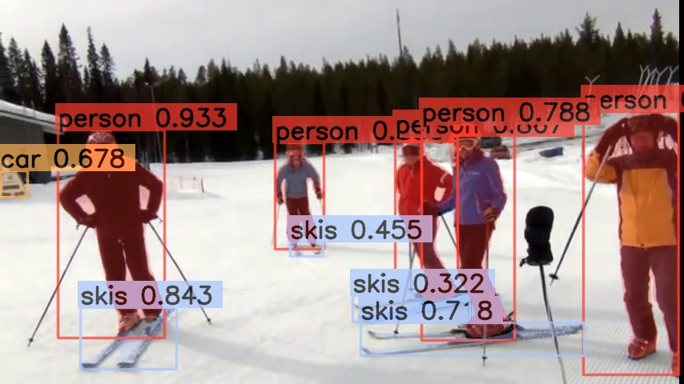

# Python例程
- [Python例程](#python例程)
  - [1. 环境准备](#1-环境准备)
    - [1.1 x86/arm/riscv PCIe平台](#11-x86armriscv-pcie平台)
    - [1.2 SoC平台](#12-soc平台)
  - [2. 推理测试](#2-推理测试)
    - [2.1 参数说明](#21-参数说明)
    - [2.2 测试图片](#22-测试图片)
    - [2.3 测试视频](#23-测试视频)

python目录下提供了一系列Python例程，具体情况如下：

| 序号 |  Python例程      | 说明                                |
| ---- | ---------------- | -----------------------------------  |
| 2    | yolov8_bmcv.py   | 使用SAIL解码、BMCV前处理、SAIL推理 |

## 1. 环境准备
### 1.1 x86/arm/riscv PCIe平台

如果您在x86/arm/riscv平台安装了PCIe加速卡（如SC系列加速卡），并使用它测试本例程，您需要安装libsophon、sophon-opencv、sophon-ffmpeg，具体请参考[x86-pcie平台的开发和运行环境搭建](../../../docs/Environment_Install_Guide.md#3-x86-pcie平台的开发和运行环境搭建)。或[arm-pcie平台的开发和运行环境搭建](../../../docs/Environment_Install_Guide.md#5-arm-pcie平台的开发和运行环境搭建)或[riscv-pcie平台的开发和运行环境搭建](../../../docs/Environment_Install_Guide.md#6-riscv-pcie平台的开发和运行环境搭建)。

x86 pcie平台可以使用如下命令安装sophon-sail：
```bash
pip3 install dfss --upgrade #安装dfss依赖
python3 -m dfss --install sail>=3.10.3
```

arm/riscv pcie平台需要下载sophon-sail源码包：
```bash
python3 -m dfss --url=open@sophgo.com:sophon-demo/YOLOv8_plus_seg_fuse/sophon-sail.tar.gz
```
下载完成后，参考[sophon-sail编译安装指南](https://doc.sophgo.com/sdk-docs/v24.04.01/docs_latest_release/docs/sophon-sail/docs/zh/html/1_build.html#)编译。

此外您可能还需要安装其他第三方库：
```bash
pip3 install opencv-python-headless
```

### 1.2 SoC平台

如果您使用SoC平台（如SE、SM系列边缘设备），并使用它测试本例程，刷机后在`/opt/sophon/`下已经预装了相应的libsophon、sophon-opencv和sophon-ffmpeg运行库包。

SoC平台可以通过下面的命令安装sophon-sail：
```bash
pip3 install dfss --upgrade #安装dfss依赖
python3 -m dfss --install sail>=3.10.3
```


此外您可能还需要安装其他第三方库：
```bash
pip3 install opencv-python-headless
```

> **注:**
>
> 上述命令安装的opencv是公版opencv，如果您希望使用sophon-opencv，可以设置如下环境变量：
> ```bash
> export PYTHONPATH=$PYTHONPATH:/opt/sophon/sophon-opencv-latest/opencv-python/
> ```
> **若使用sophon-opencv需要保证python版本小于等于3.8。**

## 2. 推理测试
python例程不需要编译，可以直接运行，PCIe平台和SoC平台的测试参数和运行方式是相同的。
### 2.1 参数说明
```bash
usage: yolov8_bmcv.py [--input INPUT_PATH] [--bmodel BMODEL] [--dev_id DEV_ID]
                        [--draw_thresh CONF_THRESH]
--input: 测试数据路径，可输入整个图片文件夹的路径或者视频路径；
--bmodel: 用于推理的bmodel路径，默认使用stage 0的网络进行推理；
--dev_id: 用于推理的tpu设备id；
--draw_thresh: 画框所需的置信度阈值；
```

### 2.2 测试图片
图片测试实例如下，支持对整个图片文件夹进行测试。
```bash
python3 python/yolov8_bmcv.py --input datasets/test --bmodel models/BM1688/yolov8s_seg_fuse_int8_1b.bmodel --dev_id 0 --draw_thresh 0.5
```
测试结束后，会将预测的图片保存在`results/images`下，预测的结果保存在`results/yolov8s_int8_1b.bmodel.bmodel_test_bmcv_python_result.json`下，同时会打印预测结果、推理时间等信息。



### 2.3 测试视频
视频测试实例如下，支持对视频流进行测试。
```bash
python3 python/yolov8_bmcv.py --input datasets/test_car_person_1080P.mp4 --bmodel models/BM1688/yolov8s_seg_fuse_int8_1b.bmodel --dev_id 0 --draw_thresh 0.5
```
测试结束后，同时会打印预测结果、推理时间等信息。`yolov8_bmcv.py`会将预测结果画在图片上并保存在`results/output.mp4`中。