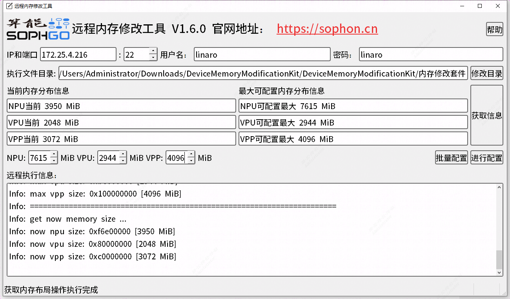

# ChatGLM2

## 目录
- [ChatGLM2](#chatglm2)
  - [目录](#目录)
  - [1. 简介](#1-简介)
  - [2. SE7下运行环境准备](#2-se7下运行环境准备)
    - [2.1 方式一](#21-方式一)
    - [2.1 方式二](#21-方式二)
  - [3. 准备模型](#3-准备模型)
  - [4. 例程测试](#4-例程测试)

## 1. 简介
ChatGLM2-6B 是开源中英双语对话模型 ChatGLM-6B 的第二代版本,相比于初代模型，具有更强大的性能，更长的上下文，更高的推理性能和更开放的协议，ChatGLM2-6B 权重对学术研究完全开放。

该例程支持在SDK0301及以上的版本上运行，提供了三个版本,分别是C++、python、python_web版本，三个版本可以独立运行，支持在插有1684X系列加速卡的x86主机上运行，也可以SE7上运行。其中在SE7上运行需要额外进行环境配置，请参照[SE7下运行环境准备](#2-se7下运行环境准备)完成环境部署。

## 2. SE7下运行环境准备
### 2.1 方式一
这是最推荐的方式，通过修改SE7的内存，使得满足chatGLM2运行条件。首先，下载根据[修改工具](https://doc.sophgo.com/sdk-docs/v23.07.01/docs_latest_release/docs/SophonSDK_doc/zh/html/appendix/2_mem_edit_tools.html)将SE7的内存修改为：

NPU:7360 MiB

VPU:2560 MiB 

VPP:4096 MiB



### 2.1 方式二
直接使用我么们提供的刷机包，刷机包已经完成环境部署，并且内置chatglm2_soc版本的程序，刷机包地址如下：
```
pip3 install dfss -i https://pypi.tuna.tsinghua.edu.cn/simple --upgrade
python3 -m dfss --url=open@sophgo.com:sophon-demo/chatglm/sdcard_chatglm2.zip
```
刷机方式可以参考[刷机问题](https://doc.sophgo.com/docs/3.0.0/docs_latest_release/faq/html/devices/SOC/soc_firmware_update.html?highlight=%E5%88%B7%E6%9C%BA),在完成刷机后，代码程序在`/data`目录下。当然，还是建议您使用sophon-demo下的程序,它是最新版本的。

## 3. 准备模型
该模型目前只支持在1684X上运行，由于原始模型巨大，此示例暂不提供模型编译脚本，直接提供编译好的bmodel。如果需要进行模型编译，可以参考[sophgo
/ChatGLM2-TPU](https://github.com/sophgo/ChatGLM2-TPU)完成模型编译。


​本例程在`scripts`目录下提供了相关模型载脚本`download.sh`

```bash
# 安装unzip，若已安装请跳过，非ubuntu系统视情况使用yum或其他方式安装
sudo apt install unzip
chmod -R +x scripts/
./scripts/download.sh
```

执行程序后，当前目录下的文件如下：

```
.
├── cpp                                  #cpp版本
│   ├── chatglm2.hpp                     #chatglm2推理base 
│   ├── CMakeLists.txt
│   ├── lib_pcie                         #pcie依赖的libsentencepiece.a
│   ├── lib_soc                          #soc依赖的libsentencepiece.a
│   ├── main.cpp                         #主程序
│   └── sentencepiece                    #sentencepiece头文件
│   └── README.md                        #使用说明
├── models
│   └── BM1684X                          #bmodel、token
├── python
│   ├── chatglm2.py                      #主程序
│   ├── CMakeLists.txt
│   └── pybind.cpp                       #绑定chatglm2推理base 
│   └── README.md                        #使用说明
├── python_web
│   ├── CMakeLists.txt
│   ├── pybind.cpp                       #绑定chatglm2推理base 
│   └── web_chatglm2.py                  #主程序
│   └── README.md                        #使用说明
├── README.md                            #使用说明
└── script
    └── download.sh                      #模型下载脚本
```


## 4. 例程测试

本例程一共分为三个版本，分别是cpp、python以及web版本，具体的编译和运行方法如下。为了提高运行效率，python和web版本都是通过调用cpp接口实现的。因此，每个版本都需要编译。

- [C++例程](./cpp/README.md)
- [Python例程](./python/README.md)
- [Python_web例程](./python_web/README.md)

